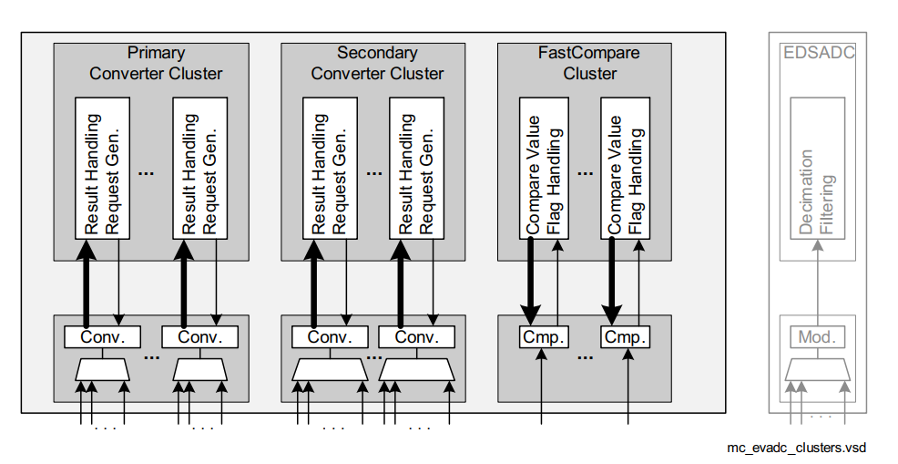
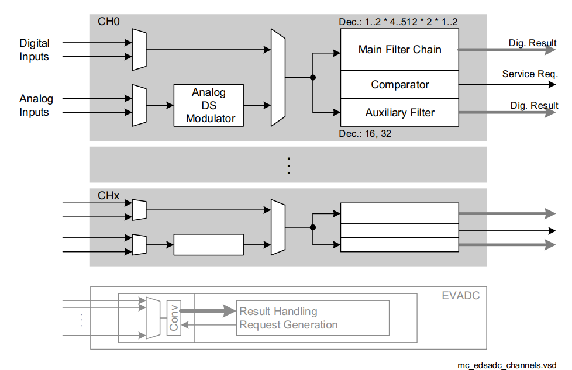
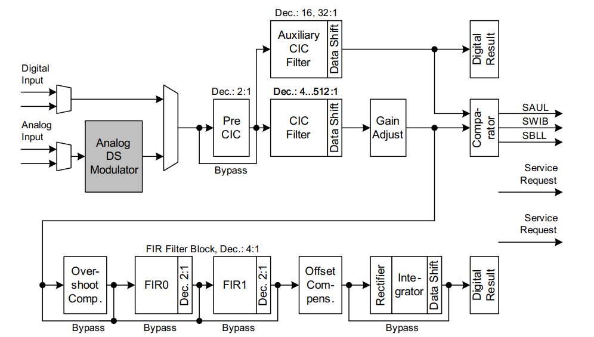
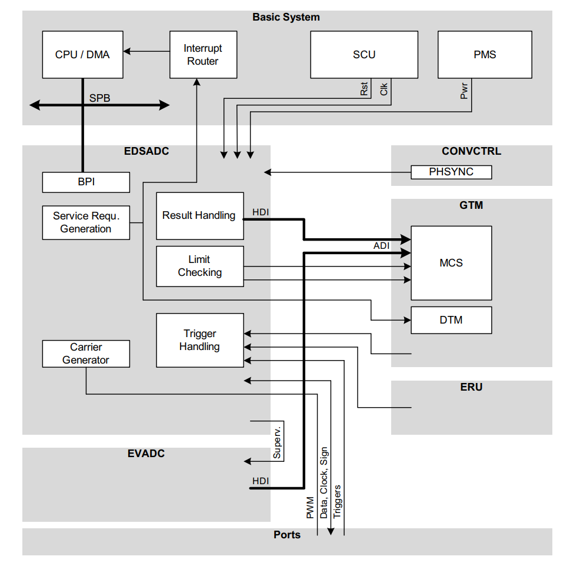
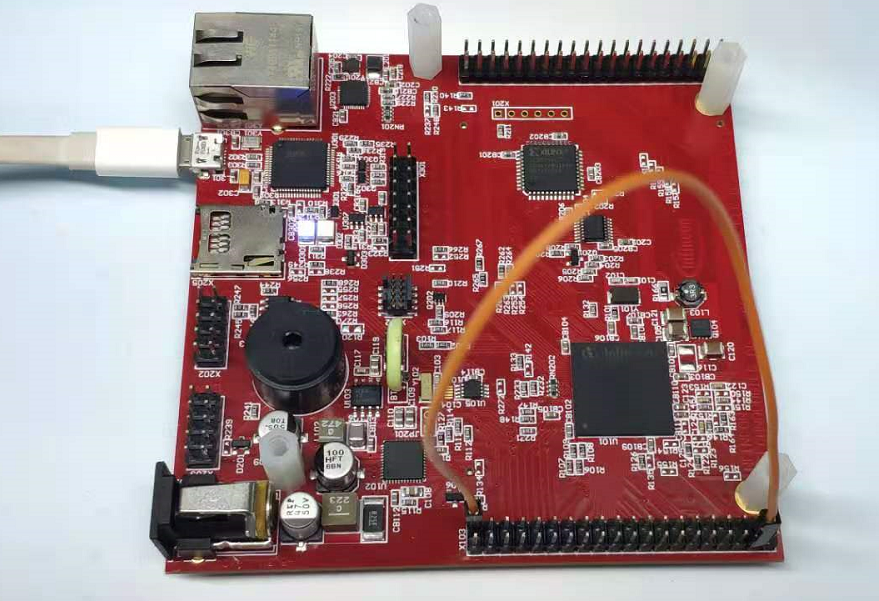
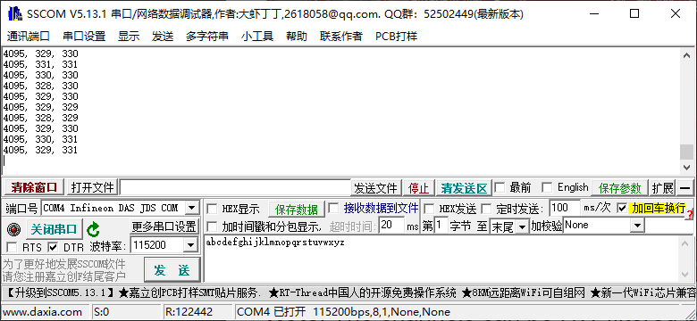

# TC397_ADC

<!-- TOC -->

- [TC397_ADC](#tc397_adc)
  - [EVADC](#evadc)
  - [EDSADC](#edsadc)
  - [Example_ADC_Queued_Scan](#example_adc_queued_scan)
  - [Example_ADC_Filtering](#example_adc_filtering)

<!-- /TOC -->

## EVADC

EVADC, Enhanced Versatile Analog-to-Digital Converter, 增强型多功能模数转换器.  



EVADC提供了一系列模拟输入通道, 这些通道使用逐次逼近寄存器(SAR, Successive Approximation Register)原理连接到数个模/数转换器的群集, 以将模拟输入值(电压)转换为离散的数字值.

EVADC基于SAR转换器, 每个转换器都包含一个采样保持单元和一个转换器模块. 模拟多路复用器选择几个输入通道之一, 带有几个请求源的专用控制逻辑定义了连续转换的顺序.总共建立了一个转换组.  

模拟输入通道和转换组的数量取决于所选的产品类型.在特定于产品的附录中对此进行了描述.  

ADC群集的每个转换器可以独立于其他转换器运行.每个通道的结果可以存储在专用于通道的结果寄存器或特定于组的结果寄存器中.

提供了三个具有不同功能的集群：

- 主转换器集群(Primary converter cluster)：配备8：1多路复用器和8级队列, 转换时间降至0.5 µs以下)
- 辅助转换器集群(Secondary converter cluster)：配备16：1多路复用器和16级队列, 转换时间降至1 µs以下
- 快速比较集群(Fast compare cluster)：单通道, 更新速率降至0.2 µs以下)

常用的Primary这个组的Source-Group_Channel对应关系如下表(AURIX™ TC39x UserManual, 32.3节):  

| Signal                              | Source  | Overlay                | Description                       |
|-------------------------------------|---------|------------------------|-----------------------------------|
| Analog Inputs for Group 0 (Primary) |         |                        |                                   |
| G0CH0 (AltRef)                      | AN0     | EDS3PA                 | analog input channel 0 of group 0 |
| G0CH1 (MD, AL)                      | AN1     | EDS3NA                 | analog input channel 1 of group 0 |
| G0CH2 (MD, AL)                      | AN2     | EDS0PA                 | analog input channel 2 of group 0 |
| G0CH3                               | AN3     | EDS0NA                 | analog input channel 3 of group 0 |
| G0CH4 (FixRef,ARefG11)              | AN4     | G11CH0                 | analog input channel 4 of group 0 |
| G0CH5 (FixRef)                      | AN5     | G11CH1                 | analog input channel 5 of group 0 |
| G0CH6 (FixRef)                      | AN6     | G11CH2                 | analog input channel 6 of group 0 |
| G0CH7 (PDD, FixRef)                 | AN7     | G11CH3                 | analog input channel 7 of group 0 |
| Analog Inputs for Group 1 (Primary) |         |                        |                                   |
| G1CH0 (AltRef)                      | AN8     | G11CH4                 | analog input channel 0 of group 1 |
| G1CH1 (MD, AL)                      | AN9     | G11CH5                 | analog input channel 1 of group 1 |
| G1CH2 (MD, AL)                      | AN10    | G11CH6                 | analog input channel 2 of group 1 |
| G1CH3 (PDD)                         | AN11    | G11CH7                 | analog input channel 3 of group 1 |
| G1CH4                               | AN12    | EDS0PB                 | analog input channel 4 of group 1 |
| G1CH5                               | AN13    | EDS0NB                 | analog input channel 5 of group 1 |
| G1CH6                               | AN14    | EDS3PB                 | analog input channel 6 of group 1 |
| G1CH7                               | AN15    | EDS3NB                 | analog input channel 7 of group 1 |
| Analog Inputs for Group 2 (Primary) |         |                        |                                   |
| G2CH0 (AltRef)                      | AN16    | FC0CH0                 | analog input channel 0 of group 2 |
| G2CH1 (MD)                          | AN17    | FC1CH0/SENT10A         | analog input channel 1 of group 2 |
| G2CH2 (MD)                          | AN18    | G11CH8/SENT11A         | analog input channel 2 of group 2 |
| G2CH3 (PDD)                         | AN19    | G11CH9/SENT12A         | analog input channel 3 of group 2 |
| G2CH4                               | AN20    | EDS2PA                 | analog input channel 4 of group 2 |
| G2CH5                               | AN21    | EDS2NA                 | analog input channel 5 of group 2 |
| G2CH6                               | AN22    | -                      | analog input channel 6 of group 2 |
| G2CH7                               | AN23    | -                      | analog input channel 7 of group 2 |
| Analog Inputs for Group 3 (Primary) |         |                        |                                   |
| G3CH0 (AltRef)                      | AN24    | EDS2PB/SENT0A          | analog input channel 0 of group 3 |
| G3CH1 (MD)                          | AN25    | EDS2NB/SENT1A          | analog input channel 1 of group 3 |
| G3CH2 (MD)                          | AN26    | G11CH10/SENT2A         | analog input channel 2 of group 3 |
| G3CH3 (PDD)                         | AN27    | G11CH11/SENT3A         | analog input channel 3 of group 3 |
| G3CH4                               | AN28    | G4CH4/SENT13A          | analog input channel 4 of group 3 |
| G3CH5                               | AN29    | G4CH5/SENT14A          | analog input channel 5 of group 3 |
| G3CH6                               | AN30    | G4CH6                  | analog input channel 6 of group 3 |
| G3CH7                               | AN31    | G4CH7                  | analog input channel 7 of group 3 |
| Analog Inputs for Group 4 (Primary) |         |                        |                                   |
| G4CH0 (AltRef)                      | AN40    | G8CH8                  | analog input channel 0 of group 4 |
| G4CH1 (MD, AL)                      | AN41    | G8CH9                  | analog input channel 1 of group 4 |
| G4CH2 (MD, AL)                      | AN42    | G8CH10                 | analog input channel 2 of group 4 |
| G4CH3 (PDD, FixRef)                 | AN43    | G8CH11                 | analog input channel 3 of group 4 |
| G4CH4                               | AN28    | G3CH4/SENT13A          | analog input channel 4 of group 4 |
| G4CH5                               | AN29    | G3CH5/SENT14A          | analog input channel 5 of group 4 |
| G4CH6                               | AN30    | G3CH6                  | analog input channel 6 of group 4 |
| G4CH7                               | AN31    | G3CH7                  | analog input channel 7 of group 4 |
| Analog Inputs for Group 5 (Primary) |         |                        |                                   |
| G5CH0 (AltRef)                      | AN48    | -                      | analog input channel 0 of group 5 |
| G5CH1 (MD, AL)                      | AN49    | -                      | analog input channel 1 of group 5 |
| G5CH2 (MD, AL)                      | AN50    | EDS9PA                 | analog input channel 2 of group 5 |
| G5CH3 (PDD)                         | AN51    | EDS9NA                 | analog input channel 3 of group 5 |
| G5CH4                               | AN52    | EDS6PA                 | analog input channel 4 of group 5 |
| G5CH5                               | AN53    | EDS6NA                 | analog input channel 5 of group 5 |
| G5CH6                               | AN54    | EDS6PB/SENT20A         | analog input channel 6 of group 5 |
| G5CH7                               | AN55    | EDS6NB/SENT21A         | analog input channel 7 of group 5 |
| Analog Inputs for Group 6 (Primary) |         |                        |                                   |
| G6CH0 (AltRef)                      | AN56    | -                      | analog input channel 0 of group 6 |
| G6CH1 (MD, AL)                      | AN57    | -                      | analog input channel 1 of group 6 |
| G6CH2 (MD, AL)                      | AN58    | EDS10PA                | analog input channel 2 of group 6 |
| G6CH3 (PDD)                         | AN59    | EDS10NA                | analog input channel 3 of group 6 |
| G6CH4                               | AN60    | EDS7PA                 | analog input channel 4 of group 6 |
| G6CH5                               | AN61    | EDS7NA                 | analog input channel 5 of group 6 |
| G6CH6                               | AN62    | EDS7PB/SENT22A         | analog input channel 6 of group 6 |
| G6CH7                               | AN63    | EDS7NB/SENT23A         | analog input channel 7 of group 6 |
| Analog Inputs for Group 7 (Primary) |         |                        |                                   |
| G7CH0 (AltRef)                      | AN64    | SENT24A                | analog input channel 0 of group 7 |
| G7CH1 (MD, AL)                      | AN65    | -                      | analog input channel 1 of group 7 |
| G7CH2 (MD, AL)                      | AN66    | EDS11PA                | analog input channel 2 of group 7 |
| G7CH3 (PDD)                         | AN67    | EDS11NA/SENT15A        | analog input channel 3 of group 7 |
| G7CH4                               | AN68    | EDS8PA/SENT16A         | analog input channel 4 of group 7 |
| G7CH5                               | AN69    | EDS8NA/SENT17A         | analog input channel 5 of group 7 |
| G7CH6                               | AN70    | EDS9PB/EDS12PA/SENT18A | analog input channel 6 of group 7 |
| G7CH7                               | AN71    | EDS9NB/EDS12NA/SENT19A | analog input channel 7 of group 7 |

除EVADC群集外, EDSADC也可以执行模数转换.  

## EDSADC

EDSADC, Enhanced Delta-Sigma Analog-to-Digital Converter, 增强型Delta-Sigma模数转换器.  

EDSADC 提供了一系列使用Delta / Sigma（DS）转换原理连接到片上调制器的模拟输入通道. 数字输入通道接受来自外部调制器的数据流. 片上解调器通道将这些输入转换为离散的数字值.  

  

EDSADC Structure Overview(结构概述):  

  

直接系统互联(Direct System Interconnections):  

  

官方给的例子都是EVADC的, 所以EDSADC暂作了解或查阅iLLD API.  

## Example_ADC_Queued_Scan

参考:  

- [ADC_Single_Channel_1 for KIT_AURIX_TC397_TFT](https://www.infineon.com/dgdl/Infineon-AURIX_TC3xx_ADC_Single_Channel_1_KIT_TC397_TFT-Training-v01_00-EN.pdf?fileId=5546d46274cf54d50174da20b3c22217)  
- [ADC_Queued_Scan_1 for KIT_AURIX_TC397_TFT](https://www.infineon.com/dgdl/Infineon-AURIX_TC3xx_ADC_Queued_Scan_1_KIT_TC397_TFT-Training-v01_00-EN.pdf?fileId=5546d46274cf54d50174da20c0cf2219)

EVADC的初始化有4个步骤:  

- EVADC模块(module)配置
- EVADC组(Group)配置
- EVADC通道(Channel)配置
- 填充队列(Filling the queue): 一次, 常规时基, 或者永久(Refill)

本例中, EVADC模块(module)的队列请求(Queued Request)用于组(Group)2的通道(Channel)1, 4和5. 每个通道的分辨率为12-bit(0~4095). 通过串口打印出这3个通道的采样结果.  

Cpu0_Main.c代码如下:  

```c
#include "Ifx_Types.h"
#include "IfxCpu.h"
#include "IfxScuWdt.h"

IFX_ALIGN(4) IfxCpu_syncEvent g_cpuSyncEvent = 0;

#include "Bsp.h"
#include "IfxAsclin_Asc.h"
#include "Ifx_Console.h"
#include "IfxCpu_Irq.h"

#include "IfxEvadc_Adc.h"

#define SERIAL_BAUDRATE0         115200
#define SERIAL_PIN_RX0           IfxAsclin0_RXA_P14_1_IN
#define SERIAL_PIN_TX0           IfxAsclin0_TX_P14_0_OUT
#define INTPRIO_ASCLIN0_TX       19      /* Priority of the ISR */
#define ASC_TX_BUFFER_SIZE       64
uint8 g_ascTxBuffer[ASC_TX_BUFFER_SIZE + sizeof(Ifx_Fifo) + 8];
IfxAsclin_Asc g_asc0;
IfxStdIf_DPipe  g_ascStandardInterface;     /* Standard interface object            */

#define GROUPID_2           IfxEvadc_GroupId_2
#define CHANNELS_NUM        3    /* Number of used channels */
#define AN17_CHID           1    /* Channel ID for pin AN17 */
#define AN20_CHID           4    /* Channel ID for pin AN20 */
#define AN21_CHID           5    /* Channel ID for pin AN21 */

IfxEvadc_Adc         g_evadc;                                   /* EVADC module handle variable                     */
IfxEvadc_Adc_Group   g_adcGroup;                                /* EVADC group handle variable                      */
IfxEvadc_Adc_Channel g_adcChannel[CHANNELS_NUM];                /* EVADC channels handle array                      */
uint8 g_grp2channels[CHANNELS_NUM] = {AN17_CHID, AN20_CHID, AN21_CHID}; /* AN17, AN20, AN21 channel IDs array       */
Ifx_EVADC_G_RES g_results[CHANNELS_NUM];                        /* Array of results                                 */

/* Function to initialize the EVADC module with default parameters */
void initEVADCModule()
{
    /* Create configuration */
    IfxEvadc_Adc_Config adcConfig;
    IfxEvadc_Adc_initModuleConfig(&adcConfig, &MODULE_EVADC);

    /* Initialize module */
    IfxEvadc_Adc_initModule(&g_evadc, &adcConfig);
}

/* Function to initialize the EVADC group with default parameters */
void initEVADCGroup()
{
    /* Create and initialize group configuration with default values */
    IfxEvadc_Adc_GroupConfig adcGroupConfig;
    IfxEvadc_Adc_initGroupConfig(&adcGroupConfig, &g_evadc);

    /* Setting user configuration using group 2 */
    adcGroupConfig.groupId = GROUPID_2;
    adcGroupConfig.master = GROUPID_2;

    /* Enable queued source */
    adcGroupConfig.arbiter.requestSlotQueue0Enabled = TRUE;

    /* Enable all gates in "always" mode (no edge detection) */
    adcGroupConfig.queueRequest[0].triggerConfig.gatingMode = IfxEvadc_GatingMode_always;

    /* Initialize the group */
    IfxEvadc_Adc_initGroup(&g_adcGroup, &adcGroupConfig);
}

void initEVADCChannels()
{
    /* Create channel configuration */
    IfxEvadc_Adc_ChannelConfig adcChannelConfig[CHANNELS_NUM];

    for(uint16 idx = 0; idx < CHANNELS_NUM; idx++)
    {
        /* Initialize the configuration with default values */
        IfxEvadc_Adc_initChannelConfig(&adcChannelConfig[idx], &g_adcGroup);

        /* Select the channel ID and the respective result register */
        adcChannelConfig[idx].channelId = (IfxEvadc_ChannelId)(g_grp2channels[idx]);
        adcChannelConfig[idx].resultRegister = (IfxEvadc_ChannelResult)(g_grp2channels[idx]);

        /* Initialize the channel */
        IfxEvadc_Adc_initChannel(&g_adcChannel[idx], &adcChannelConfig[idx]);
    }

    /* Start the queue */
    IfxEvadc_Adc_startQueue(&g_adcGroup, IfxEvadc_RequestSource_queue0);
}

void fillQueue()
{
    for(uint16 idx = 0; idx < CHANNELS_NUM; idx++)
    {
        /* Add channel to queue with refill option enabled */
        IfxEvadc_Adc_addToQueue(&g_adcChannel[idx], IfxEvadc_RequestSource_queue0, IFXEVADC_QUEUE_REFILL);
    }
}

/* Function to initialize the EVADC with default parameters */
void initEVADC()
{
    initEVADCModule();      /* Initialize the EVADC module  */
    initEVADCGroup();       /* Initialize the EVADC group   */
    initEVADCChannels();    /* Initialize the channels      */
    fillQueue();            /* Fill the queue request       */
}

/* Function to read the EVADC used channel */
void readEVADC()
{
    for(uint8 i = 0; i < CHANNELS_NUM; i++)
    {
        /* Wait for a valid result */
        Ifx_EVADC_G_RES conversionResult;
        do
        {
            conversionResult = IfxEvadc_Adc_getResult(&g_adcChannel[i]); /* Read the result of the selected channel */
        } while(!conversionResult.B.VF);

        /* Store result */
        g_results[i] = conversionResult;
    }
}

void initUART(void)
{
    /* Initialize an instance of IfxAsclin_Asc_Config with default values */
    IfxAsclin_Asc_Config ascConfig;
    IfxAsclin_Asc_initModuleConfig(&ascConfig, SERIAL_PIN_TX0.module);
    /* Set the desired baud rate */
    ascConfig.baudrate.baudrate = SERIAL_BAUDRATE0;
    /* ISR priorities and interrupt target */
    ascConfig.interrupt.txPriority = INTPRIO_ASCLIN0_TX;
    ascConfig.interrupt.typeOfService = IfxCpu_Irq_getTos(IfxCpu_getCoreIndex());
    /* FIFO configuration */
    ascConfig.txBuffer = &g_ascTxBuffer;
    ascConfig.txBufferSize = ASC_TX_BUFFER_SIZE;
    /* Port pins configuration */
    const IfxAsclin_Asc_Pins pins =
    {
        NULL_PTR,         IfxPort_InputMode_pullUp,     /* CTS pin not used     */
        &SERIAL_PIN_RX0,   IfxPort_InputMode_pullUp,     /* RX pin              */
        NULL_PTR,         IfxPort_OutputMode_pushPull,  /* RTS pin not used     */
        &SERIAL_PIN_TX0,   IfxPort_OutputMode_pushPull,  /* TX pin              */
        IfxPort_PadDriver_cmosAutomotiveSpeed1
    };
    ascConfig.pins = &pins;
    /* Initialize module with above parameters  */
    IfxAsclin_Asc_initModule(&g_asc0, &ascConfig);

    /* Initialize the Standard Interface */
    IfxAsclin_Asc_stdIfDPipeInit(&g_ascStandardInterface, &g_asc0);
    /* Initialize the Console */
    Ifx_Console_init(&g_ascStandardInterface);
}

IFX_INTERRUPT(asclin0TxISR, 0, INTPRIO_ASCLIN0_TX);  /* Adding the Interrupt Service Routine */
void asclin0TxISR(void)
{
    IfxAsclin_Asc_isrTransmit(&g_asc0);
}

void core0_main(void)
{
    IfxCpu_enableInterrupts();
    
    /* !!WATCHDOG0 AND SAFETY WATCHDOG ARE DISABLED HERE!!
     * Enable the watchdogs and service them periodically if it is required
     */
    IfxScuWdt_disableCpuWatchdog(IfxScuWdt_getCpuWatchdogPassword());
    IfxScuWdt_disableSafetyWatchdog(IfxScuWdt_getSafetyWatchdogPassword());
    
    /* Wait for CPU sync event */
    IfxCpu_emitEvent(&g_cpuSyncEvent);
    IfxCpu_waitEvent(&g_cpuSyncEvent, 1);
    
    initTime();
    initUART();
    initEVADC();

    while(1)
    {
        readEVADC();
        Ifx_Console_print("%d, %d, %d\n\r", g_results[0].B.RESULT,
                g_results[1].B.RESULT, g_results[2].B.RESULT);  //12-bit resolution, 0~4095
        waitTime(TimeConst_100ms);
    }
}
```  

编译下载, 按复位运行:  



默认不连情况下, 结果在330左右浮动, 连接AN17到V_UC, 由于是12-bit分辨率, 可以看到值变成了4095, 如果连接GND, 就是0~5浮动:  



## Example_ADC_Filtering

参考 [ADC_Filtering_1 for KIT_AURIX_TC397_TFT](https://www.infineon.com/dgdl/Infineon-AURIX_TC3xx_ADC_Filtering_1_KIT_TC397_TFT-Training-v01_00-EN.pdf?fileId=5546d46274cf54d50174da20cbf1221b)  

ADC转换产生的数据可以在应用程序使用之前自动修改，以减少处理转换所需的CPU / DMA负载. 支持三种类型的数据修改：

- 标准数据缩减模式, Standard Data Reduction Mode, 最多可累积16个值，然后生成结果中断.  
- 结果过滤模式, Result Filtering Mode, 可以将具有可选系数的三阶有限冲激响应（FIR）滤波器或具有可选系数的一阶无限冲激响应（IIR）滤波器应用于转换结果, 关于FIR和IIR, 可参考 [滤波器简介：FIR与IIR](https://blog.csdn.net/Cratial/article/details/96423786)
- 差异模式, Difference Mode, 从转换结果中减去结果寄存器GxRES0的内容

官方的这个例子, EVADC模块配置为转换四个通道. 自动修改由三个通道转换得到的数据：一个通道计算4个结果的平均值，另一个通道应用三阶有限冲激响应（FIR）滤波器，另一个通道应用一阶无限冲激响应（IIR）滤波器. 最后一个通道无需数据修改即可测量相同的信号. 通道被连续转换，并为每个通道存储最大值和最小值，然后将其通过UART发送以便进行比较.  

具体见官方例程, 这里不再贴出.  
