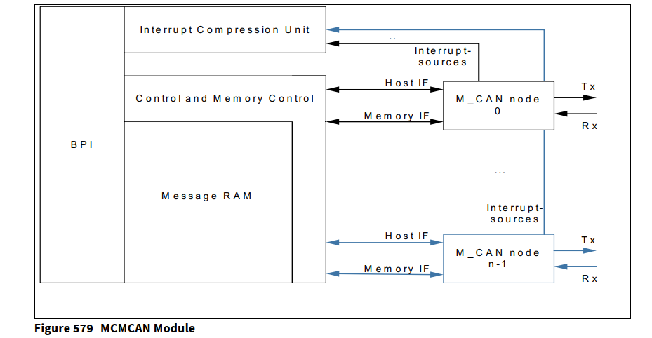
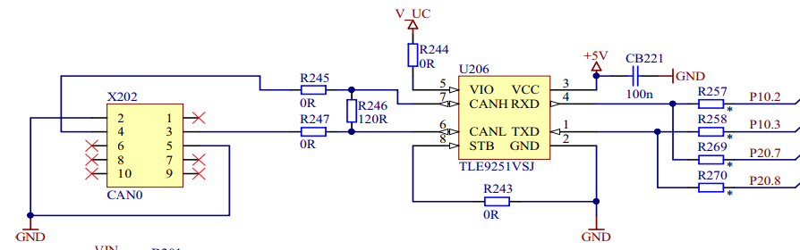
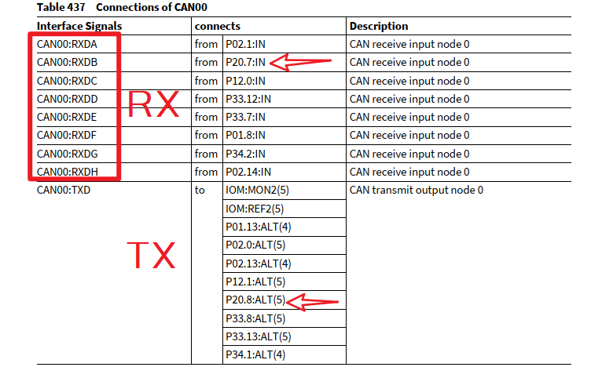
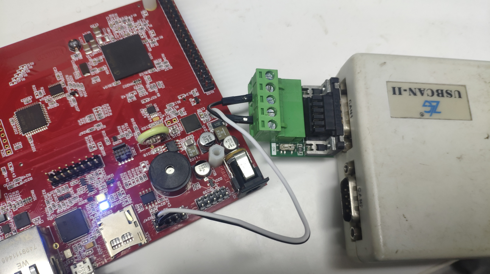
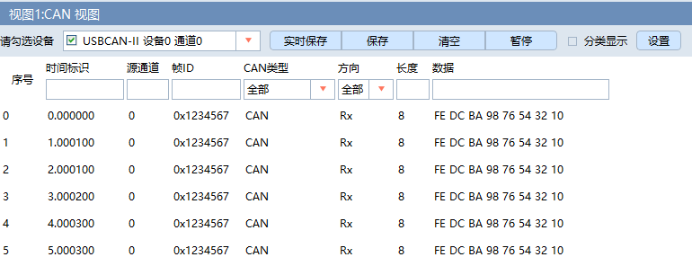

# TC397_CAN

<!-- TOC -->

- [TC397_CAN](#tc397_can)
  - [TC397_CAN简介](#tc397_can简介)
  - [CAN Loop-Back](#can-loop-back)
  - [CAN Transceiver](#can-transceiver)

<!-- /TOC -->

## TC397_CAN简介

不同于TC297的MultiCAN+, TC397的CAN模块唤作`MCMCAN`:  

- 实现了Bosch的M_CAN, 遵循`ISO 11898-1`(Classical CAN, CAN FD)和`ISO 11898-4`(Time-triggered CAN, TTCAN)
- TTCAN协议级别1和级别2完全硬件实现
- 支持事件同步时间触发通讯
- CAN错误记录
- AUTOSAR优化, SAE J1939优化
- 改进的验收过滤
- 接收高优先级消息时的单独信令
- **MCMCAN 0/1/2模块由M_CAN作为CAN节点组成, 每个模块4个节点, 共计`12路CANFD`**
- 主CPU直接消息RAM访问
- 一个可配置的消息RAM(configurable Message RAM)用于储存发送或者接收的消息, 多个M_CAN共享相同的消息RAM
- 可编程回环测试模式
- 可屏蔽的模块中断
- 8/16/32位通用从接口，用于连接客户特定的主机CPU
- 每个CAN节点有两个可配置的接收FIFO, 接收高优先级消息时的单独信令(signaling), 多达64个专用接收缓冲, 多达32个专用发送缓冲, 可配置的发送FIFO/Queue/Event FIFO

TC397的`MCMCAN`取代之前TC297的`MultiCAN+`有下面值得注意的改变:  

- 消息对象被**可配置的消息RAM**取代
- 支持CAN上的调试

其它可参考 [TC297 MultiCAN+](https://www.infineon.com/dgdl/Infineon-AURIX_Controller_Area_Network-TR-v01_00-EN.pdf?fileId=5546d46269bda8df0169ca5c06fe2534&intc=0560030)

综述如下:  



资源如下:  

| Parameter                                              | CAN0  | CAN1  | CAN2  |
|--------------------------------------------------------|-------|-------|-------|
| Node size in byte                                      | 1024  | 1024  | 1024  |
| Number of CAN Nodes                                    | 4     | 4     | 4     |
| Number of TTCAN Nodes                                  | 1     |       |       |
| RAM size in byte                                       | 32768 | 16384 | 16384 |
| Maximum Number of Standard ID Filter Messages per node | 128   | 128   | 128   |
| Maximum Number of Extended ID Filter Messages per node | 64    | 64    | 64    |
| Maximum Number of RxFIFO structures per node           | 2     | 2     | 2     |
| Maximum Number of Messages in a Rx buffer per node     | 64    | 64    | 64    |
| Maximum Number of Tx Event Messages per node           | 32    | 32    | 32    |
| Maximum Number of Tx Messages in a Tx Buffer per node  | 32    | 32    | 32    |
| Maximum number of trigger messages per TTCAN node      | 64    |

官方的评估板, 默认仅仅引出了CAN00:  

- P20.7, CAN00 Receive Input B
- P20.8, CAN00 Transmit Output



CAN的IO可以在 [Infineon-AURIX_TC39x-UserManual-v01_00-EN.pdf](https://www.infineon.com/dgdl/Infineon-AURIX_TC39x-UserManual-v01_00-EN.pdf?fileId=5546d462712ef9b7017182d371dc1d95) 第40.4节 MCMCAN的Connectivity查看, 以CAN00为例, 有下面引脚复用:  



官方评估板选了P20.7和P20.8来用

## CAN Loop-Back

参考 [MCMCAN_1 for KIT_AURIX_TC397_TFT](https://www.infineon.com/dgdl/Infineon-AURIX_TC3xx_MCMCAN_1_KIT_TC397_TFT-Training-v01_00-EN.pdf?fileId=5546d46274cf54d50174da20a6242215)  

本例MCMCAN用于在两个节点之间交换数据，实现在使用环回模式的同一设备中. 环回模式下, 无需外部引脚.  

CAN0发消息给CAN1, 发送中断点亮LED表示发送成功, 一旦CAN消息被CAN1接收, 接收中断中比较接收和发送的消息内容, 一致就点亮另一颗LED表示接收成功:

- 初始化MODULE_CAN0模块
- 初始化发送CAN00节点, 回环模式, 发送中断
- 初始化接收CAN01节点, 回环模式, 接收中断
- 初始化滤波器
- 发送消息
- 发送中断点灯, 接收中断比较消息, 成功点灯

Cpu0_Main.c代码如下:  

```c
#include "Ifx_Types.h"
#include "IfxCpu.h"
#include "IfxScuWdt.h"

#include <stdio.h>
#include <string.h>
#include "Ifx_Types.h"
#include "IfxCan_Can.h"
#include "IfxCan.h"
#include "IfxCpu_Irq.h"
#include "IfxPort.h"

IFX_ALIGN(4) IfxCpu_syncEvent g_cpuSyncEvent = 0;

#define LED0                     &MODULE_P13,0
#define LED1                     &MODULE_P13,1

#define CAN_MESSAGE_ID              (uint32)0x777           /* Message ID that will be used in arbitration phase    */
#define INVALID_RX_DATA_VALUE       0xA5                    /* Used to invalidate RX message data content           */
#define INVALID_ID_VALUE            (uint32)0xFFFFFFFF      /* Used to invalidate RX message ID value               */
#define ISR_PRIORITY_CAN_TX         2                       /* Define the CAN TX interrupt priority                 */
#define ISR_PRIORITY_CAN_RX         1                       /* Define the CAN RX interrupt priority                 */
#define TX_DATA_LOW_WORD            (uint32)0xC0CAC01A      /* Define CAN data lower word to be transmitted         */
#define TX_DATA_HIGH_WORD           (uint32)0xBA5EBA11      /* Define CAN data higher word to be transmitted        */
#define MAXIMUM_CAN_DATA_PAYLOAD    2                       /* Define maximum classical CAN payload in 4-byte words */

/*********************************************************************************************************************/
/*--------------------------------------------------Data Structures--------------------------------------------------*/
/*********************************************************************************************************************/
typedef struct
{
    IfxCan_Can_Config canConfig;                            /* CAN module configuration structure                   */
    IfxCan_Can canModule;                                   /* CAN module handle                                    */
    IfxCan_Can_Node canSrcNode;                             /* CAN source node handle data structure                */
    IfxCan_Can_Node canDstNode;                             /* CAN destination node handle data structure           */
    IfxCan_Can_NodeConfig canNodeConfig;                    /* CAN node configuration structure                     */
    IfxCan_Filter canFilter;                                /* CAN filter configuration structure                   */
    IfxCan_Message txMsg;                                   /* Transmitted CAN message structure                    */
    IfxCan_Message rxMsg;                                   /* Received CAN message structure                       */
    uint32 txData[MAXIMUM_CAN_DATA_PAYLOAD];                /* Transmitted CAN data array                           */
    uint32 rxData[MAXIMUM_CAN_DATA_PAYLOAD];                /* Received CAN data array                              */
} McmcanType;

McmcanType                  g_mcmcan;

IFX_INTERRUPT(canIsrTxHandler, 0, ISR_PRIORITY_CAN_TX);
void canIsrTxHandler(void)
{
    /* Clear the "Transmission Completed" interrupt flag */
    IfxCan_Node_clearInterruptFlag(g_mcmcan.canSrcNode.node, IfxCan_Interrupt_transmissionCompleted);
    /* Just to indicate that the CAN message has been transmitted by turning on LED0 */
    IfxPort_setPinState(LED0, IfxPort_State_low);
}

IFX_INTERRUPT(canIsrRxHandler, 0, ISR_PRIORITY_CAN_RX);
void canIsrRxHandler(void)
{
    /* Clear the "Message stored to Dedicated RX Buffer" interrupt flag */
    IfxCan_Node_clearInterruptFlag(g_mcmcan.canDstNode.node, IfxCan_Interrupt_messageStoredToDedicatedRxBuffer);
    /* Clear the "New Data" flag; as long as the "New Data" flag is set, the respective Rx buffer is
     * locked against updates from received matching frames.
     */
    IfxCan_Node_clearRxBufferNewDataFlag(g_mcmcan.canDstNode.node, g_mcmcan.canFilter.rxBufferOffset);
    /* Read the received CAN message */
    IfxCan_Can_readMessage(&g_mcmcan.canDstNode, &g_mcmcan.rxMsg, g_mcmcan.rxData);

    /* Check if the received data matches with the transmitted one */
    if( ( g_mcmcan.rxData[0] == g_mcmcan.txData[0] ) &&
        ( g_mcmcan.rxData[1] == g_mcmcan.txData[1] ) &&
        ( g_mcmcan.rxMsg.messageId == g_mcmcan.txMsg.messageId ) )
    {
        /* Turn on the LED1 to indicate correctness of the received message */
        IfxPort_setPinState(LED1, IfxPort_State_low);
    }
}

void core0_main(void)
{
    IfxCpu_enableInterrupts();
    
    /* !!WATCHDOG0 AND SAFETY WATCHDOG ARE DISABLED HERE!!
     * Enable the watchdogs and service them periodically if it is required
     */
    IfxScuWdt_disableCpuWatchdog(IfxScuWdt_getCpuWatchdogPassword());
    IfxScuWdt_disableSafetyWatchdog(IfxScuWdt_getSafetyWatchdogPassword());
    
    /* Wait for CPU sync event */
    IfxCpu_emitEvent(&g_cpuSyncEvent);
    IfxCpu_waitEvent(&g_cpuSyncEvent, 1);
    
    //initLED
    IfxPort_setPinMode(LED0, IfxPort_Mode_outputPushPullGeneral);    /* Initialize LED port pin                      */
    IfxPort_setPinMode(LED1, IfxPort_Mode_outputPushPullGeneral);
    IfxPort_setPinState(LED0, IfxPort_State_high);                   /* Turn off LED (LED is low-level active)       */
    IfxPort_setPinState(LED1, IfxPort_State_high);

    //initMcmcan

    /*******CAN module configuration and initialization*******/
    //load default CAN module configuration into configuration structure
    IfxCan_Can_initModuleConfig(&g_mcmcan.canConfig, &MODULE_CAN0);
    //initialize CAN module with the default configuration
    IfxCan_Can_initModule(&g_mcmcan.canModule, &g_mcmcan.canConfig);

    /*******Source CAN node configuration and initialization*******/
    IfxCan_Can_initNodeConfig(&g_mcmcan.canNodeConfig, &g_mcmcan.canModule);
    g_mcmcan.canNodeConfig.busLoopbackEnabled = TRUE;
    g_mcmcan.canNodeConfig.nodeId = IfxCan_NodeId_0;
    g_mcmcan.canNodeConfig.frame.type = IfxCan_FrameType_transmit;
    g_mcmcan.canNodeConfig.interruptConfig.transmissionCompletedEnabled = TRUE;
    g_mcmcan.canNodeConfig.interruptConfig.traco.priority = ISR_PRIORITY_CAN_TX;
    g_mcmcan.canNodeConfig.interruptConfig.traco.interruptLine = IfxCan_InterruptLine_0;
    g_mcmcan.canNodeConfig.interruptConfig.traco.typeOfService = IfxSrc_Tos_cpu0;
    IfxCan_Can_initNode(&g_mcmcan.canSrcNode, &g_mcmcan.canNodeConfig);

    /*******Destination CAN node configuration and initialization*******/
    //load default CAN node configuration into configuration structure
    IfxCan_Can_initNodeConfig(&g_mcmcan.canNodeConfig, &g_mcmcan.canModule);
    //set destination CAN node in the "Loop-Back" mode (no external pins are used)
    g_mcmcan.canNodeConfig.busLoopbackEnabled = TRUE;
    //assign destination CAN node to CAN node 1
    g_mcmcan.canNodeConfig.nodeId = IfxCan_NodeId_1;
    //define the frame to be the receiving one
    g_mcmcan.canNodeConfig.frame.type = IfxCan_FrameType_receive;
    //once the message is stored in the dedicated RX buffer, raise the interrupt
    g_mcmcan.canNodeConfig.interruptConfig.messageStoredToDedicatedRxBufferEnabled = TRUE;
    //define the receive interrupt priority
    g_mcmcan.canNodeConfig.interruptConfig.reint.priority = ISR_PRIORITY_CAN_RX;
    //assign the interrupt line 1 to the receive interrupt
    g_mcmcan.canNodeConfig.interruptConfig.reint.interruptLine = IfxCan_InterruptLine_1;
    //receive interrupt service routine should be serviced by the CPU0
    g_mcmcan.canNodeConfig.interruptConfig.reint.typeOfService = IfxSrc_Tos_cpu0;
    //initialize the destination CAN node with the modified configuration
    IfxCan_Can_initNode(&g_mcmcan.canDstNode, &g_mcmcan.canNodeConfig);

    /*******CAN filter configuration and initialization*******/
    //filter configuration is stored under the filter element number 0
    g_mcmcan.canFilter.number = 0;
    //store received frame in a dedicated RX Buffer
    g_mcmcan.canFilter.elementConfiguration = IfxCan_FilterElementConfiguration_storeInRxBuffer;
    //define the same message ID as defined for the TX message
    g_mcmcan.canFilter.id1 = CAN_MESSAGE_ID;
    //assign the filter to the dedicated RX Buffer (RxBuffer0 in this case)
    g_mcmcan.canFilter.rxBufferOffset = IfxCan_RxBufferId_0;
    //initialize the standard filter with the modified configuration
    IfxCan_Can_setStandardFilter(&g_mcmcan.canDstNode, &g_mcmcan.canFilter);

    //transmitCanMessage

    //Initialization of the RX message with the default configuration
    IfxCan_Can_initMessage(&g_mcmcan.rxMsg);
    //Invalidation of the RX message data content
    memset((void *)(&g_mcmcan.rxData[0]), INVALID_RX_DATA_VALUE, MAXIMUM_CAN_DATA_PAYLOAD * sizeof(uint32));
    //Initialization of the TX message with the default configuration
    IfxCan_Can_initMessage(&g_mcmcan.txMsg);
    //Define the content of the data to be transmitted
    g_mcmcan.txData[0] = TX_DATA_LOW_WORD;
    g_mcmcan.txData[1] = TX_DATA_HIGH_WORD;
    //Set the message ID that is used during the receive acceptance phase
    g_mcmcan.txMsg.messageId = CAN_MESSAGE_ID;
    //Send the CAN message with the previously defined TX message content
    while( IfxCan_Status_notSentBusy ==
           IfxCan_Can_sendMessage(&g_mcmcan.canSrcNode, &g_mcmcan.txMsg, &g_mcmcan.txData[0]) )
    {
    }

    while(1)
    {
    }
}

```

## CAN Transceiver

下面的例子用到了CAN00, 加收发器, 评估板有, 连到CAN卡, 以便在电脑上收发:  

- 板子上默认有120Ω终端电阻了, 可以把USB-CAN卡的120Ω也用上
- CAN波特率500K
- 对应的引脚是P20.7(CAN00_RX)和P20.8(CAN00_TX)
- CAN发送ID为 0x1234567, 中断中翻转LED0
- CAN接收 0x1234561 扩展帧, 数据为0x 01 23 45 67 89 AB CD EF 时, 点亮LED1
- CAN接收 0x1234562 扩展帧, 数据为0x 02 23 45 67 89 AB CD EF 时, 点亮LED2
- CAN接收 0x1234563 扩展帧, 数据为0x 03 23 45 67 89 AB CD EF 时, 点亮LED3



Cpu0_Main.c代码: 

```c
#include "Ifx_Types.h"
#include "IfxCpu.h"
#include "IfxScuWdt.h"

IFX_ALIGN(4) IfxCpu_syncEvent g_cpuSyncEvent = 0;

#include "Ifx_Types.h"
#include "IfxCan_Can.h"
#include "IfxCan.h"
#include "IfxCpu_Irq.h"
#include "IfxPort.h"
#include "Bsp.h"

#define LED0                     &MODULE_P13,0
#define LED1                     &MODULE_P13,1
#define LED2                     &MODULE_P13,2
#define LED3                     &MODULE_P13,3

#define MODULE_CAN0_RAM    0xF0200000
#define NODE0_RAM_OFFSET   0x0
//#define NODE1_RAM_OFFSET   0x1000

#define CAN_MESSAGE_TX_ID0             (uint32)0x1234567
#define CAN_MESSAGE_RX_ID1             (uint32)0x1234561
#define CAN_MESSAGE_RX_ID2             (uint32)0x1234562
#define CAN_MESSAGE_RX_ID3             (uint32)0x1234563

#define ISR_PRIORITY_CAN_TX         2                       /* Define the CAN TX interrupt priority                 */
#define ISR_PRIORITY_CAN_RX         1                       /* Define the CAN RX interrupt priority                 */
#define MAXIMUM_CAN_DATA_PAYLOAD    2                       /* Define maximum classical CAN payload in 4-byte words */

IFX_CONST IfxCan_Can_Pins Can00_pins = {
       &IfxCan_TXD00_P20_8_OUT,   IfxPort_OutputMode_pushPull, // CAN00_TX
       &IfxCan_RXD00B_P20_7_IN,   IfxPort_InputMode_pullUp,    // CAN00_RX
       IfxPort_PadDriver_cmosAutomotiveSpeed4
};

typedef struct
{
    IfxCan_Can_Config canConfig;                            /* CAN module configuration structure                   */
    IfxCan_Can canModule;                                   /* CAN module handle                                    */
    IfxCan_Can_Node can00Node;                             /* CAN source node handle data structure                */
    IfxCan_Can_NodeConfig canNodeConfig;                    /* CAN node configuration structure                     */
    IfxCan_Filter canFilter;                                /* CAN filter configuration structure                   */
    IfxCan_Message txMsg;                                   /* Transmitted CAN message structure                    */
    IfxCan_Message rxMsg;                                   /* Received CAN message structure                       */
    uint32 txData[MAXIMUM_CAN_DATA_PAYLOAD];                /* Transmitted CAN data array                           */
    uint32 rxData[MAXIMUM_CAN_DATA_PAYLOAD];                /* Received CAN data array                              */
} McmcanType;

McmcanType                  g_mcmcan;

IFX_INTERRUPT(canIsrTxHandler, 0, ISR_PRIORITY_CAN_TX);
void canIsrTxHandler(void)
{
    /* Clear the "Transmission Completed" interrupt flag */
    IfxCan_Node_clearInterruptFlag(g_mcmcan.can00Node.node, IfxCan_Interrupt_transmissionCompleted);

    IfxPort_togglePin(LED0);    //transmit indicator
}

IFX_INTERRUPT(canIsrRxHandler, 0, ISR_PRIORITY_CAN_RX);
void canIsrRxHandler(void)
{
    /* Clear the "Message stored to Dedicated RX Buffer" interrupt flag */
    IfxCan_Node_clearInterruptFlag(g_mcmcan.can00Node.node, IfxCan_Interrupt_messageStoredToDedicatedRxBuffer);
    /* Clear the "New Data" flag; as long as the "New Data" flag is set, the respective Rx buffer is
     * locked against updates from received matching frames.
     */
    IfxCan_Node_clearRxBufferNewDataFlag(g_mcmcan.can00Node.node, g_mcmcan.canFilter.rxBufferOffset);
    /* Read the received CAN message */
    IfxCan_Can_readMessage(&g_mcmcan.can00Node, &g_mcmcan.rxMsg, g_mcmcan.rxData);

    /* Check if the received data matches with the transmitted one */
    if((g_mcmcan.rxMsg.messageId == CAN_MESSAGE_RX_ID1)
            && (g_mcmcan.rxData[1] == 0xEFCDAB89))
    {
        if(g_mcmcan.rxData[0] == 0x67452301) {  //send 0x
            IfxPort_setPinState(LED1, IfxPort_State_low);   //LED ON
        } else {
            IfxPort_setPinState(LED1, IfxPort_State_high);  //LED OFF
        }
    }

    if((g_mcmcan.rxMsg.messageId == CAN_MESSAGE_RX_ID2)
            && (g_mcmcan.rxData[1] == 0xEFCDAB89))
    {
        if(g_mcmcan.rxData[0] == 0x67452302) {
            IfxPort_setPinState(LED2, IfxPort_State_low);
        } else {
            IfxPort_setPinState(LED2, IfxPort_State_high);
        }
    }

    if((g_mcmcan.rxMsg.messageId == CAN_MESSAGE_RX_ID3)
            && (g_mcmcan.rxData[1] == 0xEFCDAB89))
    {
        if(g_mcmcan.rxData[0] == 0x67452303) {
            IfxPort_setPinState(LED3, IfxPort_State_low);
        } else {
            IfxPort_setPinState(LED3, IfxPort_State_high);
        }
    }

}

void initCAN0(void)
{
    /*******CAN module configuration and initialization*******/
    IfxCan_Can_initModuleConfig(&g_mcmcan.canConfig, &MODULE_CAN0);
    IfxCan_Can_initModule(&g_mcmcan.canModule, &g_mcmcan.canConfig);

    /*******CAN00 node configuration and initialization*******/
    IfxCan_Can_initNodeConfig(&g_mcmcan.canNodeConfig, &g_mcmcan.canModule);

    g_mcmcan.canNodeConfig.nodeId = IfxCan_NodeId_0;
    g_mcmcan.canNodeConfig.clockSource = IfxCan_ClockSource_both;
    g_mcmcan.canNodeConfig.frame.type = IfxCan_FrameType_transmitAndReceive;
    g_mcmcan.canNodeConfig.frame.mode = IfxCan_FrameMode_standard;  //Classic CAN

    g_mcmcan.canNodeConfig.txConfig.txMode = IfxCan_TxMode_dedicatedBuffers;
    g_mcmcan.canNodeConfig.txConfig.dedicatedTxBuffersNumber = 255;
    g_mcmcan.canNodeConfig.txConfig.txBufferDataFieldSize = IfxCan_DataFieldSize_8;

    g_mcmcan.canNodeConfig.rxConfig.rxMode = IfxCan_RxMode_dedicatedBuffers;
    g_mcmcan.canNodeConfig.rxConfig.rxBufferDataFieldSize = IfxCan_DataFieldSize_8;

    g_mcmcan.canNodeConfig.filterConfig.extendedListSize = 255; //Extended Frame
    g_mcmcan.canNodeConfig.filterConfig.messageIdLength = IfxCan_MessageIdLength_extended;

    g_mcmcan.canNodeConfig.messageRAM.extendedFilterListStartAddress = 0x100;   //Extended Frame
    g_mcmcan.canNodeConfig.messageRAM.rxBuffersStartAddress = 0x200;
    g_mcmcan.canNodeConfig.messageRAM.txBuffersStartAddress = 0x400;
    g_mcmcan.canNodeConfig.messageRAM.baseAddress = MODULE_CAN0_RAM + NODE0_RAM_OFFSET;

    g_mcmcan.canNodeConfig.baudRate.baudrate = 500000;   //500KBaud

    //transmit interrupt
    g_mcmcan.canNodeConfig.interruptConfig.transmissionCompletedEnabled = TRUE;
    g_mcmcan.canNodeConfig.interruptConfig.traco.priority = ISR_PRIORITY_CAN_TX;
    g_mcmcan.canNodeConfig.interruptConfig.traco.interruptLine = IfxCan_InterruptLine_0;
    g_mcmcan.canNodeConfig.interruptConfig.traco.typeOfService = IfxSrc_Tos_cpu0;

    //receive interrupt
    g_mcmcan.canNodeConfig.interruptConfig.messageStoredToDedicatedRxBufferEnabled = TRUE;
    g_mcmcan.canNodeConfig.interruptConfig.reint.priority = ISR_PRIORITY_CAN_RX;
    g_mcmcan.canNodeConfig.interruptConfig.reint.interruptLine = IfxCan_InterruptLine_1;
    g_mcmcan.canNodeConfig.interruptConfig.reint.typeOfService = IfxSrc_Tos_cpu0;

    //binding pin
    g_mcmcan.canNodeConfig.pins = &Can00_pins;

    IfxCan_Can_initNode(&g_mcmcan.can00Node, &g_mcmcan.canNodeConfig);

    /*******CAN filter configuration and initialization*******/
    g_mcmcan.canFilter.number = 0;
    g_mcmcan.canFilter.elementConfiguration = IfxCan_FilterElementConfiguration_storeInRxBuffer;
    g_mcmcan.canFilter.id1 = CAN_MESSAGE_RX_ID1;
    g_mcmcan.canFilter.rxBufferOffset = IfxCan_RxBufferId_0;
    //IfxCan_Can_setStandardFilter(&g_mcmcan.can00Node, &g_mcmcan.canFilter);
    IfxCan_Can_setExtendedFilter(&g_mcmcan.can00Node, &g_mcmcan.canFilter);

    g_mcmcan.canFilter.number = 1;
    g_mcmcan.canFilter.elementConfiguration = IfxCan_FilterElementConfiguration_storeInRxBuffer;
    g_mcmcan.canFilter.id1 = CAN_MESSAGE_RX_ID2;
    //g_mcmcan.canFilter.id2 = CAN_MESSAGE_RX_ID2;
    g_mcmcan.canFilter.rxBufferOffset = IfxCan_RxBufferId_0;
    //IfxCan_Can_setStandardFilter(&g_mcmcan.can00Node, &g_mcmcan.canFilter);
    IfxCan_Can_setExtendedFilter(&g_mcmcan.can00Node, &g_mcmcan.canFilter);

    g_mcmcan.canFilter.number = 2;
    g_mcmcan.canFilter.elementConfiguration = IfxCan_FilterElementConfiguration_storeInRxBuffer;
    g_mcmcan.canFilter.id1 = CAN_MESSAGE_RX_ID3;
    //g_mcmcan.canFilter.id2 = CAN_MESSAGE_RX_ID3;
    g_mcmcan.canFilter.rxBufferOffset = IfxCan_RxBufferId_0;
    //IfxCan_Can_setStandardFilter(&g_mcmcan.can00Node, &g_mcmcan.canFilter);
    IfxCan_Can_setExtendedFilter(&g_mcmcan.can00Node, &g_mcmcan.canFilter);

}

void initLED(void)
{
    IfxPort_setPinMode(LED0, IfxPort_Mode_outputPushPullGeneral);    /* Initialize LED port pin                      */
    IfxPort_setPinMode(LED1, IfxPort_Mode_outputPushPullGeneral);
    IfxPort_setPinMode(LED2, IfxPort_Mode_outputPushPullGeneral);
    IfxPort_setPinMode(LED3, IfxPort_Mode_outputPushPullGeneral);
    IfxPort_setPinState(LED0, IfxPort_State_high);                   /* Turn off LED (LED is low-level active)       */
    IfxPort_setPinState(LED1, IfxPort_State_high);
    IfxPort_setPinState(LED2, IfxPort_State_high);
    IfxPort_setPinState(LED3, IfxPort_State_high);
}


void core0_main(void)
{
    IfxCpu_enableInterrupts();
    
    /* !!WATCHDOG0 AND SAFETY WATCHDOG ARE DISABLED HERE!!
     * Enable the watchdogs and service them periodically if it is required
     */
    IfxScuWdt_disableCpuWatchdog(IfxScuWdt_getCpuWatchdogPassword());
    IfxScuWdt_disableSafetyWatchdog(IfxScuWdt_getSafetyWatchdogPassword());
    
    /* Wait for CPU sync event */
    IfxCpu_emitEvent(&g_cpuSyncEvent);
    IfxCpu_waitEvent(&g_cpuSyncEvent, 1);
    
    initLED();
    initTime();
    initCAN0();

    IfxCan_Can_initMessage(&g_mcmcan.txMsg);
    g_mcmcan.txMsg.messageId = CAN_MESSAGE_TX_ID0;
    g_mcmcan.txMsg.bufferNumber = 0;
    g_mcmcan.txMsg.dataLengthCode = IfxCan_DataLengthCode_8;//8 bytes
    g_mcmcan.txMsg.frameMode = IfxCan_FrameMode_standard;   //Classic CAN
    g_mcmcan.txMsg.messageIdLength=IfxCan_MessageIdLength_extended;  //Extended Frame
    g_mcmcan.txData[0] = 0x98BADCFE;
    g_mcmcan.txData[1] = 0x10325476;
    //you will receive: FE DC BA 98 76 54 32 10

    while(1)
    {
        while(IfxCan_Status_notSentBusy ==
                IfxCan_Can_sendMessage(&g_mcmcan.can00Node, &g_mcmcan.txMsg, &g_mcmcan.txData[0]) );

        waitTime(TimeConst_1s);
    }
}
```

编译运行, LED0每秒翻转一次状态, 查看CAN00发送出来的数据:  



点亮LED1:


