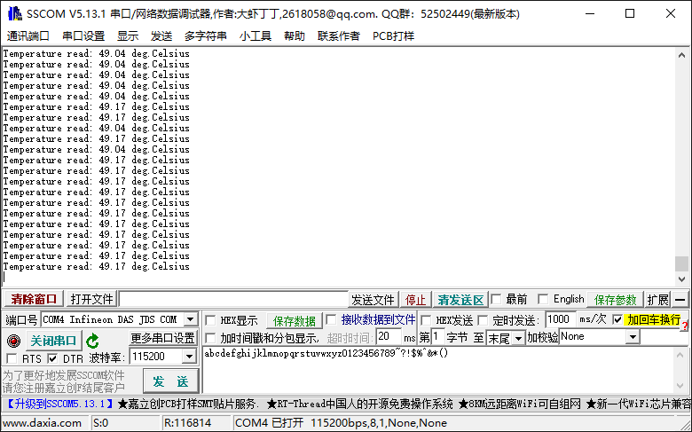

# TC397_DTS

<!-- TOC -->

- [TC397_DTS](#tc397_dts)
  - [DTS](#dts)
  - [DTS Example](#dts-example)

<!-- /TOC -->

## DTS

参考TC3XX User Manual, 11.2.1.4小节, 11.2.3.6小节, 12.2.1.4小节, 12.2.3.6小节.  

DTS, Die Temperature Sensor, 核心温度传感器. 或者DTSC, Core Die Temperature Sensor.  

DTS直接产生当前温度的测量结果. DTS可以在数据表中记录的TSR温度范围内的（TNL + TCALACC）参数范围内准确测量温度。 测量结果在DTSSTAT.RESULT寄存器位字段中定期更新，分辨率小于开尔文度的1/5。 DTS可在器件启动时冷PORST复位释放后使用，并且在正常RUN / SLEEP模式下连续进行温度测量. DTS和相应的寄存器不受PORST预热，系统或应用程序复位的影响； 因此，任何热复位后，都可以立即使用较早转换得到的DTSTAT温度结果.  

完成正在进行的温度测量后，DTSSTAT.RESULT位字段将与新值一致更新。 测量完成后可以生成中断服务请求（SRC_PMSDTS）。DTS精度和测量时间在数据表中定义.  

DTS的上限和下限在DTSLIM.UPPER和LOWER寄存器位中配置. 违反这些限制时，将设置DTSLIM.UOF和LLU状态位，并将警报转发到SMU和HSM. 启动后，必须先根据应用重新配置DTS限制，然后才能激活来自SMU或HSM的警报响应. 仅当有新的DTS转换结果可用时，DTS比较器才被触发以检查实际DTSSTAT.RESULT是否符合上下限.  

iLLD->DTS中说, DTS给出芯片温度结果，并将其解码为标准温度值. 为了获得可靠的温度，最小的前两个温度结果将被忽略.  

## DTS Example

参考 [SCU_Die_Temp_Sensor_1 for KIT_AURIX_TC397_TFT](https://www.infineon.com/dgdl/Infineon-AURIX_SCU_Die_Temp_Sensor_1_KIT_TC397_TFT-Training-v01_00-EN.pdf?fileId=5546d46272e49d2a0172e6ea90da0210)

用串口打印温度(℃), Cpu0_Main.c代码如下:  

```c
#include "Ifx_Types.h"
#include "IfxCpu.h"
#include "IfxScuWdt.h"

IFX_ALIGN(4) IfxCpu_syncEvent g_cpuSyncEvent = 0;

#include "IfxDts_Dts.h"
#include "IfxAsclin_Asc.h"
#include "Bsp.h"

#define ISR_PRIORITY_UART_TX    1       /* Priority for UART Transmit interrupt */
#define ISR_PRIORITY_UART_RX    2       /* Priority for UART Receive interrupt  */
#define ISR_PRIORITY_UART_ER    3       /* Priority for UART Error interrupt    */
#define UART_TX_BUFFER_SIZE     64      /* Transmit buffer size                 */
#define UART_RX_BUFFER_SIZE     64      /* Receive buffer size                  */

#define ASC_BAUDRATE            115200  /* UART baud rate                       */

#define ISR_PRIORITY_DTS        4       /* Priority for DTS interrupt           */
#define MIN_TEMP_LIMIT          -35     /* Lower temperature limit              */
#define MAX_TEMP_LIMIT          150     /* Upper temperature limit              */

IfxAsclin_Asc   g_asclinHandle;         /* Variable for ASCLIN UART module      */
IfxStdIf_DPipe  g_stdInterface;         /* Variable for Standard interface      */
uint8 g_uartTxBuffer[UART_TX_BUFFER_SIZE + sizeof(Ifx_Fifo) + 8];
uint8 g_uartRxBuffer[UART_RX_BUFFER_SIZE + sizeof(Ifx_Fifo) + 8];

uint8 g_isMeasureAvailable = FALSE;     /* Variable to store availability of new measurements */

IFX_INTERRUPT(ASCLIN_ISR_Tx, 0, ISR_PRIORITY_UART_TX);
void ASCLIN_ISR_Tx(void)
{
    IfxAsclin_Asc_isrTransmit(&g_asclinHandle);
}

IFX_INTERRUPT(ASCLIN_ISR_Rx, 0, ISR_PRIORITY_UART_RX);
void ASCLIN_ISR_Rx(void)
{
    IfxAsclin_Asc_isrReceive(&g_asclinHandle);
}

IFX_INTERRUPT(ASCLIN_ISR_Er, 0, ISR_PRIORITY_UART_ER);
void ASCLIN_ISR_Er(void)
{
    IfxAsclin_Asc_isrError(&g_asclinHandle);
}

IFX_INTERRUPT(DTS_ISR, 0, ISR_PRIORITY_DTS);
void DTS_ISR(void)
{
    g_isMeasureAvailable = TRUE; /* Notify the system that a new measurement is ready */
}

/* Function to initialize ASCLIN module */
void initSerialInterface(void)
{
    IfxAsclin_Asc_Config ascConf;

    IfxAsclin_Asc_initModuleConfig(&ascConf, &MODULE_ASCLIN0);          /* Fill the structure with default values    */

    /* Set the desired baudrate */
    ascConf.baudrate.baudrate = ASC_BAUDRATE;                           /* Set the baudrate in bit/s                 */

    /* ISR priorities and interrupt target */
    ascConf.interrupt.txPriority = ISR_PRIORITY_UART_TX;                /* Set the interrupt priority for tx events  */
    ascConf.interrupt.rxPriority = ISR_PRIORITY_UART_RX;                /* Set the interrupt priority for rx events  */
    ascConf.interrupt.erPriority = ISR_PRIORITY_UART_ER;                /* Set the interrupt priority for err events */
    ascConf.interrupt.typeOfService = IfxSrc_Tos_cpu0;                  /* Set the service provider responsible for
                                                                         * handling the interrupts */
    /* Pin configuration */
    const IfxAsclin_Asc_Pins pins = {
            NULL,                       IfxPort_InputMode_pullUp,       /* CTS pin not used                          */
            &IfxAsclin0_RXA_P14_1_IN,   IfxPort_InputMode_pullUp,       /* RX: select the pin connected to the USB   */
            NULL,                       IfxPort_OutputMode_pushPull,    /* RTS pin not used                          */
            &IfxAsclin0_TX_P14_0_OUT,   IfxPort_OutputMode_pushPull,    /* TX: select the pin connected to the USB   */
            IfxPort_PadDriver_cmosAutomotiveSpeed1
    };
    ascConf.pins = &pins;

    /* FIFO configuration */
    ascConf.txBuffer = g_uartTxBuffer;                                  /* Set the transmit buffer                   */
    ascConf.txBufferSize = UART_TX_BUFFER_SIZE;                         /* Set the transmit buffer size              */
    ascConf.rxBuffer = g_uartRxBuffer;                                  /* Set the receive buffer                    */
    ascConf.rxBufferSize = UART_RX_BUFFER_SIZE;                         /* Set the receive buffer size               */

    /* Init module */
    IfxAsclin_Asc_initModule(&g_asclinHandle, &ascConf);                /* Initialize ASCLIN module as UART with
                                                                         * the given configuration                   */
}

void core0_main(void)
{
    IfxCpu_enableInterrupts();
    
    /* !!WATCHDOG0 AND SAFETY WATCHDOG ARE DISABLED HERE!!
     * Enable the watchdogs and service them periodically if it is required
     */
    IfxScuWdt_disableCpuWatchdog(IfxScuWdt_getCpuWatchdogPassword());
    IfxScuWdt_disableSafetyWatchdog(IfxScuWdt_getSafetyWatchdogPassword());
    
    /* Wait for CPU sync event */
    IfxCpu_emitEvent(&g_cpuSyncEvent);
    IfxCpu_waitEvent(&g_cpuSyncEvent, 1);
    
    /* Init Serial Interface */
    initSerialInterface();
    /* Init Standard Interface */
    IfxAsclin_Asc_stdIfDPipeInit(&g_stdInterface, &g_asclinHandle);

    initTime();

    IfxDts_Dts_Config dtsConf;
    IfxDts_Dts_initModuleConfig(&dtsConf);              /* Initialize the structure with default values              */
    dtsConf.lowerTemperatureLimit = MIN_TEMP_LIMIT;     /* Set the lower temperature limit                           */
    dtsConf.upperTemperatureLimit = MAX_TEMP_LIMIT;     /* Set the upper temperature limit                           */
    dtsConf.isrPriority = ISR_PRIORITY_DTS;             /* Set the interrupt priority for new measurement events     */
    dtsConf.isrTypeOfService = IfxSrc_Tos_cpu0;         /* Set the service provider responsible for handling
                                                         * the interrupts                                            */
    IfxDts_Dts_initModule(&dtsConf);                    /* Initialize the DTS with the given configuration           */

    while(1)
    {
        if(g_isMeasureAvailable == TRUE)
        {
            /* Get the new measurement */
            float32 temperature = IfxDts_Dts_getTemperatureCelsius();

            /* Print the measured temperature */
            IfxStdIf_DPipe_print(&g_stdInterface, "Temperature read: " "%.2f" " deg.Celsius\n\r", temperature);

            /* Reset the global variable that stores availability of new measurements */
            g_isMeasureAvailable = FALSE;
        }

        waitTime(TimeConst_1s);
    }
}
```

编译运行, 默认六核心全开的暖宝宝还是给这个冬天带来一丝温暖:  


