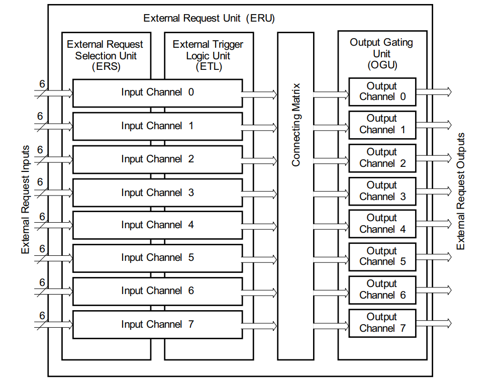
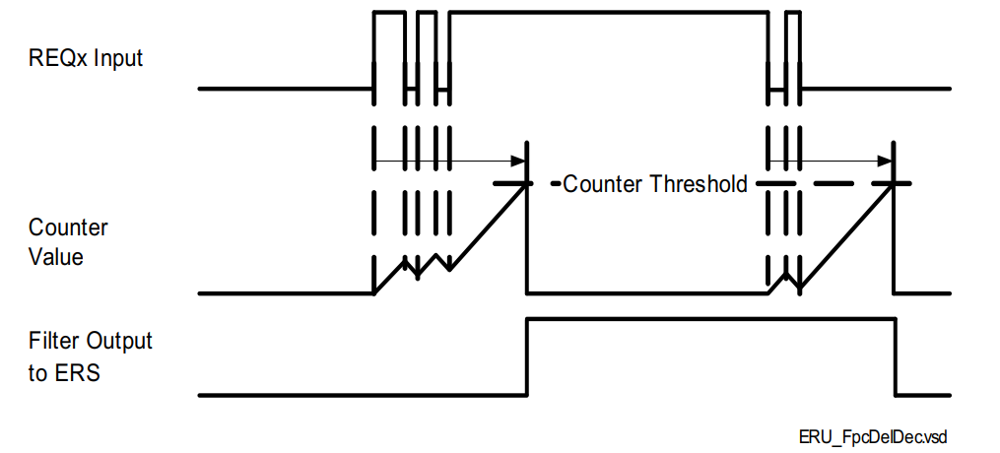
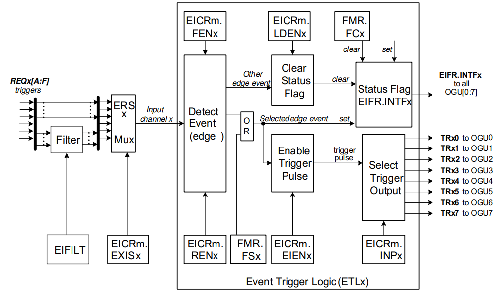
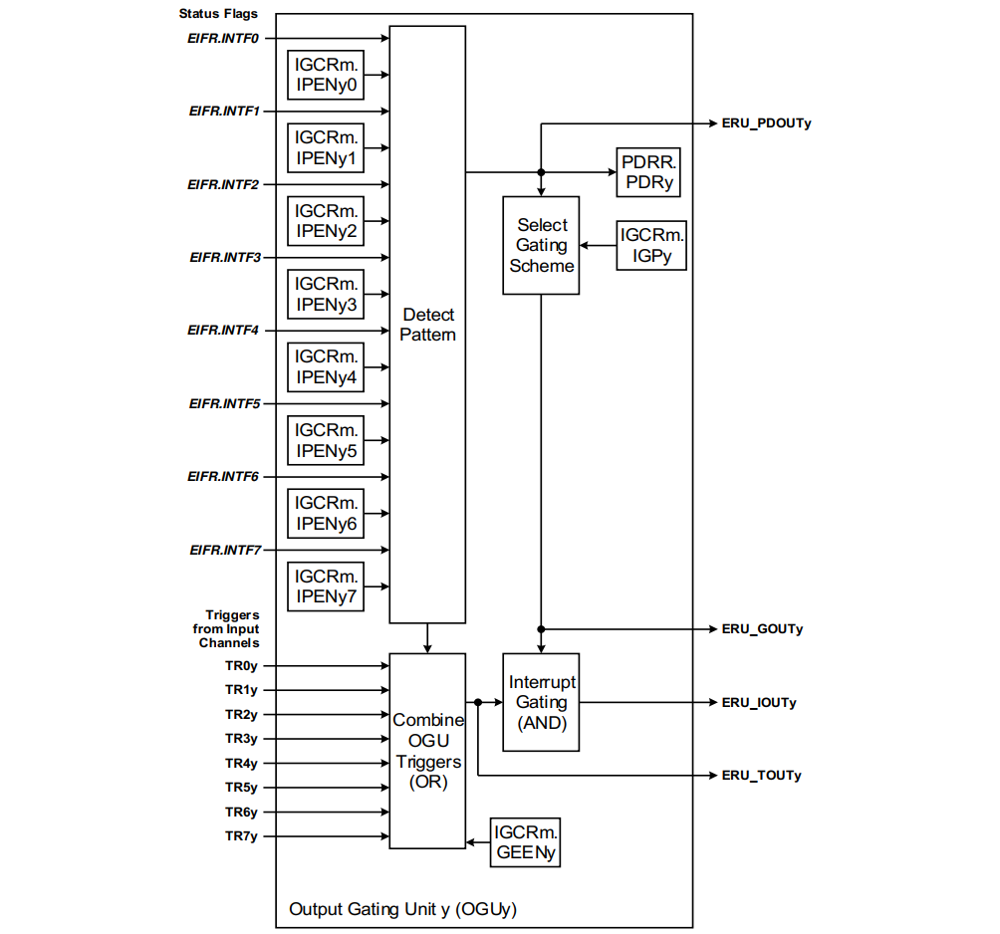
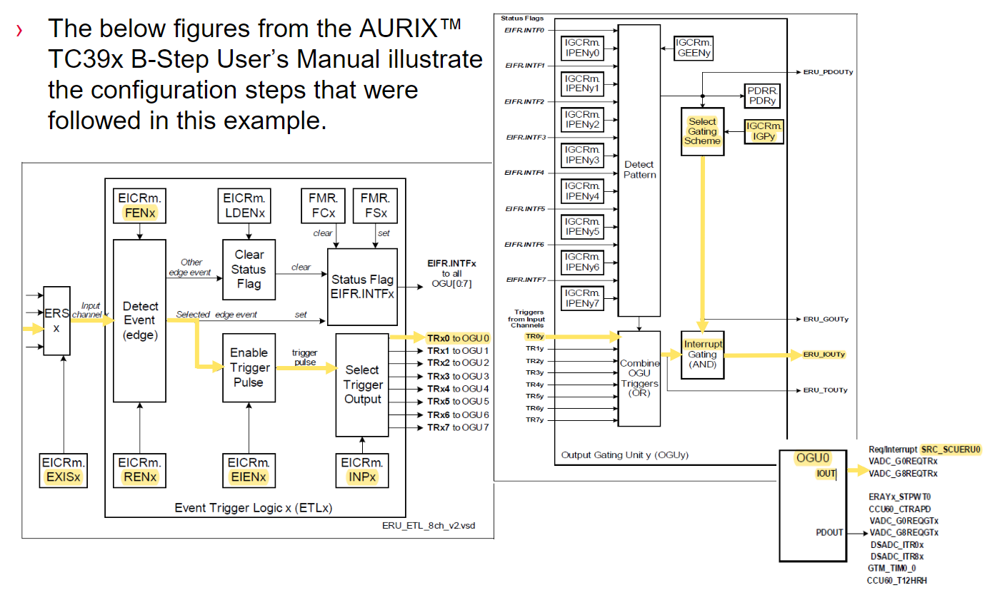

# TC397_ERU

<!-- TOC -->

- [TC397_ERU](#tc397_eru)
  - [ERU基础知识](#eru基础知识)
  - [输入外部中断引脚](#输入外部中断引脚)
  - [ERU Example](#eru-example)

<!-- /TOC -->

## ERU基础知识

参考 [AURIX™ TC3xx User Manual Part-1](infineon.com/dgdl/Infineon-AURIX_TC3xx_Part1-UserManual-v01_00-EN.pdf?fileId=5546d462712ef9b701717d3605221d96)  

ERU, Event Request Unit, 外部请求单元. TC3XX User Manual 第9章`System Control Units (SCU)` 第5小节介绍了ERU.  

先来看一下系统控制单元SCU, SCU是控制各种系统功能的子模块的集群, 包括:  

- 复位控制, Reset Control (RCU)
- 陷阱生成, Trap generation (TR)
- 其他功能的系统寄存器, System Registers for miscellaneous functions (SRU)
- 看门狗定时器, Watchdog Timers (WDT)
- 外部请求处理, External Request handling (ERU)
- 紧急停止, Emergency Stop (ES)
- 电源管理控制, Power Management Control (PMC)

这些子模块共享一个公共总线接口.  

其中, ERU用于在输入引脚的每个上升沿和下降沿生成中断:  

- ERU是多功能的事件和模式检测单元
- 它的主要任务是根据不同输入上的可选触发事件来生成中断. 比如在输入引脚边沿生成外部中断请求
- 检测到的事件还可以被其他模块用来触发或门控特定模块的动作

ERU特性列表:  

- 支持根据不同输入上的可选触发事件生成中断
- 8个独立的输入通道，用于输入选择和触发或门控功能的调节
- 具有连接矩阵的事件分发，该矩阵定义了导致输出通道y反应的输入通道x的事件
- 8个独立的输出通道，用于事件组合，事件影响的定义以及对系统的分发（例如，中断产生，定时器触发...）

TC3xx ERU相比TC2xx ERU最重要的变化是：

- 一些寄存器地址更改
- ERU输入多路复用器从每个通道的4个输入扩展到6个输入，以容纳其他触发源
- ERU REQx输入上提供可编程的数字故障过滤(Programmable digital glitch filtering)
- 能够从ERU生成SMU警报

ERU Overview:  

  

这些任务由以下构建块(building block)处理:  

- External Request Select Unit (ERSx), 每个输入通道都有一个外部请求选择单元（ERSx），可以从6个可能的可用输入中选择一个输入向量
- Event Trigger Logic (ETLx), 每个输入通道的事件触发逻辑（ETLx）允许定义导致触发事件的转换（边缘选择或通过软件），也可以存储此状态. 此处，所选信号的输入电平被转换为事件（检测到事件=置位事件标志，与原始输入信号的极性无关）
- Connecting Matrix, 连接矩阵将输入通道生成的事件和状态标志分配到输出通道
- Output Gating Unit (OGUy), 每个输出通道的输出门控单元（OGUy），结合了可用的触发事件和来自输入通道的状态信息. 一个输入通道的事件可以导致多个输出通道的反应，或者多个输入通道的事件也可以组合成一个输出通道的反应（模式检测）. 可以配置不同类型的反应，例如产生中断.  

可以从大量输入信号中选择ERU的输入, 这些输入中的**16个**直接来自输入端口，而其他输入则来自各种外围模块状态信号.  

REQxy Digital PORT Input Glitch Filter (FILT), 毛刺滤波器仅在端口(PORTS)可用, 用寄存器EIFILT配置, 用于抑制信号噪声导致PORTS的输入引脚上发生的不必要的快速转换, 类似于延时消抖. 滤波器预分频器可以设置为1到15之间的值，从而提供从**10ns ~ >2µs**的可能的毛刺特性范围, 通常，3~5 Tfilt的深度就足够了. 默认情况下，它是清除的. 如果清除了DEPTH，则所有过滤器均处于非活动状态:  



Event Trigger Logic (ETLx), 事件触发逻辑, 基于边缘检测模块，在该模块中，可以分别启用对上升沿或下降沿的检测. 如果两个使能位都被置位（例如处理触发输入），则两个边沿都会导致触发事件. 四个ETL单元中的每对都有一个关联的EICRy寄存器，该寄存器控制ETL的所有选项（该寄存器还保存关联的ERS单元对的控制位）:  

  

Output Gating Unit (OGU), 输出门控单元, 每个OGU的功能可以分成2个部分:  

- Trigger combination, 触发组合, 来自输入通道的所有触发信号TRxy（已启用并定向到OGUy）和模式更改事件（如果启用）在逻辑上进行或运算
- Pattern detection, 模式检测, 可以启用输入通道的状态标志EIFR.INTFx来参与模式检测. 设置所有启用的状态标志时，将检测到模式匹配



## 输入外部中断引脚

可用的外部中断引脚其实是非常少的, 自己设计板子的时候万万注意:  

- IfxScu_REQ0A_P15_4_IN  
- IfxScu_REQ0C_P10_7_IN  
- IfxScu_REQ1A_P14_3_IN  
- IfxScu_REQ1C_P10_8_IN  
- IfxScu_REQ2A_P10_2_IN  
- IfxScu_REQ2B_P02_1_IN  
- IfxScu_REQ2C_P00_4_IN  
- IfxScu_REQ3A_P10_3_IN  
- IfxScu_REQ3B_P14_1_IN  
- IfxScu_REQ3C_P02_0_IN  
- IfxScu_REQ4A_P33_7_IN  
- IfxScu_REQ4D_P15_5_IN  
- IfxScu_REQ5A_P15_8_IN  
- IfxScu_REQ6A_P20_0_IN  
- IfxScu_REQ6D_P11_10_IN  
- IfxScu_REQ7A_P20_9_IN  
- IfxScu_REQ7C_P15_1_IN  

## ERU Example

参考 [ERU_Interrupt_1 for KIT_AURIX_TC397_TFT](https://www.infineon.com/dgdl/Infineon-AURIX_ERU_Interrupt_1_KIT_TC397_TFT-Training-v01_00-EN.pdf?fileId=5546d46272e49d2a0172e6e108e601f4)

本例中用P02.1模拟产生方波, 连接P02.1和P02.0, 在P02.0的每一个升降沿产生中断, 中断里面翻转LED.  

本例的配置步骤如下图:  



Cpu0_Main.c代码如下:  

```c
#include "Ifx_Types.h"
#include "IfxCpu.h"
#include "IfxScuWdt.h"

IFX_ALIGN(4) IfxCpu_syncEvent g_cpuSyncEvent = 0;

#include "Ifx_Types.h"
#include "IfxSrc.h"
#include "IfxScuEru.h"
#include "Bsp.h"


#define TRIGGER_PIN                &MODULE_P02,1            /* Pin which can be controlled via debugger
                                                               to trigger interrupt                                 */
#define LED                        &MODULE_P13,0            /* LED which gets toggled in Interrupt Service Routine  */


#define ISR_PRIORITY_SCUERU_INT0   40                       /* Define the SCU ERU interrupt priority                */
#define REQ_IN                     &IfxScu_REQ3C_P02_0_IN   /* External request pin                                 */

typedef struct
{
    IfxScu_Req_In *reqPin;                      /* External request pin                                             */
    IfxScuEru_InputChannel inputChannel;        /* Input channel EICRm depending on input pin                       */
    IfxScuEru_InputNodePointer triggerSelect;   /* Input node pointer                                               */
    IfxScuEru_OutputChannel outputChannel;      /* Output channel                                                   */
    volatile Ifx_SRC_SRCR *src;                 /* Service request register                                         */
} ERUconfig;

ERUconfig g_ERUconfig;

IFX_INTERRUPT(SCUERU_Int0_Handler, 0, ISR_PRIORITY_SCUERU_INT0);
void SCUERU_Int0_Handler(void)
{
    IfxPort_setPinState(LED, IfxPort_State_toggled);                        /* Toggle LED                       */
}

void core0_main(void)
{
    IfxCpu_enableInterrupts();
    
    /* !!WATCHDOG0 AND SAFETY WATCHDOG ARE DISABLED HERE!!
     * Enable the watchdogs and service them periodically if it is required
     */
    IfxScuWdt_disableCpuWatchdog(IfxScuWdt_getCpuWatchdogPassword());
    IfxScuWdt_disableSafetyWatchdog(IfxScuWdt_getSafetyWatchdogPassword());
    
    /* Wait for CPU sync event */
    IfxCpu_emitEvent(&g_cpuSyncEvent);
    IfxCpu_waitEvent(&g_cpuSyncEvent, 1);
    
    //initLED, initPin
    IfxPort_setPinMode(LED, IfxPort_Mode_outputPushPullGeneral);
    IfxPort_setPinMode(TRIGGER_PIN, IfxPort_Mode_outputPushPullGeneral);
    IfxPort_setPinState(LED, IfxPort_State_high);
    IfxPort_setPinState(TRIGGER_PIN, IfxPort_State_high);

    initTime();

    //initERU
    /* Trigger pin */
    g_ERUconfig.reqPin = REQ_IN; /* Select external request pin */

    /* Initialize this pin with pull-down enabled
     * This function will also configure the input multiplexers of the ERU (Register EXISx)
     */
    IfxScuEru_initReqPin(g_ERUconfig.reqPin, IfxPort_InputMode_pullDown);

    /* Determine input channel depending on input pin */
    g_ERUconfig.inputChannel = (IfxScuEru_InputChannel) g_ERUconfig.reqPin->channelId;

    /* Input channel configuration */
    IfxScuEru_enableRisingEdgeDetection(g_ERUconfig.inputChannel);          /* Interrupt triggers on
                                                                               rising edge (Register RENx) and  */
    IfxScuEru_enableFallingEdgeDetection(g_ERUconfig.inputChannel);         /* on falling edge (Register FENx)  */

    /* Signal destination */
    g_ERUconfig.outputChannel = IfxScuEru_OutputChannel_0;                  /* OGU channel 0                    */
    /* Event from input ETL0 triggers output OGU0 (signal TRx0) */
    g_ERUconfig.triggerSelect = IfxScuEru_InputNodePointer_0;

    /* Connecting Matrix, Event Trigger Logic ETL block */
    /* Enable generation of trigger event (Register EIENx) */
    IfxScuEru_enableTriggerPulse(g_ERUconfig.inputChannel);
    /* Determination of output channel for trigger event (Register INPx) */
    IfxScuEru_connectTrigger(g_ERUconfig.inputChannel, g_ERUconfig.triggerSelect);

    /* Configure Output channels, OutputGating Unit OGU (Register IGPy) */
    IfxScuEru_setInterruptGatingPattern(g_ERUconfig.outputChannel, IfxScuEru_InterruptGatingPattern_alwaysActive);

    /* Service request configuration */
    /* Get source pointer depending on outputChannel (SRC_SCUERU0 for outputChannel0) */
    g_ERUconfig.src = &MODULE_SRC.SCU.SCUERU[(int) g_ERUconfig.outputChannel % 4];
    IfxSrc_init(g_ERUconfig.src, IfxSrc_Tos_cpu0, ISR_PRIORITY_SCUERU_INT0);
    IfxSrc_enable(g_ERUconfig.src);

    while(1)
    {
        IfxPort_setPinState(TRIGGER_PIN, IfxPort_State_toggled);
        waitTime(TimeConst_1s);
    }
}
```  

编译运行, 短接P02.0和P02.1, 可以看到LED每秒翻转一次.  
