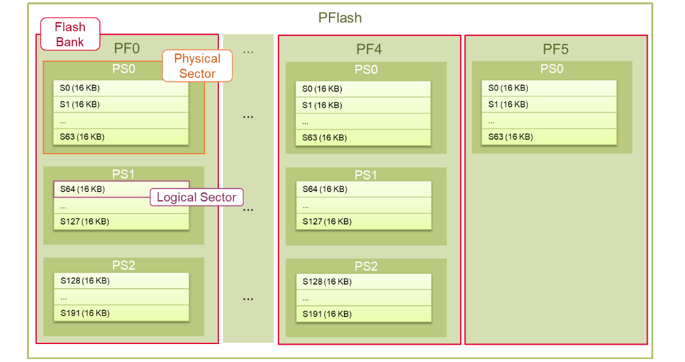
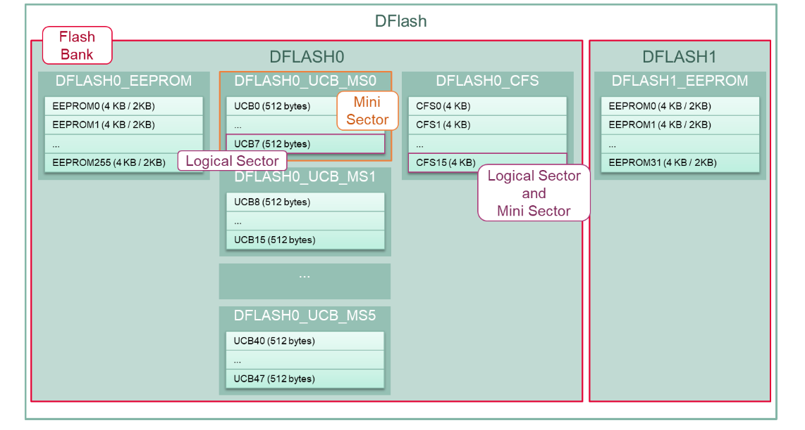
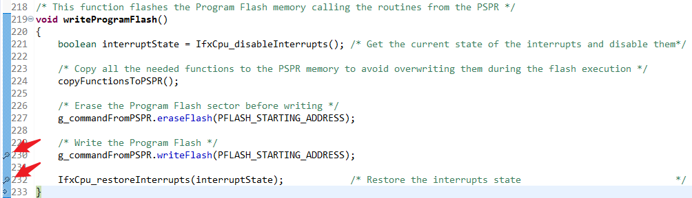
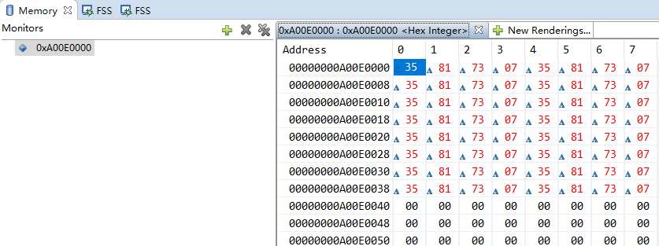
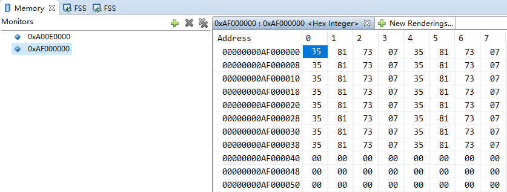

# TC397_Flash

<!-- TOC -->

- [TC397_Flash](#tc397_flash)
  - [Flash编程基础知识](#flash编程基础知识)
  - [Flash Programming](#flash-programming)

<!-- /TOC -->

## Flash编程基础知识

参考 [Flash_Programming_1 for KIT_AURIX_TC397_TFT](https://www.infineon.com/dgdl/Infineon-AURIX_Flash_Programming_1_KIT_TC397_TFT-Training-v01_00-EN.pdf?fileId=5546d46272e49d2a0172e6e11d5c01f8), 本例展示了如何烧写`PFLASH`(Program Flash memory) 和 `DFLASH`(Data Flash memory).  

- 数据存储单元(`DMU`, Data Memory Unit)控制执行在PFLASH和DFLASH上的命令序列, 连接`FSI`(Flash Standard Interface)和`PFI`(Programming Flash Interface).  
- FSI在所有闪存上执行擦除, 编程和验证操作.  
- PFI为每个PFLASH块与CPU提供唯一的点对点快速连接
- TC39x 提供 6 Program Flash Banks(PFx) 和 2 Data Flash Banks(DFx)
- TC3xx 具有相同扇区结构的PFLASH块PFx, PFx块大小可能不用: 3/2/1 Mbyte Program Flash Bank
- TC39x 有5个3MB大小的PFx(PF0...PF4) 和 1个1MB大小的PF5. 每个PFx被划分为1024KB大小的物理扇区(Physical Sectors), 每个物理扇区又被划分为16KB大小的逻辑扇区(Logical Sectors)
- TC39x具有两个数据闪存存储区DFLASH0和DFLASH1, 两者都包括多个通常用于EEPROM仿真的EEPROM扇区. 仅DFLASH0包含用于数据保护的用户配置块(UCBs, User Configuration Blocks)和1个配置扇区(CFS, Configuration Sector), 用户无法直接访问该配置扇区.
- DFLASH EEPROM可以配置为单端模式(默认)或补码检测(incomplement sensing). 根据所选模式, 每个扇区的大小分别设置为4KB和2KB
- 闪存中可以编程的最小数据量是页(Page), 程序闪存(Program Flash)页由32字节组成, 数据闪存(Data Flash)页由8字节组成
- 仅在擦除操作后才能对页面进行编程
- 可以执行擦除操作的最小单元是逻辑扇区(Logical Sector)

TC39x Program Flash Memeory:



TC39x Data Flash memory:  



所有闪存操作均通过命令序列执行, DMU具有命令序列解释器(CSI, Command Sequence Interpreter)来处理命令序列, 用于对程序闪存或数据闪存进行编程的最小命令序列如下:  

- 擦除逻辑扇区待编程
- 等待直到闪存就绪(不忙)
- 进入页面模式
- 等待直到闪存就绪(不忙)
- 加载要写入页面的数据
- 写页面
- 等待直到闪存内存已准备就绪(不忙)
  
注：执行PFLASH编程或擦除的代码不应从同一PFLASH执行  

PF0...PF5的地址映射为:  

| Address Range            | Size     | Description            | Read    | Write |
|--------------------------|----------|------------------------|---------|-------|
| A000 0000H - A02F FFFFH  | 3 Mbyte  | Program Flash 0 (PF0)  | Access  | SRIBE |
| A030 0000H - A05F FFFFH  | 3 Mbyte  | Program Flash 1 (PF1)  | Access  | SRIBE |
| A060 0000H - A08F FFFFH  | 3 Mbyte  | Program Flash 2 (PF2)  | Access  | SRIBE |
| A090 0000H - A0BF FFFFH  | 3 Mbyte  | Program Flash 3 (PF3)  | Access  | SRIBE |
| A0C0 0000H - A0EF FFFFH  | 3 Mbyte  | Program Flash 4 (PF4)  | Access  | SRIBE |
| A0F0 0000H - A0FF FFFFH  | 1 Mbyte  | Program Flash 5 (PF5)  | Access  | SRIBE |

其中, `SRIBE`: A bus access is terminated with a bus error on the SRI(SRI上的总线错误终止总线访问)

DF0...DF1的地址映射为:  
| Address Range            | Size       | Description                                               | Read    | Write    |
|--------------------------|------------|-----------------------------------------------------------|---------|----------|
| AF00 0000H - AF0F FFFFH  | 1 Mbyte    | Data Flash 0 EEPROM (DF0) Host Comd. Sequence Interpreter | Access  | Access 1)|
| AF10 0000H - AF3F FFFFH  | 3 Mbyte    | Reserved                                                  | SRIBE   | SRIBE    |
| AF40 0000H - AF40 5FFFH  | 24 Kbyte   | Data Flash 0 UCB (DF0)                                    | Access  | SRIBE    |
| AF40 6000H - AF7F FFFFH  | -          | Reserved                                                  | SRIBE   | SRIBE    |
| AF80 0000H - AF80 FFFFH  | 64 Kbyte   | Data Flash 0 CFS (DF0)                                    | Access  | SRIBE    |
| AF81 0000H - AFBF FFFFH  | -          | Reserved                                                  | SRIBE   | SRIBE    |
| AFC0 0000H - AFC1 FFFFH  | 128 Kbyte  | Data Flash 1 EEPROM (DF1) HSM Comd. Sequence Interpreter  | Access  | Access 2)|

其中:  

- 1) Host Command Sequence Interpreter(主机命令序列解释器)
- 2) HSM Command Sequence Interpreter(HSM命令序列解释器)

## Flash Programming

直接搬运官方的例程来看, 此例中, 程序闪存(PFLASH)的64个字节随后被烧写并验证. 此外, 烧写并验证了64字节的数据闪存(DFLASH). 在进行任何写操作之前, 将擦除闪存, 如果闪存烧写并验证成功, 则将打开每个测试内存的LED.  

闪存中可以编程的最小数据量是页(Page), 程序闪存(Program Flash)页由32字节组成, 数据闪存(Data Flash)页由8字节组成, 所以64字节对应PFLASH的2页, DFLASH的8页.  

Cpu0_Main.c 代码如下:  

```c
#include "Ifx_Types.h"
#include "IfxCpu.h"
#include "IfxScuWdt.h"

IFX_ALIGN(4) IfxCpu_syncEvent g_cpuSyncEvent = 0;

#include <string.h>
#include "Ifx_Types.h"
#include "IfxFlash.h"
#include "IfxCpu.h"

void initLEDs(void);            /* Function that initializes the LEDs                                               */
void writeProgramFlash(void);   /* Function that flashes the Program Flash memory calling the routines from the PSPR*/
void writeDataFlash(void);      /* Function that flashes the Data Flash memory                                      */
void verifyProgramFlash(void);  /* Function that verifies the data written in the Program Flash memory              */
void verifyDataFlash(void);     /* Function that verifies the data written in the Data Flash memory                 */

#define PFLASH_PAGE_LENGTH          IFXFLASH_PFLASH_PAGE_LENGTH /* 0x20 = 32 Bytes (smallest unit that can be
                                                                 * programmed in the Program Flash memory (PFLASH)) */
#define DFLASH_PAGE_LENGTH          IFXFLASH_DFLASH_PAGE_LENGTH /* 0x8 = 8 Bytes (smallest unit that can be
                                                                 * programmed in the Data Flash memory (DFLASH))    */
#define FLASH_MODULE                0                           /* Macro to select the flash (PMU) module           */
#define PROGRAM_FLASH_0             IfxFlash_FlashType_P0       /* Define the Program Flash Bank to be used         */
#define DATA_FLASH_0                IfxFlash_FlashType_D0       /* Define the Data Flash Bank to be used            */

#define DATA_TO_WRITE               0x07738135                  /* Dummy data to be written into the Flash memories */

#define PFLASH_STARTING_ADDRESS     0xA00E0000                  /* Address of the PFLASH where the data is written  */
#define DFLASH_STARTING_ADDRESS     0xAF000000                  /* Address of the DFLASH where the data is written  */

#define PFLASH_NUM_PAGE_TO_FLASH    2                           /* Number of pages to flash in the PFLASH           */
#define PFLASH_NUM_SECTORS          1                           /* Number of PFLASH sectors to be erased            */
#define DFLASH_NUM_PAGE_TO_FLASH    8                           /* Number of pages to flash in the DFLASH           */
#define DFLASH_NUM_SECTORS          1                           /* Number of DFLASH sectors to be erased            */

/* Reserved space for erase and program routines in bytes */
#define ERASESECTOR_LEN             (100)
#define WAITUNBUSY_LEN              (100)
#define ENTERPAGEMODE_LEN           (100)
#define LOADPAGE2X32_LEN            (100)
#define WRITEPAGE_LEN               (100)
#define ERASEPFLASH_LEN             (0x100)
#define WRITEPFLASH_LEN             (0x200)

/* Relocation address for the erase and program routines: Program Scratch-Pad SRAM (PSPR) of CPU0 */
#define RELOCATION_START_ADDR       (0x70100000U)

/* Definition of the addresses where to relocate the erase and program routines, given their reserved space */
#define ERASESECTOR_ADDR            (RELOCATION_START_ADDR)
#define WAITUNBUSY_ADDR             (ERASESECTOR_ADDR + ERASESECTOR_LEN)
#define ENTERPAGEMODE_ADDR          (WAITUNBUSY_ADDR + WAITUNBUSY_LEN)
#define LOAD2X32_ADDR               (ENTERPAGEMODE_ADDR + ENTERPAGEMODE_LEN)
#define WRITEPAGE_ADDR              (LOAD2X32_ADDR + LOADPAGE2X32_LEN)
#define ERASEPFLASH_ADDR            (WRITEPAGE_ADDR + WRITEPAGE_LEN)
#define WRITEPFLASH_ADDR            (ERASEPFLASH_ADDR + ERASEPFLASH_LEN)

/* Definition of the LEDs port pins */
#define LED1                        &MODULE_P13,0               /* LED connected to Port 13, Pin 0                  */
#define LED2                        &MODULE_P13,1               /* LED connected to Port 13, Pin 1                  */

#define MEM(address)                *((uint32 *)(address))      /* Macro to simplify the access to a memory address */

/*********************************************************************************************************************/
/*------------------------------------------------Function Prototypes------------------------------------------------*/
/*********************************************************************************************************************/
void erasePFLASH(uint32 sectorAddr);
void writePFLASH(uint32 startingAddr);
void copyFunctionsToPSPR(void);

typedef struct
{
    void (*eraseSectors)(uint32 sectorAddr, uint32 numSector);
    uint8 (*waitUnbusy)(uint32 flash, IfxFlash_FlashType flashType);
    uint8 (*enterPageMode)(uint32 pageAddr);
    void (*load2X32bits)(uint32 pageAddr, uint32 wordL, uint32 wordU);
    void (*writePage)(uint32 pageAddr);
    void (*eraseFlash)(uint32 sectorAddr);
    void (*writeFlash)(uint32 startingAddr);
} Function;

/*********************************************************************************************************************/
/*-------------------------------------------------Global variables--------------------------------------------------*/
/*********************************************************************************************************************/
Function g_commandFromPSPR;

/*********************************************************************************************************************/
/*---------------------------------------------Function Implementations----------------------------------------------*/
/*********************************************************************************************************************/
/* Function to initialize the LEDs */
void initLEDs()
{
    /* Configure LED1 and LED2 port pins */
    IfxPort_setPinMode(LED1, IfxPort_Mode_outputPushPullGeneral);
    IfxPort_setPinMode(LED2, IfxPort_Mode_outputPushPullGeneral);

    /* Turn off the LEDs (LEDs are low-level active) */
    IfxPort_setPinState(LED1, IfxPort_State_high);
    IfxPort_setPinState(LED2, IfxPort_State_high);
}

/* This function copies the erase and program routines to the Program Scratch-Pad SRAM (PSPR) of the CPU0 and assigns
 * function pointers to them.
 */
void copyFunctionsToPSPR()
{
    /* Copy the IfxFlash_eraseMultipleSectors() routine and assign it to a function pointer */
    memcpy((void *)ERASESECTOR_ADDR, (const void *)IfxFlash_eraseMultipleSectors, ERASESECTOR_LEN);
    g_commandFromPSPR.eraseSectors = (void *)ERASESECTOR_ADDR;

    /* Copy the IfxFlash_waitUnbusy() routine and assign it to a function pointer */
    memcpy((void *)WAITUNBUSY_ADDR, (const void *)IfxFlash_waitUnbusy, WAITUNBUSY_LEN);
    g_commandFromPSPR.waitUnbusy = (void *)WAITUNBUSY_ADDR;

    /* Copy the IfxFlash_enterPageMode() routine and assign it to a function pointer */
    memcpy((void *)ENTERPAGEMODE_ADDR, (const void *)IfxFlash_enterPageMode, ENTERPAGEMODE_LEN);
    g_commandFromPSPR.enterPageMode = (void *)ENTERPAGEMODE_ADDR;

    /* Copy the IfxFlash_loadPage2X32() routine and assign it to a function pointer */
    memcpy((void *)LOAD2X32_ADDR, (const void *)IfxFlash_loadPage2X32, LOADPAGE2X32_LEN);
    g_commandFromPSPR.load2X32bits = (void *)LOAD2X32_ADDR;

    /* Copy the IfxFlash_writePage() routine and assign it to a function pointer */
    memcpy((void *)WRITEPAGE_ADDR, (const void *)IfxFlash_writePage, WRITEPAGE_LEN);
    g_commandFromPSPR.writePage = (void *)WRITEPAGE_ADDR;

    /* Copy the erasePFLASH() routine and assign it to a function pointer */
    memcpy((void *)ERASEPFLASH_ADDR, (const void *)erasePFLASH, ERASEPFLASH_LEN);
    g_commandFromPSPR.eraseFlash = (void *)ERASEPFLASH_ADDR;

    /* Copy the erasePFLASH() routine and assign it to a function pointer */
    memcpy((void *)WRITEPFLASH_ADDR, (const void *)writePFLASH, WRITEPFLASH_LEN);
    g_commandFromPSPR.writeFlash = (void *)WRITEPFLASH_ADDR;
}

/* This function erases a given sector of the Program Flash memory. The function is copied in the PSPR through
 * copyFunctionsToPSPR(). Because of this, inside the function, only routines from the PSPR or inline functions
 * can be called, otherwise a Context Type (CTYP) trap can be triggered.
 */
void erasePFLASH(uint32 sectorAddr)
{
    /* Get the current password of the Safety WatchDog module */
    uint16 endInitSafetyPassword = IfxScuWdt_getSafetyWatchdogPasswordInline();

    /* Erase the sector */
    IfxScuWdt_clearSafetyEndinitInline(endInitSafetyPassword);      /* Disable EndInit protection                   */
    g_commandFromPSPR.eraseSectors(sectorAddr, PFLASH_NUM_SECTORS); /* Erase the given sector                       */
    IfxScuWdt_setSafetyEndinitInline(endInitSafetyPassword);        /* Enable EndInit protection                    */

    /* Wait until the sector is erased */
    g_commandFromPSPR.waitUnbusy(FLASH_MODULE, PROGRAM_FLASH_0);
}

/* This function writes the Program Flash memory. The function is copied in the PSPR through copyFunctionsToPSPR().
 * Because of this, inside the function, only routines from the PSPR or inline functions can be called,
 * otherwise a Context Type (CTYP) trap can be triggered.
 */
void writePFLASH(uint32 startingAddr)
{
    uint32 page;                                                /* Variable to cycle over all the pages             */
    uint32 offset;                                              /* Variable to cycle over all the words in a page   */

    /* Get the current password of the Safety WatchDog module */
    uint16 endInitSafetyPassword = IfxScuWdt_getSafetyWatchdogPasswordInline();

    /* Write all the pages */
    for(page = 0; page < PFLASH_NUM_PAGE_TO_FLASH; page++)              /* Loop over all the pages                  */
    {
        uint32 pageAddr = startingAddr + (page * PFLASH_PAGE_LENGTH);   /* Get the address of the page              */

        /* Enter in page mode */
        g_commandFromPSPR.enterPageMode(pageAddr);

        /* Wait until page mode is entered */
        g_commandFromPSPR.waitUnbusy(FLASH_MODULE, PROGRAM_FLASH_0);

        /* Write 32 bytes (8 double words) into the assembly buffer */
        for(offset = 0; offset < PFLASH_PAGE_LENGTH; offset += 0x8)     /* Loop over the page length                */
        {
            g_commandFromPSPR.load2X32bits(pageAddr, DATA_TO_WRITE, DATA_TO_WRITE); /* Load 2 words of 32 bits each */
        }

        /* Write the page */
        IfxScuWdt_clearSafetyEndinitInline(endInitSafetyPassword);      /* Disable EndInit protection               */
        g_commandFromPSPR.writePage(pageAddr);                          /* Write the page                           */
        IfxScuWdt_setSafetyEndinitInline(endInitSafetyPassword);        /* Enable EndInit protection                */

        /* Wait until the page is written in the Program Flash memory */
        g_commandFromPSPR.waitUnbusy(FLASH_MODULE, PROGRAM_FLASH_0);
    }
}

/* This function flashes the Program Flash memory calling the routines from the PSPR */
void writeProgramFlash()
{
    boolean interruptState = IfxCpu_disableInterrupts(); /* Get the current state of the interrupts and disable them*/

    /* Copy all the needed functions to the PSPR memory to avoid overwriting them during the flash execution */
    copyFunctionsToPSPR();

    /* Erase the Program Flash sector before writing */
    g_commandFromPSPR.eraseFlash(PFLASH_STARTING_ADDRESS);

    /* Write the Program Flash */
    g_commandFromPSPR.writeFlash(PFLASH_STARTING_ADDRESS);

    IfxCpu_restoreInterrupts(interruptState);            /* Restore the interrupts state                            */
}

/* This function verifies if the data has been correctly written in the Program Flash */
void verifyProgramFlash()
{
    uint32 page;                                                /* Variable to cycle over all the pages             */
    uint32 offset;                                              /* Variable to cycle over all the words in a page   */
    uint32 errors = 0;                                          /* Variable to keep record of the errors            */

    /* Verify the written data */
    for(page = 0; page < PFLASH_NUM_PAGE_TO_FLASH; page++)                          /* Loop over all the pages      */
    {
        uint32 pageAddr = PFLASH_STARTING_ADDRESS + (page * PFLASH_PAGE_LENGTH);    /* Get the address of the page  */

        for(offset = 0; offset < PFLASH_PAGE_LENGTH; offset += 0x4)                 /* Loop over the page length    */
        {
            /* Check if the data in the Program Flash is correct */
            if(MEM(pageAddr + offset) != DATA_TO_WRITE)
            {
                /* If not, count the found errors */
                errors++;
            }
        }
    }

    /* If the data is correct, turn on the LED1 */
    if(errors == 0)
    {
        IfxPort_setPinState(LED1, IfxPort_State_low);
    }
}

/* This function flashes the Data Flash memory.
 * It is not needed to run this function from the PSPR, thus functions from the Program Flash memory can be called
 * inside.
 */
void writeDataFlash()
{
    uint32 page;                                                /* Variable to cycle over all the pages             */

    /* --------------- ERASE PROCESS --------------- */
    /* Get the current password of the Safety WatchDog module */
    uint16 endInitSafetyPassword = IfxScuWdt_getSafetyWatchdogPassword();

    /* Erase the sector */
    IfxScuWdt_clearSafetyEndinit(endInitSafetyPassword);        /* Disable EndInit protection                       */
    IfxFlash_eraseMultipleSectors(DFLASH_STARTING_ADDRESS, DFLASH_NUM_SECTORS); /* Erase the given sector           */
    IfxScuWdt_setSafetyEndinit(endInitSafetyPassword);          /* Enable EndInit protection                        */

    /* Wait until the sector is erased */
    IfxFlash_waitUnbusy(FLASH_MODULE, DATA_FLASH_0);

    /* --------------- WRITE PROCESS --------------- */
    for(page = 0; page < DFLASH_NUM_PAGE_TO_FLASH; page++)      /* Loop over all the pages                          */
    {
        uint32 pageAddr = DFLASH_STARTING_ADDRESS + (page * DFLASH_PAGE_LENGTH); /* Get the address of the page     */

        /* Enter in page mode */
        IfxFlash_enterPageMode(pageAddr);

        /* Wait until page mode is entered */
        IfxFlash_waitUnbusy(FLASH_MODULE, DATA_FLASH_0);

        /* Load data to be written in the page */
        IfxFlash_loadPage2X32(pageAddr, DATA_TO_WRITE, DATA_TO_WRITE); /* Load two words of 32 bits each            */

        /* Write the loaded page */
        IfxScuWdt_clearSafetyEndinit(endInitSafetyPassword);    /* Disable EndInit protection                       */
        IfxFlash_writePage(pageAddr);                           /* Write the page                                   */
        IfxScuWdt_setSafetyEndinit(endInitSafetyPassword);      /* Enable EndInit protection                        */

        /* Wait until the data is written in the Data Flash memory */
        IfxFlash_waitUnbusy(FLASH_MODULE, DATA_FLASH_0);
    }
}

/* This function verifies if the data has been correctly written in the Data Flash */
void verifyDataFlash()
{
    uint32 page;                                                /* Variable to cycle over all the pages             */
    uint32 offset;                                              /* Variable to cycle over all the words in a page   */
    uint32 errors = 0;                                          /* Variable to keep record of the errors            */

    /* Verify the written data */
    for(page = 0; page < DFLASH_NUM_PAGE_TO_FLASH; page++)                          /* Loop over all the pages      */
    {
        uint32 pageAddr = DFLASH_STARTING_ADDRESS + (page * DFLASH_PAGE_LENGTH);    /* Get the address of the page  */

        for(offset = 0; offset < DFLASH_PAGE_LENGTH; offset += 0x4)                 /* Loop over the page length    */
        {
            /* Check if the data in the Data Flash is correct */
            if(MEM(pageAddr + offset) != DATA_TO_WRITE)
            {
                /* If not, count the found errors */
                errors++;
            }
        }
    }

    /* If the data is correct, turn on the LED2 */
    if(errors == 0)
    {
        IfxPort_setPinState(LED2, IfxPort_State_low);
    }
}

void core0_main(void)
{
    IfxCpu_enableInterrupts();
    
    /* !!WATCHDOG0 AND SAFETY WATCHDOG ARE DISABLED HERE!!
     * Enable the watchdogs and service them periodically if it is required
     */
    IfxScuWdt_disableCpuWatchdog(IfxScuWdt_getCpuWatchdogPassword());
    IfxScuWdt_disableSafetyWatchdog(IfxScuWdt_getSafetyWatchdogPassword());
    
    /* Wait for CPU sync event */
    IfxCpu_emitEvent(&g_cpuSyncEvent);
    IfxCpu_waitEvent(&g_cpuSyncEvent, 1);
    
    /* Initialize the LEDs */
    initLEDs();

    /* Flash the Program Flash memory and verify the written data */
    writeProgramFlash();
    verifyProgramFlash();

    /* Flash the Data Flash memory and verify the written data */
    writeDataFlash();
    verifyDataFlash();

    while(1)
    {
    }
}
```

编译运行程序, 两个LED亮表示Flash操作成功.  

在擦除和写PFLASH后面各打一个断点:  

  

调试运行, Memory窗口中, 添加地址`0xA00E0000`, Resume程序, 第一个断点停止, 将显示0或0xEEEEEEEE, 因为它无法读取已擦除的内存, 再Resume, 第二个断点停止后, 应显示64个字节, 内容为`0x07738135` :  



同理, DFLASH查看地址`0xAF000000`:  

