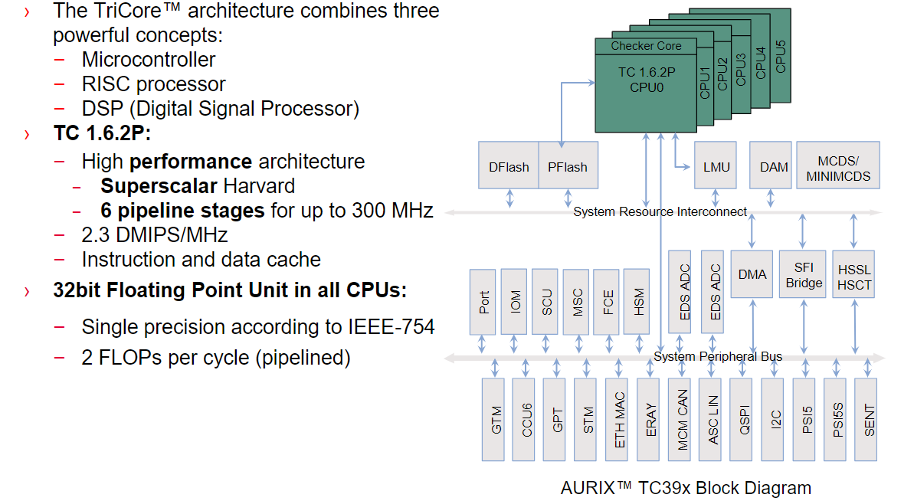
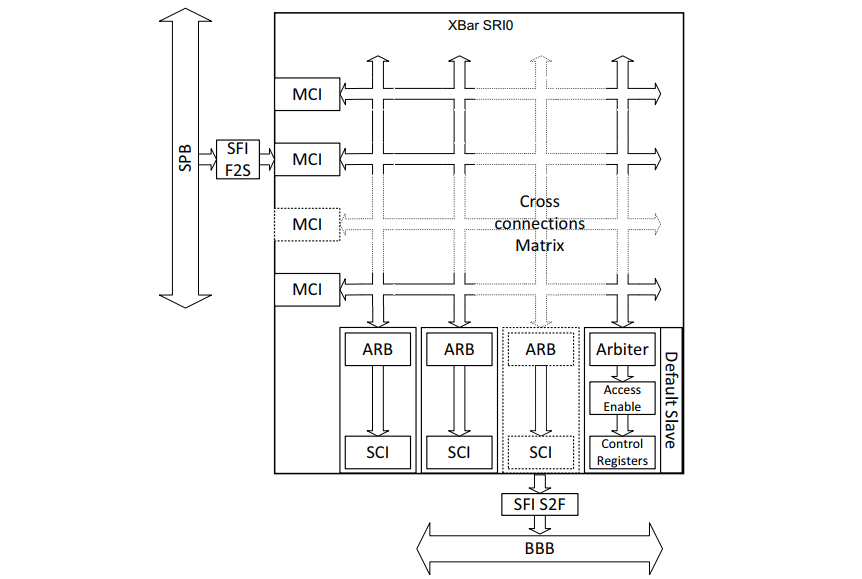
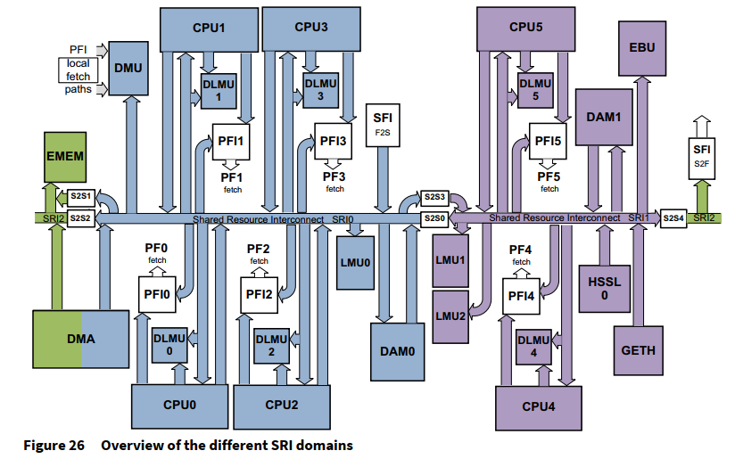
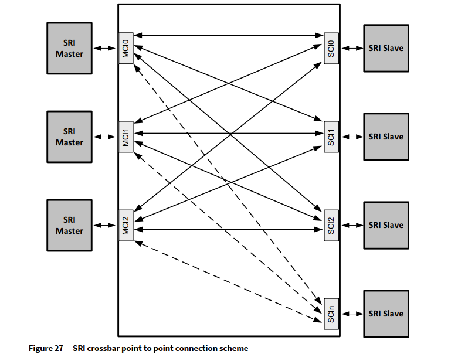
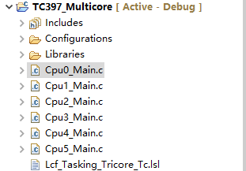

# TC397_Multicore

<!-- TOC -->

- [TC397_Multicore](#tc397_multicore)
  - [TC397 Multicore基础知识](#tc397-multicore基础知识)
  - [片上系统互联和桥](#片上系统互联和桥)
  - [多核操作遐想](#多核操作遐想)
  - [新工程](#新工程)
  - [Multicore Example](#multicore-example)

<!-- /TOC -->

## TC397 Multicore基础知识



参考[AURIX™ System Architecture](https://www.infineon.com/dgdl/Infineon-AURIX_TC3xx_System_Architecture-Training-v01_00-EN.pdf?fileId=5546d46272e49d2a0172eb476d56739e) 和 [Multicore_1 for KIT_AURIX_TC397_TFT](https://www.infineon.com/dgdl/Infineon-AURIX_Multicore_1_KIT_TC397_TFT-Training-v01_00-EN.pdf?fileId=5546d46272e49d2a0172e6ea67b70208):  

- AURIX™ TC3xx微控制器架构具有多达6个独立的处理器内核CPU0...CPU5, 可在一个统一平台上无缝托管多个应用程序和操作系统.
- 由于实现了具有独立读取接口的多个程序Flash模块, 该架构支持进一步的实时处理.
- AURIX™专为性能，安全性和安全性而设计，具有并行执行流程，锁步核心和进一步增强的硬件安全机制的功能

CPU架构;  

- 32位, 六核(TC1.6.2P TriCore), 超标量哈佛(Superscalar Harvard)架构, 2.3 DMIPS/MHz, 6级流水线, 高达300 MHz
- 所有CPU都有32位浮点单元, 符合IEEE-754的单精度, 每个周期2个FLOP(流水线)
- 数据，存储器和CPU寄存器的小端字节顺序(Little-endian byte ordering)
- 乘法和累加（MAC）指令：双16×16、16×32、32×32
- 时间保护系统，允许有时间限制的实时操作
- ...

TC1.6.2P实现:  

- 大多数指令在1个周期内执行
- 1、2或3个周期的分支指令（使用动态分支预测）
- 宽内存接口，用于快速上下文切换
- 上下文自动进入保存和退出恢复：子例程，中断，陷阱
- 六个存储器保护寄存器组
- 双指令发布（并行进入整数管道和加载/存储管道）
- 第三条流水线仅用于循环指令（零开销循环）
- 单精度浮点单元（兼容IEEE-754）
- 专用整数除法单元
- 18个数据存储器保护范围，10个代码存储器保护范围，分为6组

## 片上系统互联和桥

这一部分手册的内容直接机翻了. 至于怎么用, 这节先不管, 有个概念即可.  

AURIX™ TC3xx平台具有三个独立的片上连接资源：

- 系统资源互连结构(System Resource Interconnect Fabric, `SRI` Fabric)
- 系统外设总线(System Peripheral Bus, SPB))
- 骨干总线(Back Bone Bus, BBB)


  
SRI Fabric将TriCore CPU, DMA模块和其他高带宽请求者连接到高带宽存储器和其他资源用于指令提取和数据访问.  

SPB将TriCore CPU, DMA模块和其他SPB主设备连接到中低带宽外设, SPB主服务器不会直接连接到SRI Fabric，而是将通过SRI_F2S桥访问SRI附加的资源.  

BBB将TriCore CPU, DMA模块和SPB主站与ADAS资源相连. 主SRI不直接连接到BBB, 但通过SFI_S2F桥接器访问BBB连接的资源.  

SRI连接TriCore CPU和高性能模块如DMA等. 结构的关键组件是SRI交叉开关, 它将所有代理(agent)连接到一个SRI域. SRI交叉开关承载域的SRI主站和SRI从站之间的事务. SRI交叉开关支持不同SRI主代理和SRI从代理之间的并行事务. 除了并发请求的并行性, 它还支持从SRI主设备到SRI从设备的流水线请求. SRI功能概述：

- 单次和突发读取和写入事务(最多4个64位突发)
- 原子读取修改写入事务
- 从SRI Masters到SRI Slave的管道事务(Pipelined transactions)
- 每个SRI从站的仲裁器(Arbiter)，具有单独的配置: 两个循环分组，高优先级和低优先级; 控制高优先级组的带宽
- 从SRI主站传输到SRI从站的所有地址和控制信息上的EDC(错误检测代码): 从SRI主站传输到SRI从站以进行写入和RMW的所有数据和控制信息的EDC; 从SRI从站传输到SRI主站以进行读取和RMW的所有数据和控制信息的EDC  

与以前的基于AURIX™的产品相比，AURIX连接性的主要差异:  

- SRI Fabric现在可以包含一个或多个独立的交叉开关
- SRI Crossbar仲裁方案简化为两层轮询(round-robin)



上图的解释:  

- SRI Fabric由一个或多个交叉开关组成, 这些交叉开关支持单次和突发数据传输. 如果有多个交叉开关, 它们通过桥连接(S2S桥).  
- 连接到同一交叉开关的SRI代理(主从))形成SRI域(domain), TC39xB有3个域: SRI0(4个CPU), SRI1(2个CPU), SRI2(ADAS/调试)
- S2S桥的特殊之处在于它们存在于两个域中. 由于S2S桥接, 所有SRI主站都可以直接寻址(访问)大多数SRI从站(不是全部的原因: 即使在单个SRI域中, 也可能存在未连接的主从, 因为没有功能交流需求)



上图的解释:  

- SRI交叉开关提供SRI主连接接口(MCIx), 用于连接SRI主模块和SRI从站连接接口(SCIx)
- SCIx用于将SRI从站模块连接到SRI交叉开关
- 每个SRI Slave和结构的连接都有一个仲裁器, 用于读/写数据路径
- SRI Fabric至少包括一个提供管家(housekeeping)功能的Slave, 主要目地是为了允许访问SRI Fabric控制和状态寄存器, 第二个目的是响应(有错误)所有不针对其他SRI Slave的SRI事务
- 只需要实现系统所需的那些SRI主站到SRI从站连接功能, 例如, 来自另一个域的S2S Master不需要连接到连接回同一域的S2S Slave
- SRI结构提供了仲裁功能，使每个SRI Master优先级配置不同于每一个SRI Slave. 为了支持系统级诊断, SRI Fabric包含捕获SRI错误和SRI Transaction ID错误

名词的解释:  

| Term              | Description                                                                                                                                                                                                                                                                                                                     |
|-------------------|---------------------------------------------------------------------------------------------------------------------------------------------------------------------------------------------------------------------------------------------------------------------------------------------------------------------------------|
| Agent 代理,媒介       | An SRI agent is any master or slave device which is connected to the SRI Fabric.                                                                                                                                                                                                                                                |
| Master 主          | An SRI master device is an SRI agent which is able to initiate transactions on the SRI Fabric.                                                                                                                                                                                                                                  |
| Slave 从           | An SRI slave device is an SRI agent which is not able to initiate transactions on the SRI. It is only able to respond to transactions operations that are directed to it by the SRI Fabric.                                                                                                                                     |
| SRI crossbar 交叉开关 | The SRI crossbar provides the interconnects between Masters and Slaves in the same domain. The SRI crossbar includes arbitration mechanisms and error capture capabilities.                                                                                                                                                     |
| MCI  主连接接口        | Each Master is connected via one Master Connection Interface. The SRI Fabric contains control and status registers which affect MCI priority and provide related error information.                                                                                                                                             |
| SCI  从连接接口        | Each Slave is connected via one Slave Connection Interface. The SRI Fabric contains control and status registers which include control and error informations related to the SCI.                                                                                                                                               |
| Domain  域         | An SRI domain consists of those agents which are connected to a specific SRI crossbar. There will be at least one Master (or S2S bridge acting as a Master) and at least one Slave (or S2S bridge acting as a Slave), and an instance of a crossbarproviding full or partial connectivity between all the agents in the domain. |
| Arbiter 仲裁        | If two (or more) Masters attempt to access the same Slave, the arbiter provides the decisions as to the order in which Masters gain access. The order is determined by the two-level round-robin mechanism implemented in the arbiter and the configuration programmed by the user.                                             |

## 多核操作遐想

拍脑袋能想出来的一般多核注意事项:  

- 外设是公共的, 被一个CPU占用, 其它CPU最好不占用该外设
- 如果多个CPU共享一个外设, 外设只在一个CPU初始化后, 再在其它CPU进行操作. 最好不要同时写, 或者一个写其它读
- 至少可以用共享内存的方法进行多核通信?

`英飞凌多和单片机应用技术`一书中, 以TC2x举例:  

- 单核MCU工作模式有三种: 复位(Reset), 运行(Run), 待机(Idle)
- 多核MCU工作模式有四种: 复位(Reset), HALT, 运行(Run), 待机(Idle)

CPU0外的其它CPU上电后会保持在HALT暂停状态, 需要通过CPU0设置它们的PC程序指针寄存器, 设置HALT相应的位, 从HALT状态切换到RUN状态.  

## 新工程

我们打开 AURIX Development Studio, File -> New -> New AURIX Project, 新建的空工程默认就有6个Main.c文件对应6个CPU:  



Cpu0_Main.c 内容默认为:  

```c
#include "Ifx_Types.h"
#include "IfxCpu.h"
#include "IfxScuWdt.h"

IFX_ALIGN(4) IfxCpu_syncEvent g_cpuSyncEvent = 0;

void core0_main(void)
{
    IfxCpu_enableInterrupts();
    
    /* !!WATCHDOG0 AND SAFETY WATCHDOG ARE DISABLED HERE!!
     * Enable the watchdogs and service them periodically if it is required
     */
    IfxScuWdt_disableCpuWatchdog(IfxScuWdt_getCpuWatchdogPassword());
    IfxScuWdt_disableSafetyWatchdog(IfxScuWdt_getSafetyWatchdogPassword());
    
    /* Wait for CPU sync event */
    IfxCpu_emitEvent(&g_cpuSyncEvent);
    IfxCpu_waitEvent(&g_cpuSyncEvent, 1);
    
    while(1)
    {
    }
}
```

Cpu1_Main.c 内容默认为:  

```c
#include "Ifx_Types.h"
#include "IfxCpu.h"
#include "IfxScuWdt.h"

extern IfxCpu_syncEvent g_cpuSyncEvent;

void core1_main(void)
{
    IfxCpu_enableInterrupts();
    
    /* !!WATCHDOG1 IS DISABLED HERE!!
     * Enable the watchdog and service it periodically if it is required
     */
    IfxScuWdt_disableCpuWatchdog(IfxScuWdt_getCpuWatchdogPassword());
    
    /* Wait for CPU sync event */
    IfxCpu_emitEvent(&g_cpuSyncEvent);
    IfxCpu_waitEvent(&g_cpuSyncEvent, 1);
    
    while(1)
    {
    }
}
```

其中:  

- `IFX_ALIGN(4) IfxCpu_syncEvent g_cpuSyncEvent = 0;` 定义在CPU0的Main.c中, 在其它CPU中被引用. 一种共享内存的方法用于核间通信
- 各个CPU进来先开中断, 关自己的看门狗
- `IfxCpu_waitEvent` 该函数将一直等到所有内核在事件中都设置了它们相应的位. 该函数与`IfxCpu_emitEvent`一起用于实现已配置内核之间的同步, 默认情况下，为所有内核定义`IFXCPU_CFG_ALLCORE_DONE`宏
- 如果一个外设被多个CPU用, 其初始化可以放在`Cpu0_Main.c`中 `/* Wait for CPU sync event */` 注释上面的地方.  

## Multicore Example

点灯为例, 如果一个核操作一个LED翻转, 互不干涉, 直接在各个Cpux_Main.c初始化延时翻转即可, 不存在冲突. 官方给的这个例子是3个核控制一个LED: 

- 3个CPU都可以访问全局变量标志位
- Cpu0在其他CPU RUN之前初始化LED, while中判断标志位打开LED
- Cpu1 While中判断标志位关闭LED
- Cpu3 While中延时翻转标志位

Cpu0_Main.c 内容(注意LED初始化放到其它CPU初始化之前):  

```c
#include "Ifx_Types.h"
#include "IfxCpu.h"
#include "IfxScuWdt.h"

IFX_ALIGN(4) IfxCpu_syncEvent g_cpuSyncEvent = 0;

#define LED    &MODULE_P13, 0   /* LED D107 */
uint16 g_turnLEDon = FALSE;     /* Variable for the LED, CPU0 and CPU1 are toggling the LED depending on its state  */

void core0_main(void)
{
    IfxCpu_enableInterrupts();
    
    /* !!WATCHDOG0 AND SAFETY WATCHDOG ARE DISABLED HERE!!
     * Enable the watchdogs and service them periodically if it is required
     */
    IfxScuWdt_disableCpuWatchdog(IfxScuWdt_getCpuWatchdogPassword());
    IfxScuWdt_disableSafetyWatchdog(IfxScuWdt_getSafetyWatchdogPassword());
    
    //initLED
    IfxPort_setPinHigh(LED);
    IfxPort_setPinMode(LED, IfxPort_Mode_outputPushPullGeneral);

    //Initialize the time constants
    initTime();

    /* Wait for CPU sync event */
    IfxCpu_emitEvent(&g_cpuSyncEvent);
    IfxCpu_waitEvent(&g_cpuSyncEvent, 1);
    
    while(1)
    {
        if(g_turnLEDon == TRUE)
        {
            IfxPort_setPinLow(LED);     /* Turn on the LED (LED is low-level active)    */
        }
    }
}
```

Cpu1_Main.c 内容:  

```c
#include "Ifx_Types.h"
#include "IfxCpu.h"
#include "IfxScuWdt.h"

extern IfxCpu_syncEvent g_cpuSyncEvent;

#ifndef LED
#define LED    &MODULE_P13, 0
#endif
extern uint16 g_turnLEDon;

void core1_main(void)
{
    IfxCpu_enableInterrupts();
    
    /* !!WATCHDOG1 IS DISABLED HERE!!
     * Enable the watchdog and service it periodically if it is required
     */
    IfxScuWdt_disableCpuWatchdog(IfxScuWdt_getCpuWatchdogPassword());
    
    /* Wait for CPU sync event */
    IfxCpu_emitEvent(&g_cpuSyncEvent);
    IfxCpu_waitEvent(&g_cpuSyncEvent, 1);
    
    while(1)
    {
        if(g_turnLEDon == FALSE)
        {
            IfxPort_setPinHigh(LED);    /* Turn off the LED (LED is low-level active)   */
        }
    }
}
```

Cpu2_Main.c 内容:  

```c
#include "Ifx_Types.h"
#include "IfxCpu.h"
#include "IfxScuWdt.h"

extern IfxCpu_syncEvent g_cpuSyncEvent;

#include "Bsp.h"
#ifndef LED
#define LED    &MODULE_P13, 0
#endif
extern uint16 g_turnLEDon;

void core2_main(void)
{
    IfxCpu_enableInterrupts();
    
    /* !!WATCHDOG2 IS DISABLED HERE!!
     * Enable the watchdog and service it periodically if it is required
     */
    IfxScuWdt_disableCpuWatchdog(IfxScuWdt_getCpuWatchdogPassword());
    
    /* Wait for CPU sync event */
    IfxCpu_emitEvent(&g_cpuSyncEvent);
    IfxCpu_waitEvent(&g_cpuSyncEvent, 1);
    
    while(1)
    {
        g_turnLEDon = !g_turnLEDon;     /* Toggle the state of the global variable      */
        wait(TimeConst_1s);
    }
}
```

当然, define或者全局变量的extern可以放到一个公共的头文件如`Multicore.h`中, 然后所有.c包含即可.  

编译运行, LED每s翻转一次状态.  
