# TC397_Timer_PWM

<!-- TOC -->

- [TC397_Timer_PWM](#tc397_timer_pwm)
  - [Timer/PWM资源](#timerpwm资源)
  - [STM](#stm)
  - [GTM](#gtm)
  - [GPT12](#gpt12)
  - [CCU6](#ccu6)
  - [参考](#参考)

<!-- /TOC -->

## Timer/PWM资源

TC397有下列Timer/PWM资源:  

- 6x STM
- GTM
- 1x GPT12
- 1x CCU6

## STM

STM, System Timer, 系统定时器, 64bit计数器, 6个STM意味着6个核每个都可以有自己的**时基定时器**, 用于各自的RTOS

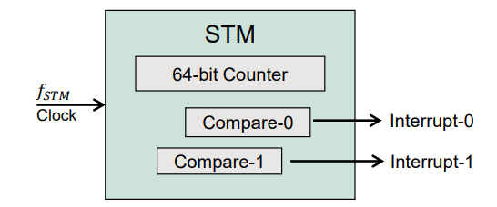

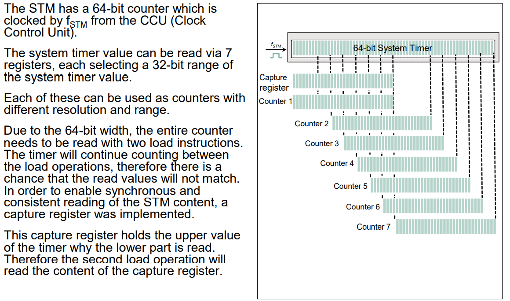

## GTM

GTM, Generic Timer Module, 通用定时器模块, 24bit分辨率, 10ns精度, 可以用于**PWM输出, 脉冲捕获, 电机控制(包括BLDC)**等.  

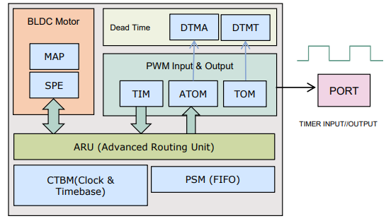

内建的先进的路由单元ARU, 遵循循环调度, 用于交换子模块之间的特定数据. 循环时间固定所以调度确定, 不需要内部中断机制就可以交换数据  

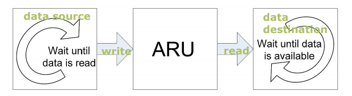

支持无刷电机, 在定时器输入输出模块(Timer input and output modules,
TIM/(A)TOM )之间有信号模式评估(Signal pattern evaluation, SEU)子模块:  

- 硬件的模式匹配算法
- 旋转方向和有效性校测
- 能在特定的旋转上生成中断

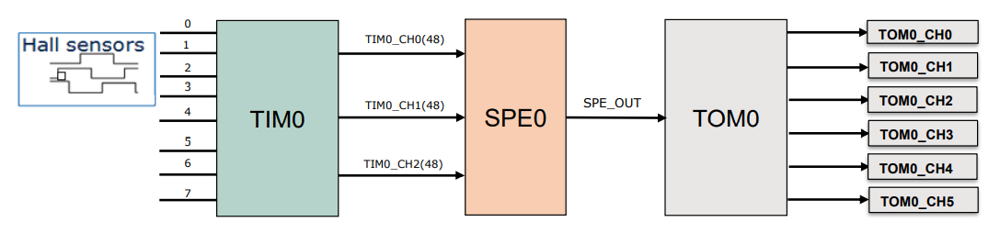

CTBM(Common time-base module)子模块中的TBU(Time base unit)提供了公共的时基, 为同步GTM中不同子模块的事件(event)提供了可能:  

- 输入事件来自TBU的时间戳
- 用TBU的时间戳作为参考, 实现不同定时器输出事件的同步开始

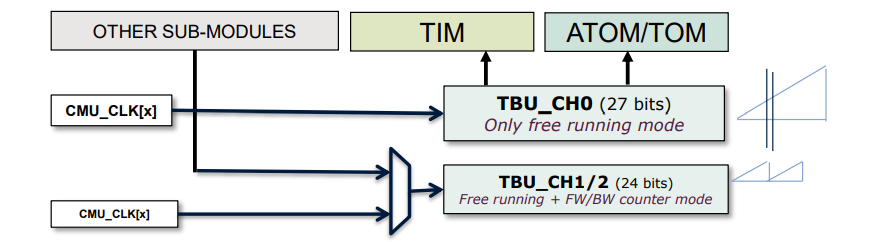

GTM提供了其他外设的柔性连接:  

- 多端口的PWM输入输出
- ADCs的触发输入, 从ADC到GTM-TIM/DTMx的服务请求事件输入
- SENT, CAN, MSC 和 PSi5/PSi5S 的触发输入
- 定时器输出直接内部连接CCU6的输入进行测量

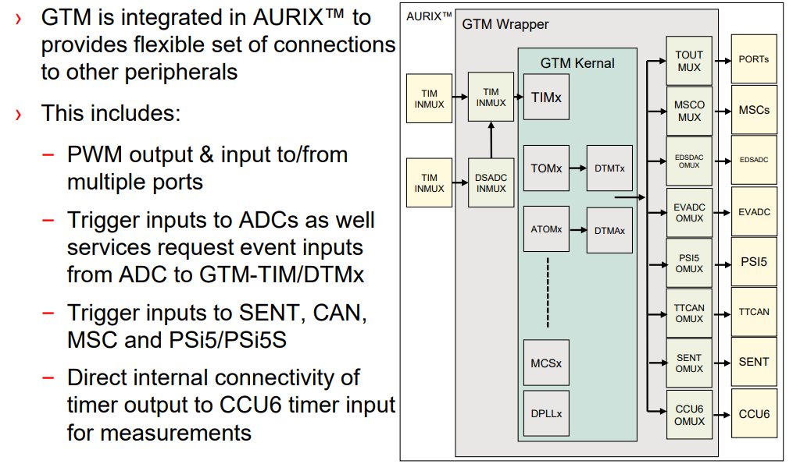

以数字PWM输出为例:  

- 16通道-16bit, 8通道-24bit分辨率, 10ns精度
- ATOM有多种模式, 支持不同的PWM输出
- 用ATOM的ARU接收数据
- 优势1: Dynamic PWM generation with input of period/duty via the ARU
- 优势2: 通道计数器可以通过前身(predecessor)被触发或复位, 用一个参考通道实现多个通道的控制

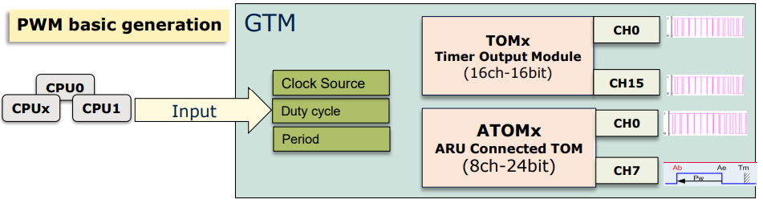

再以数字输入捕获为例:  

- 每个定时器输入模块(TIM)有8个独立的通道, 用于输入捕获或者测量, 每通道有独立的滤波器模块
- 多重模式支持不同的测量, 包括周期/占空比, 所需活动边沿的时间戳
- 优势1: 输入PWM毛刺的硬件数字滤波器
- 优势2: 每个通道可以用TDU(Timeout Detection Unit)实现超时检测
- 优势3: TIM通道输出结果通过ARU路由到其它子模块, 无需中断

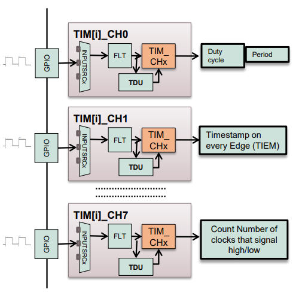

## GPT12

GPT12, General Purpose Timer Unit, 用于定时, 计数, 脉宽测量和脉冲产生等, 5个16bit定时器组成了2个定时器块GPT1和GPT2. 完美适合**带编码器的电机应用**  

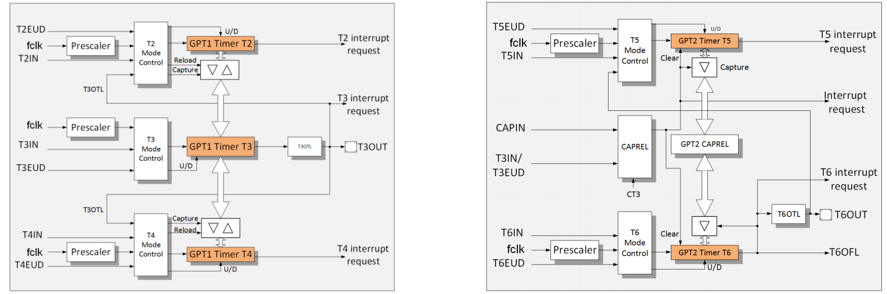

增量接口模式--转速较低时:  

- 每个检测边缘产生中断
- 可以用于捕获运行时间, 启动速度的算法控制

增量接口模式--检测旋转方向:  

- 状态位指示电流方向
- 状态位指示方向改变
- 方向改变时产生中断以快速响应
- T0事件(电机的机械零位)时, 复位或者装载计数器

增量接口模式--状态标志是独立的, 与中断无关, 控制GPT12无需中断.  

T2~T6每个定时器有一个输入引脚, 用于门控或者技术输入, 而且T3和T6各自有一个输出引脚用于输出翻转锁存(Output Toggle Latch).  

以无刷电机为例, 电机配有一个编码器, 输出A,B,T0信号, A和B是有90度相位差的方波, T0每圈产生1个用于同步的方波:  

- 电机转子位置的准确位置可以用于正确的换相模式
- GPT1提供正确的位置, 无需附加软件

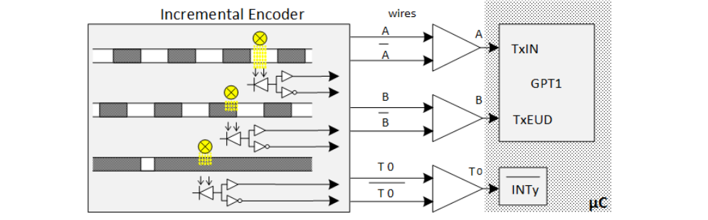

## CCU6

## 参考

- [AURIX STM](https://www.infineon.com/dgdl/Infineon-AURIX_System_Timer-Training-v01_00-EN.pdf?fileId=5546d46269bda8df0169ca92e404259c)  
- [AURIX GTM](https://www.infineon.com/dgdl/Infineon-AURIX_Generic_Timer_Module-Training-v01_00-EN.pdf?fileId=5546d46269bda8df0169ca6e2c652546)
- 

