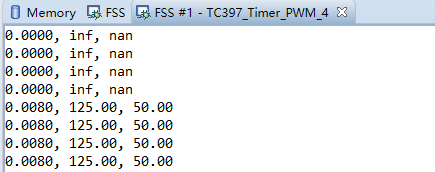

# TC397_Timer_PWM_2

<!-- TOC -->

- [TC397_Timer_PWM_2](#tc397_timer_pwm_2)
  - [STM_Interrupt](#stm_interrupt)
  - [STM_System_Time](#stm_system_time)
  - [GTM_ATOM_PWM](#gtm_atom_pwm)
  - [GTM_ATOM_Interrupt](#gtm_atom_interrupt)
  - [GTM_TOM_PWM](#gtm_tom_pwm)
  - [GTM_TIM_Capture](#gtm_tim_capture)

<!-- /TOC -->

TC397有下列Timer/PWM资源:  

- 6x STM
- GTM
- 1x GPT12
- 1x CCU6

## STM_Interrupt

下面`Cpu0_Main.c`的代码, STM配置每500ms触发一次中断, 中断中翻转LED:  

- STM是一个自由运行的64bit计数器, 先声明结构体`IfxStm_CompareConfig g_STMConf;`, 初始化结构体;
- 设置中断优先级 `g_STMConf.triggerPriority`
- 设置服务对象是哪个CPU核 `g_STMConf.typeOfService = IfxSrc_Tos_cpu0;`
- 设置初次中断计数 `g_STMConf.ticks`
- 用上面的配置对STM初始化 `IfxStm_initCompare(STM, &g_STMConf);`
- 中断中更新比较寄存器值来触发下一次中断 `IfxStm_increaseCompare();`

```c
#include "Ifx_Types.h"
#include "IfxCpu.h"
#include "IfxScuWdt.h"

#include "Bsp.h"
#include "IfxPort.h"
#include "IfxStm.h"

#define ISR_PRIORITY_STM        40                              /* Priority for interrupt ISR                       */
#define TIMER_INT_TIME          (uint32)(TimeConst_100ms * 5)   /* Time between interrupts (500 ms)                 */

#define LED                     &MODULE_P13,0                   /* LED toggled in Interrupt Service Routine (ISR)   */
#define STM                     &MODULE_STM0                    /* STM0 is used in this example                     */

IfxStm_CompareConfig g_STMConf;                                 /* STM configuration structure                      */

IFX_ALIGN(4) IfxCpu_syncEvent g_cpuSyncEvent = 0;

/* Macro to define Interrupt Service Routine.
 * This macro makes following definitions:
 * 1) Define linker section as .intvec_tc<vector number>_<interrupt priority>.
 * 2) define compiler specific attribute for the interrupt functions.
 * 3) define the Interrupt service routine as ISR function.
 *
 * IFX_INTERRUPT(isr, vectabNum, priority)
 *  - isr: Name of the ISR function.
 *  - vectabNum: Vector table number.
 *  - priority: Interrupt priority. Refer Usage of Interrupt Macro for more details.
 */
IFX_INTERRUPT(isrSTM, 0, ISR_PRIORITY_STM);

void isrSTM(void)
{
    /* Update the compare register value that will trigger the next interrupt and toggle the LED */
    IfxStm_increaseCompare(STM, g_STMConf.comparator, TIMER_INT_TIME);
    IfxPort_setPinState(LED, IfxPort_State_toggled);
}

void core0_main(void)
{
    IfxCpu_enableInterrupts();
    
    /* !!WATCHDOG0 AND SAFETY WATCHDOG ARE DISABLED HERE!!
     * Enable the watchdogs and service them periodically if it is required
     */
    IfxScuWdt_disableCpuWatchdog(IfxScuWdt_getCpuWatchdogPassword());
    IfxScuWdt_disableSafetyWatchdog(IfxScuWdt_getSafetyWatchdogPassword());
    
    /* Wait for CPU sync event */
    IfxCpu_emitEvent(&g_cpuSyncEvent);
    IfxCpu_waitEvent(&g_cpuSyncEvent, 1);
    
    //=================================================================
    initTime();                                     /* Initialize time constants */

    //initLED
    IfxPort_setPinMode(LED, IfxPort_Mode_outputPushPullGeneral);    /* Initialize LED port pin                      */
    IfxPort_setPinState(LED, IfxPort_State_high);                   /* Turn off LED (LED is low-level active)       */

    //initSTM
    IfxStm_initCompareConfig(&g_STMConf);           /* Initialize the configuration structure with default values   */
    g_STMConf.triggerPriority = ISR_PRIORITY_STM;   /* Set the priority of the interrupt                            */
    g_STMConf.typeOfService = IfxSrc_Tos_cpu0;      /* Set the service provider for the interrupts                  */
    g_STMConf.ticks = TIMER_INT_TIME;               /* Set the number of ticks after which the timer triggers an
                                                     * interrupt for the first time                                 */
    IfxStm_initCompare(STM, &g_STMConf);            /* Initialize the STM with the user configuration               */

    while(1)
    {
    }
}
```

参考自 [STM_Interrupt_1 for KIT_AURIX_TC397_TFT](https://www.infineon.com/dgdl/Infineon-AURIX_STM_Interrupt_1_KIT_TC397_TFT-Training-v01_00-EN.pdf?fileId=5546d46272e49d2a0172e6fcd9870222)  

## STM_System_Time

另一个例子是 [STM_System_Time_1](https://www.infineon.com/dgdl/Infineon-AURIX_STM_System_Time_1_KIT_TC397_TFT-Training-v01_00-EN.pdf?fileId=5546d46272e49d2a0172e6fce27f0224), 用STM模块得到当前的开机时间(days:hours:minutes:seconds, 从复位开始计数), 储存在一个结构体中:  

- 秒数 = 滴答数(ticks) / STIM频率 = IfxStm_get() / IfxStm_getFrequency();
- 用秒数换算天,时,分,秒.

Cpu0_Main.c 代码如下, 用串口0打印出来:  

```c
#include "Ifx_Types.h"
#include "IfxCpu.h"
#include "IfxScuWdt.h"

#include "Bsp.h"
#include "IfxPort.h"
#include "IfxStm.h"

#include "IfxAsclin_Asc.h"
#include "IfxCpu_Irq.h"
#include "Ifx_Console.h"

//STM
#define ISR_PRIORITY_STM        40                              /* Priority for interrupt ISR                       */
#define TIMER_INT_TIME          (uint32)(TimeConst_100ms * 10)   /* Time between interrupts (500 ms)                 */
#define LED                     &MODULE_P13,0                   /* LED toggled in Interrupt Service Routine (ISR)   */
#define STM                     &MODULE_STM0                    /* STM0 is used in this example                     */
IfxStm_CompareConfig g_STMConf;                                 /* STM configuration structure                      */

#define DAY_IN_SECONDS      86400                               /* Define the number of seconds in one day      */
#define HOURS_IN_SECONDS    3600                                /* Define the number of seconds in one hour     */
#define MIN_IN_SECONDS      60                                  /* Define the number of seconds in one minute   */

typedef struct
{
    uint64 totalSeconds;                            /* Total seconds since the last reset of the microcontroller    */
    uint64 days;                                    /* Number of days                                               */
    uint64 hours;                                   /* Number of hours                                              */
    uint64 minutes;                                 /* Number of minutes                                            */
    uint64 seconds;                                 /* Number of seconds                                            */
} systemTime;
systemTime g_time;                                      /* Instance of the structure time to store the system time  */

//UART
#define SERIAL_BAUDRATE0         115200
#define SERIAL_PIN_RX0           IfxAsclin0_RXA_P14_1_IN
#define SERIAL_PIN_TX0           IfxAsclin0_TX_P14_0_OUT
#define INTPRIO_ASCLIN0_TX       19      /* Priority of the ISR */
#define ASC_TX_BUFFER_SIZE       64
/* The transfer buffers allocate memory for the data itself and for FIFO runtime variables.
 * 8 more bytes have to be added to ensure a proper circular buffer handling independent from
 * the address to which the buffers have been located.
 */
uint8 g_ascTxBuffer[ASC_TX_BUFFER_SIZE + sizeof(Ifx_Fifo) + 8];
IfxAsclin_Asc g_asc0;
IfxStdIf_DPipe  g_ascStandardInterface;     /* Standard interface object */

IFX_ALIGN(4) IfxCpu_syncEvent g_cpuSyncEvent = 0;

/* Macro to define Interrupt Service Routine.
 * This macro makes following definitions:
 * 1) Define linker section as .intvec_tc<vector number>_<interrupt priority>.
 * 2) define compiler specific attribute for the interrupt functions.
 * 3) define the Interrupt service routine as ISR function.
 *
 * IFX_INTERRUPT(isr, vectabNum, priority)
 *  - isr: Name of the ISR function.
 *  - vectabNum: Vector table number.
 *  - priority: Interrupt priority. Refer Usage of Interrupt Macro for more details.
 */
IFX_INTERRUPT(isrSTM, 0, ISR_PRIORITY_STM);
static uint8 STM_INT_State = 0;
void isrSTM(void)
{
    /* Update the compare register value that will trigger the next interrupt and toggle the LED */
    IfxStm_increaseCompare(STM, g_STMConf.comparator, TIMER_INT_TIME);
    STM_INT_State = 1;
}

IFX_INTERRUPT(asclin0TxISR, 0, INTPRIO_ASCLIN0_TX);  /* Adding the Interrupt Service Routine */

void asclin0TxISR(void)
{
    IfxAsclin_Asc_isrTransmit(&g_asc0);
}

void core0_main(void)
{
    IfxCpu_enableInterrupts();
    
    /* !!WATCHDOG0 AND SAFETY WATCHDOG ARE DISABLED HERE!!
     * Enable the watchdogs and service them periodically if it is required
     */
    IfxScuWdt_disableCpuWatchdog(IfxScuWdt_getCpuWatchdogPassword());
    IfxScuWdt_disableSafetyWatchdog(IfxScuWdt_getSafetyWatchdogPassword());
    
    /* Wait for CPU sync event */
    IfxCpu_emitEvent(&g_cpuSyncEvent);
    IfxCpu_waitEvent(&g_cpuSyncEvent, 1);
    
    //=================================================================
    initTime();                                     /* Initialize time constants */

    //initLED
    IfxPort_setPinMode(LED, IfxPort_Mode_outputPushPullGeneral);    /* Initialize LED port pin                      */
    IfxPort_setPinState(LED, IfxPort_State_high);                   /* Turn off LED (LED is low-level active)       */

    //initSTM
    IfxStm_initCompareConfig(&g_STMConf);           /* Initialize the configuration structure with default values   */
    g_STMConf.triggerPriority = ISR_PRIORITY_STM;   /* Set the priority of the interrupt                            */
    g_STMConf.typeOfService = IfxSrc_Tos_cpu0;      /* Set the service provider for the interrupts                  */
    g_STMConf.ticks = TIMER_INT_TIME;               /* Set the number of ticks after which the timer triggers an
                                                     * interrupt for the first time                                 */
    IfxStm_initCompare(STM, &g_STMConf);            /* Initialize the STM with the user configuration               */

    //initUART0
    /* Initialize an instance of IfxAsclin_Asc_Config with default values */
    IfxAsclin_Asc_Config ascConfig;
    IfxAsclin_Asc_initModuleConfig(&ascConfig, SERIAL_PIN_TX0.module);
    /* Set the desired baud rate */
    ascConfig.baudrate.baudrate = SERIAL_BAUDRATE0;
    /* ISR priorities and interrupt target */
    ascConfig.interrupt.txPriority = INTPRIO_ASCLIN0_TX;
    ascConfig.interrupt.typeOfService = IfxCpu_Irq_getTos(IfxCpu_getCoreIndex());
    /* FIFO configuration */
    ascConfig.txBuffer = &g_ascTxBuffer;
    ascConfig.txBufferSize = ASC_TX_BUFFER_SIZE;
    /* Port pins configuration */
    const IfxAsclin_Asc_Pins pins =
    {
        NULL_PTR,         IfxPort_InputMode_pullUp,     /* CTS pin not used     */
        &SERIAL_PIN_RX0,   IfxPort_InputMode_pullUp,     /* RX pin not used      */
        NULL_PTR,         IfxPort_OutputMode_pushPull,  /* RTS pin not used     */
        &SERIAL_PIN_TX0,   IfxPort_OutputMode_pushPull,  /* TX pin               */
        IfxPort_PadDriver_cmosAutomotiveSpeed1
    };
    ascConfig.pins = &pins;
    /* Initialize module with above parameters  */
    IfxAsclin_Asc_initModule(&g_asc0, &ascConfig);
    /* Initialize the Standard Interface */
    IfxAsclin_Asc_stdIfDPipeInit(&g_ascStandardInterface, &g_asc0);
    /* Initialize the Console */
    Ifx_Console_init(&g_ascStandardInterface);

    while(1)
    {
        if(STM_INT_State) {
            
            STM_INT_State = 0;
            IfxPort_setPinState(LED, IfxPort_State_toggled);

            /* Get the system time (since the last reset of the microcontroller) in seconds */
            g_time.totalSeconds = IfxStm_get(&MODULE_STM0) / IfxStm_getFrequency(&MODULE_STM0);

            /* Calculate the number of days */
            g_time.days = g_time.totalSeconds / DAY_IN_SECONDS;

            /* Calculate the number of hours */
            g_time.hours = (g_time.totalSeconds - (g_time.days * DAY_IN_SECONDS)) / HOURS_IN_SECONDS;

            /* Calculate the number of minutes */
            g_time.minutes = (g_time.totalSeconds - (g_time.days * DAY_IN_SECONDS) - (g_time.hours * HOURS_IN_SECONDS)) / MIN_IN_SECONDS;

            /* Calculate the number of seconds */
            g_time.seconds = (g_time.totalSeconds - (g_time.days * DAY_IN_SECONDS) - (g_time.hours * HOURS_IN_SECONDS) - (g_time.minutes * MIN_IN_SECONDS));

            //第二个开始居然都是0...
            //Ifx_Console_print("totalSeconds %d, Day %d, H:M:S %d:%d:%d\n\r", g_time.totalSeconds, g_time.days, g_time.hours, g_time.minutes, g_time.seconds);

            Ifx_Console_print("\n\r");
            Ifx_Console_print("totalSeconds: %d\n\r", g_time.totalSeconds);
            Ifx_Console_print("days: %d\n\r", g_time.days);
            Ifx_Console_print("hours: %d\n\r", g_time.hours);
            Ifx_Console_print("minutes: %d\n\r", g_time.minutes);
            Ifx_Console_print("seconds: %d\n\r", g_time.seconds);
            Ifx_Console_print("\n\r");
        }
    }
}
```

运行结果如下:  


## GTM_ATOM_PWM

[GTM_ATOM_PWM_1](https://www.infineon.com/dgdl/Infineon-AURIX_GTM_ATOM_PWM_1_KIT_TC397_TFT-Training-v01_00-EN.pdf?fileId=5546d46272e49d2a0172e73cc93f0236) 给出了一个 GTM ATOM 产生PWM驱动LED明暗的例子.  

Cpu0_Main.c 代码如下:  

```c
#include "Ifx_Types.h"
#include "IfxCpu.h"
#include "IfxScuWdt.h"

#include "Bsp.h"
#include "Ifx_Types.h"
#include "IfxGtm_Atom_Pwm.h"

IFX_ALIGN(4) IfxCpu_syncEvent g_cpuSyncEvent = 0;

#define ISR_PRIORITY_ATOM   20                                  /* Interrupt priority number                        */
#define LED                 IfxGtm_ATOM2_5_TOUT91_P13_0_OUT     /* LED which will be driven by the PWM              */
#define CLK_FREQ            1000000.0f                          /* CMU clock frequency, in Hertz                    */
#define PWM_PERIOD          5000                                /* PWM period for the ATOM, in ticks                */
#define FADE_STEP           PWM_PERIOD / 100                    /* PWM duty cycle for the ATOM                      */

//Period = Fclk0 / Fpwm = 1MHz / 200Hz = 5000 ticks

IfxGtm_Atom_Pwm_Config g_atomConfig;                            /* Timer configuration structure                    */
IfxGtm_Atom_Pwm_Driver g_atomDriver;                            /* Timer Driver structure                           */
uint32 g_fadeValue = 0;                                         /* Initialization of the fade value                 */
sint8 g_fadeDir = 1;                                            /* Initialization of the fade direction variable    */


void core0_main(void)
{
    IfxCpu_enableInterrupts();
    
    /* !!WATCHDOG0 AND SAFETY WATCHDOG ARE DISABLED HERE!!
     * Enable the watchdogs and service them periodically if it is required
     */
    IfxScuWdt_disableCpuWatchdog(IfxScuWdt_getCpuWatchdogPassword());
    IfxScuWdt_disableSafetyWatchdog(IfxScuWdt_getSafetyWatchdogPassword());
    
    /* Wait for CPU sync event */
    IfxCpu_emitEvent(&g_cpuSyncEvent);
    IfxCpu_waitEvent(&g_cpuSyncEvent, 1);
    
    initTime();         /* Calculate iLLDs time constants   */

    //initGtmAtomPwm
    IfxGtm_enable(&MODULE_GTM);                                             /* Enable GTM                           */
    IfxGtm_Cmu_setClkFrequency(&MODULE_GTM, IfxGtm_Cmu_Clk_0, CLK_FREQ);    /* Set the CMU clock 0 frequency        */
    IfxGtm_Cmu_enableClocks(&MODULE_GTM, IFXGTM_CMU_CLKEN_CLK0);            /* Enable the CMU clock 0               */
    IfxGtm_Atom_Pwm_initConfig(&g_atomConfig, &MODULE_GTM);                 /* Initialize default parameters        */
    g_atomConfig.atom = LED.atom;                                       /* Select the ATOM depending on the LED     */
    g_atomConfig.atomChannel = LED.channel;                             /* Select the channel depending on the LED  */
    g_atomConfig.period = PWM_PERIOD;                                   /* Set timer period                         */
    g_atomConfig.pin.outputPin = &LED;                                  /* Set LED as output                        */
    g_atomConfig.synchronousUpdateEnabled = TRUE;                       /* Enable synchronous update                */
    IfxGtm_Atom_Pwm_init(&g_atomDriver, &g_atomConfig);                 /* Initialize the PWM                       */
    IfxGtm_Atom_Pwm_start(&g_atomDriver, TRUE);                         /* Start the PWM                            */

    while(1)
    {
        if(g_fadeValue >= PWM_PERIOD)
        {
            g_fadeDir = -1;                                 /* Set the direction of the fading                          */
        }
        else if(g_fadeValue <= 0)
        {
            g_fadeDir = 1;                                  /* Set the direction of the fading                          */
        }

        /* Calculation of the new duty cycle */
        g_fadeValue += g_fadeDir * FADE_STEP;

        /* Set the calculated duty cycle */
        g_atomConfig.dutyCycle = g_fadeValue;                   /* Set duty cycle         */
        IfxGtm_Atom_Pwm_init(&g_atomDriver, &g_atomConfig);     /* Re-initialize the PWM  */

        waitTime(TimeConst_10ms * 3);
    }
}
```

运行, LED 明 -> 暗 -> 明 -> 暗 交替变化.  

其中:  

- ARU连接的定时器输出模块(ATOM, GTM的一部分), 能够产生复杂的输出信号, TC397的ATOM有12x8 ch. (ATOM0-11), 意味着至少可以输出96路PWM? 这里用ATOM2的通道5输出PWM连到LED(P13.0): `IfxGtm_ATOM2_5_TOUT91_P13_0_OUT`, 其它可用PWM输出引脚见这一系列的宏定义
- 时钟管理单元(CMU, Clock Management Unit)负责GTM的时钟生成, 可配置时钟生成子单元(CFGU)提供GTM子模块(TIM, TBU, MON 和 ATOM)的8个时钟源 `IfxGtm_Cmu_Clk_0..7`

## GTM_ATOM_Interrupt

GTM ATOM配置为每500ms触发一次中断, 中断中翻转LED:  

- 时钟源: IfxGtm_Cmu_Clk_0, 1MHz, ~~IfxGtm_Cmu_Clk_0..7~~
- 通道: ATOM0的通道0, ~~这就相当于12x8个定时器?~~
- 中断频率: 2Hz, 也就是500ms中断一次

```c
#include "Ifx_Types.h"
#include "IfxCpu.h"
#include "IfxScuWdt.h"

#include "IfxGtm_Atom_Timer.h"

IFX_ALIGN(4) IfxCpu_syncEvent g_cpuSyncEvent = 0;

#define ISR_PRIORITY_ATOM   1                       /* Interrupt priority number                                    */
#define ATOM_FREQ           2.0f                    /* ATOM frequency                                               */
#define CMU_FREQ            1000000.0f              /* CMU clock frequency                                          */
#define LED                 &MODULE_P13, 0          /* LED which will be toggled in Interrupt Service Routine (ISR) */

IfxGtm_Atom_Timer           g_timerDriver;  /* ATOM driver */

/* Macro to define the Interrupt Service Routine */
IFX_INTERRUPT(interruptHandlerGtmAtom, 0, ISR_PRIORITY_ATOM);

/* Interrupt Service Routine of the ATOM */
void interruptHandlerGtmAtom(void)
{
    IfxGtm_Atom_Timer_acknowledgeTimerIrq(&g_timerDriver);                      /* Reset the timer event            */
    IfxPort_togglePin(LED);                                                     /* Toggle the LED                   */
}

void core0_main(void)
{
    IfxCpu_enableInterrupts();
    
    /* !!WATCHDOG0 AND SAFETY WATCHDOG ARE DISABLED HERE!!
     * Enable the watchdogs and service them periodically if it is required
     */
    IfxScuWdt_disableCpuWatchdog(IfxScuWdt_getCpuWatchdogPassword());
    IfxScuWdt_disableSafetyWatchdog(IfxScuWdt_getSafetyWatchdogPassword());
    
    /* Wait for CPU sync event */
    IfxCpu_emitEvent(&g_cpuSyncEvent);
    IfxCpu_waitEvent(&g_cpuSyncEvent, 1);
    
    IfxPort_setPinModeOutput(LED, IfxPort_OutputMode_pushPull, IfxPort_OutputIdx_general); /* Set LED pin mode      */

    //initGtmAtom
    IfxGtm_enable(&MODULE_GTM);                                                 /* Enable GTM                       */

    IfxGtm_Atom_Timer_Config timerConfig;                                       /* Timer configuration structure    */
    IfxGtm_Atom_Timer_initConfig(&timerConfig, &MODULE_GTM);                    /* Initialize default parameters    */

    timerConfig.atom = IfxGtm_Atom_0;                                           /* Select the ATOM_0                */
    timerConfig.timerChannel = IfxGtm_Atom_Ch_0;                                /* Select channel 0                 */
    timerConfig.clock = IfxGtm_Cmu_Clk_0;                                       /* Select the CMU clock 0           */
    timerConfig.base.frequency = ATOM_FREQ;                                     /* Set timer frequency              */
    timerConfig.base.isrPriority = ISR_PRIORITY_ATOM;                           /* Set interrupt priority           */
    timerConfig.base.isrProvider = IfxSrc_Tos_cpu0;                             /* Set interrupt provider           */

    IfxGtm_Cmu_setClkFrequency(&MODULE_GTM, IfxGtm_Cmu_Clk_0, CMU_FREQ);        /* Set the clock frequency          */
    IfxGtm_Cmu_enableClocks(&MODULE_GTM, IFXGTM_CMU_CLKEN_CLK0);                /* Enable the CMU clock 0           */
    IfxGtm_Atom_Timer_init(&g_timerDriver, &timerConfig);                       /* Initialize the ATOM              */

    IfxGtm_Atom_Timer_run(&g_timerDriver);                                      /* Start the ATOM                   */

    while(1)
    {
    }
}
```

## GTM_TOM_PWM

GTM除了ATOM子模块外, TOM也可以产生PWM, 参考下一小节.  

## GTM_TIM_Capture

上面用的是GTM的ATOM(共12x8ch)输出PWM, 这里用GTM的TOM(Timer Output Module, 6x16 ch, TOM0-5)子模块输出PWM(P02.3引脚), 然后用TIM(The Timer Input Module, 8x8 ch, TIM0-7)子模块(输入端口设置为P02.0引脚)捕获这个PWM信号, 计算频率和占空比:  

- CMU负责GTM的时钟产生, FXU是CMU的一个子单元, 100MHz? 提供5个预设时钟给GTM模块, 这里给TOM, `IfxGtm_Tom_Ch_ClkSrc_cmuFxclk1`表示16分频, 也就是时钟源是 6.25MHz, Fpwm = Ffxclk1 / Period = 6.25MHz / 50000(ticks) = 125Hz => 8ms, 输出引脚P02.3(如果想用P13.0的LED, 就define为`IfxGtm_TOM2_5_TOUT91_P13_0_OUT`)
- 需要用杜邦线短接P02.3和P02.0引脚

Cpu0_Main.c 代码如下:  

```c
#include "Ifx_Types.h"
#include "IfxCpu.h"
#include "IfxScuWdt.h"

#include "Bsp.h"
#include "Ifx_Types.h"
#include "IfxGtm_Tim_In.h"
#include "IfxGtm_Tom_Pwm.h"

#include <stdio.h>

#define PWM_OUT         IfxGtm_TOM0_11_TOUT3_P02_3_OUT  /* Port pin which is driven by the PWM                      */
#define PWM_IN          IfxGtm_TIM0_0_P02_0_IN          /* Input port pin for the PWM signal                        */
#define PWM_PERIOD      50000                           /* PWM signal period for the TOM                            */
#define DUTY_CYCLE      PWM_PERIOD / 2                  /* PWM signal duty cycle for the TOM                        */

float32 g_measuredPwmDutyCycle = 0.0;                   /* Global variable for duty cycle of generated PWM signal   */
float32 g_measuredPwmFreq_Hz = 0.0;                     /* Global variable for frequency calculation of PWM signal  */
float32 g_measuredPwmPeriod = 0.0;                      /* Global variable for period calculation of PWM signal     */
IfxGtm_Tim_In g_driverTIM;                              /* TIM driver structure                                     */
boolean g_dataCoherent = FALSE;                         /* Boolean to know if the measured data is coherent         */

IFX_ALIGN(4) IfxCpu_syncEvent g_cpuSyncEvent = 0;

void core0_main(void)
{
    IfxCpu_enableInterrupts();
    
    /* !!WATCHDOG0 AND SAFETY WATCHDOG ARE DISABLED HERE!!
     * Enable the watchdogs and service them periodically if it is required
     */
    IfxScuWdt_disableCpuWatchdog(IfxScuWdt_getCpuWatchdogPassword());
    IfxScuWdt_disableSafetyWatchdog(IfxScuWdt_getSafetyWatchdogPassword());
    
    /* Wait for CPU sync event */
    IfxCpu_emitEvent(&g_cpuSyncEvent);
    IfxCpu_waitEvent(&g_cpuSyncEvent, 1);
    
    initTime();                 /* Initialize time constants                        */

    IfxGtm_enable(&MODULE_GTM);                                         /* Enable the GTM                           */
    
    //init_TIM
    IfxGtm_Cmu_enableClocks(&MODULE_GTM, IFXGTM_CMU_CLKEN_CLK0);        /* Enable the CMU clock 0                   */
    IfxGtm_Tim_In_Config configTIM;
    IfxGtm_Tim_In_initConfig(&configTIM, &MODULE_GTM);                  /* Initialize default parameters            */
    configTIM.filter.inputPin = &PWM_IN;                                /* Select input port pin                    */
    configTIM.filter.inputPinMode = IfxPort_InputMode_pullDown;         /* Select input port pin mode               */
    IfxGtm_Tim_In_init(&g_driverTIM, &configTIM);                       /* Initialize the TIM                       */

    //generate_PWM
    IfxGtm_Tom_Pwm_Config tomConfig;                                    /* Timer configuration structure            */
    IfxGtm_Tom_Pwm_Driver tomDriver;                                    /* Timer driver structure                   */
    IfxGtm_Cmu_enableClocks(&MODULE_GTM, IFXGTM_CMU_CLKEN_FXCLK);       /* Enable the FXU clocks                    */
    IfxGtm_Tom_Pwm_initConfig(&tomConfig, &MODULE_GTM);                 /* Initialize default parameters            */
    tomConfig.tom = PWM_OUT.tom;                                        /* Select the TOM                           */
    tomConfig.tomChannel = PWM_OUT.channel;                             /* Select the channel                       */
    tomConfig.period = PWM_PERIOD;                                      /* Set timer period                         */
    tomConfig.dutyCycle = DUTY_CYCLE;                                   /* Set the duty cycle                       */
    tomConfig.pin.outputPin = &PWM_OUT;                                 /* Set the pin as output                    */
    tomConfig.synchronousUpdateEnabled = TRUE;                          /* Enable synchronous update                */
    tomConfig.clock = IfxGtm_Tom_Ch_ClkSrc_cmuFxclk1;                   /* Select the FXU clock 1                   */
    IfxGtm_Tom_Pwm_init(&tomDriver, &tomConfig);                        /* Initialize the module                    */
    IfxGtm_Tom_Pwm_start(&tomDriver, TRUE);                             /* Start the generation of the PWM signal   */

    waitTime(TimeConst_100ms);  /* Wait 100 ms */

    while(1)
    {
        //measure_PWM
        IfxGtm_Tim_In_update(&g_driverTIM);                                         /* Update the measured data         */
        g_measuredPwmPeriod = IfxGtm_Tim_In_getPeriodSecond(&g_driverTIM);          /* Get the period of the PWM signal */
        g_measuredPwmFreq_Hz = 1 / g_measuredPwmPeriod;                             /* Calculate the frequency          */
        g_measuredPwmDutyCycle = IfxGtm_Tim_In_getDutyPercent(&g_driverTIM, &g_dataCoherent); /* Get the duty cycle     */
        printf("%.4f, %.2f, %.2f\n\r", g_measuredPwmPeriod, g_measuredPwmFreq_Hz, g_measuredPwmDutyCycle);

        //Change PWM Period(Freq), Duty_Cycle
        //tomConfig.period = PWM_PERIOD;                                      /* Set timer period                         */
        //tomConfig.dutyCycle = DUTY_CYCLE;                                   /* Set the duty cycle                       */
        //IfxGtm_Tom_Pwm_init(&tomDriver, &tomConfig);
        waitTime(TimeConst_1s);  /* Wait 1s */
    }
}
```

调试运行结果如下, 周期0.008s, 频率125Hz, 占空比50%:  


