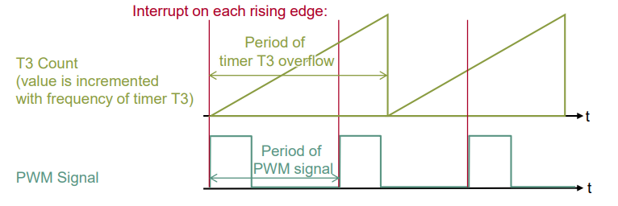
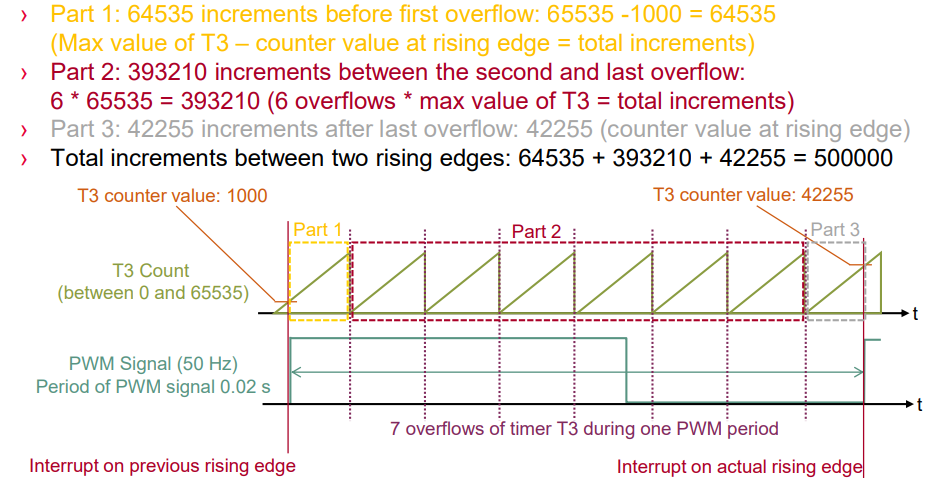
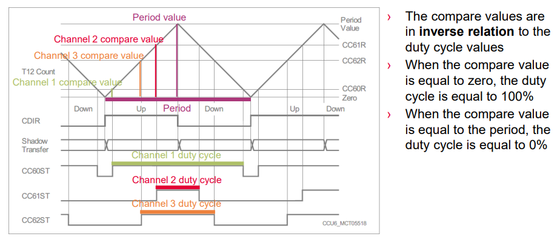
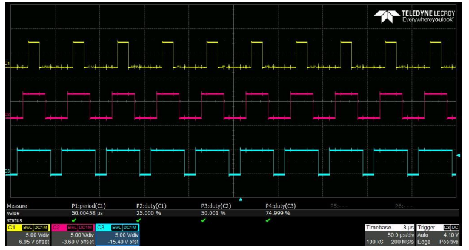
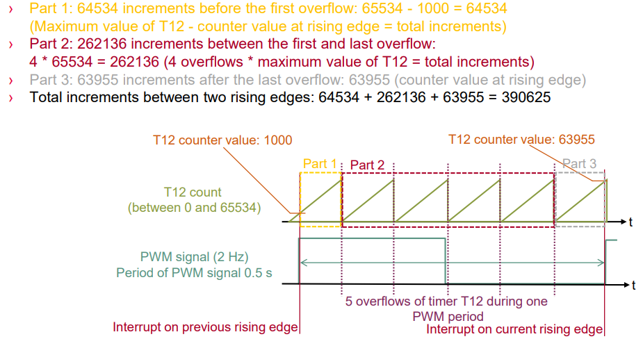
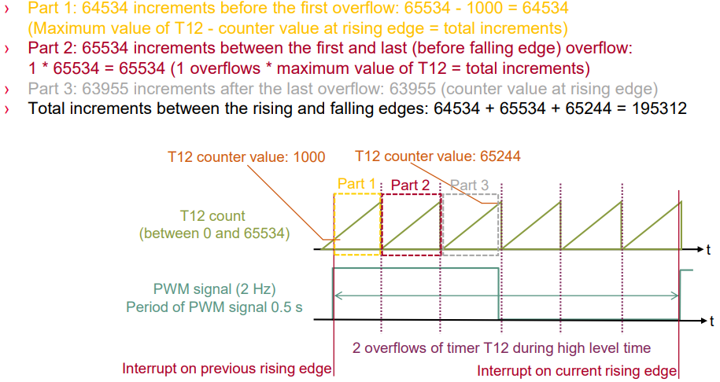

# TC397_Timer_PWM_3

<!-- TOC -->

- [TC397_Timer_PWM_3](#tc397_timer_pwm_3)
  - [GPT12_Timer_Interrupt](#gpt12_timer_interrupt)
  - [GPT12_Timer_Concatenation](#gpt12_timer_concatenation)
  - [GPT12_PWM_Generation](#gpt12_pwm_generation)
  - [GPT12_PWM_Capture](#gpt12_pwm_capture)
  - [CCU6_Interrupt](#ccu6_interrupt)
  - [CCU6_PWM_Generation](#ccu6_pwm_generation)
  - [CCU6_PWM_Capture](#ccu6_pwm_capture)

<!-- /TOC -->

## GPT12_Timer_Interrupt

GPT12模块的定时器T3产生500ms中断翻转LED:  

- GPT12(The General Purpose Timer Unit)包含两个GPT块(GPT1和GPT2), 每个块都有几个16-bit定时器
- GPT1块包含核心定时器T3和两个辅助定时器T2,T4
- GPT1的所有定时器可以四种模式之一运行: 定时器模式, 门控定时器模式, 计数器模式 或者 增量接口模式.
- 下面的例子中, T3配置为定时器模式, 向下计数, 发生下溢事件时, T2的值会传输到T3, 就不用在中断中手动重装了
- GPT12模块基本频率 Fgpt = 100MHz
- Reload_Value = Fgpt / (Gpt1BlockPrescaler*TimerInputPrescaler*f) = 100MHz / (16*64*2Hz) = 48828

```c
#include "Ifx_Types.h"
#include "IfxCpu.h"
#include "IfxScuWdt.h"

#include "Ifx_Types.h"
#include "IfxGpt12.h"
#include "IfxPort.h"

IFX_ALIGN(4) IfxCpu_syncEvent g_cpuSyncEvent = 0;

#define ISR_PRIORITY_GPT12_TIMER    6                       /* Define the GPT12 Timer interrupt priority            */
#define ISR_PROVIDER_GPT12_TIMER    IfxSrc_Tos_cpu0         /* Interrupt provider                                   */
#define RELOAD_VALUE                48828u                  /* Reload value to have an interrupt each 500ms         */
#define LED                         &MODULE_P13, 0          /* LED which toggles in the Interrupt Service Routine   */

/* Macro defining the Interrupt Service Routine */
IFX_INTERRUPT(interruptGpt12, 0, ISR_PRIORITY_GPT12_TIMER);

/* Interrupt Service Routine of the GPT12 */
void interruptGpt12(void)
{
    IfxPort_togglePin(LED);                                                         /* Toggle LED state             */
}

void core0_main(void)
{
    IfxCpu_enableInterrupts();
    
    /* !!WATCHDOG0 AND SAFETY WATCHDOG ARE DISABLED HERE!!
     * Enable the watchdogs and service them periodically if it is required
     */
    IfxScuWdt_disableCpuWatchdog(IfxScuWdt_getCpuWatchdogPassword());
    IfxScuWdt_disableSafetyWatchdog(IfxScuWdt_getSafetyWatchdogPassword());
    
    /* Wait for CPU sync event */
    IfxCpu_emitEvent(&g_cpuSyncEvent);
    IfxCpu_waitEvent(&g_cpuSyncEvent, 1);
    
    /* Initialize the LED */
    IfxPort_setPinModeOutput(LED, IfxPort_OutputMode_pushPull, IfxPort_OutputIdx_general);

    //initGpt12Timer
    /* Initialize the GPT12 module */
    IfxGpt12_enableModule(&MODULE_GPT120);                                          /* Enable the GPT12 module      */
    IfxGpt12_setGpt1BlockPrescaler(&MODULE_GPT120, IfxGpt12_Gpt1BlockPrescaler_16); /* Set GPT1 block prescaler     */

    /* Initialize the Timer T3 */
    IfxGpt12_T3_setMode(&MODULE_GPT120, IfxGpt12_Mode_timer);                       /* Set T3 to timer mode         */
    IfxGpt12_T3_setTimerDirection(&MODULE_GPT120, IfxGpt12_TimerDirection_down);    /* Set T3 count direction       */
    IfxGpt12_T3_setTimerPrescaler(&MODULE_GPT120, IfxGpt12_TimerInputPrescaler_64); /* Set T3 input prescaler       */
    IfxGpt12_T3_setTimerValue(&MODULE_GPT120, RELOAD_VALUE);                        /* Set T3 start value           */

    /* Initialize the Timer T2 */
    IfxGpt12_T2_setMode(&MODULE_GPT120, IfxGpt12_Mode_reload);                      /* Set T2 to reload mode        */
    IfxGpt12_T2_setReloadInputMode(&MODULE_GPT120, IfxGpt12_ReloadInputMode_bothEdgesTxOTL); /* Set reload trigger  */
    IfxGpt12_T2_setTimerValue(&MODULE_GPT120, RELOAD_VALUE);                        /* Set T2 reload value          */

    /* Initialize the interrupt */
    volatile Ifx_SRC_SRCR *src = IfxGpt12_T3_getSrc(&MODULE_GPT120);                /* Get the interrupt address    */
    IfxSrc_init(src, ISR_PROVIDER_GPT12_TIMER, ISR_PRIORITY_GPT12_TIMER);           /* Initialize service request   */
    IfxSrc_enable(src);                                                             /* Enable GPT12 interrupt       */

    IfxGpt12_T3_run(&MODULE_GPT120, IfxGpt12_TimerRun_start);                       /* Start the timer              */

    while(1)
    {
    }
}
```

## GPT12_Timer_Concatenation

GPT12模块的2个16-bit定时器可以级联(concatenation)成一个32bit定时器:  

- GPT2块包含两个定时器: 核心定时器T6和辅助定时器T5
- GPT2的2个定时器可以三种模式之一运行: 定时器模式, 门控定时器模式, 计数器模式.
- 一个附加的捕获/重载寄存器(Capture/Reload register, CAPREL)
- 下面的例子中T5是计数器模式, T6是定时器模式
- LED每86秒翻转一次, GPT12基本频率100Hz, GPT2预分配设置为2, 定时器T6的频率为100MHz/2=50MHz => 20ns, 32位定时器最大值4294967295*20ns ≈ 86s

Cpu0_Main.c代码如下:  

```c
#include "Ifx_Types.h"
#include "IfxCpu.h"
#include "IfxScuWdt.h"

#include "Ifx_Types.h"
#include "IfxGpt12.h"

IFX_ALIGN(4) IfxCpu_syncEvent g_cpuSyncEvent = 0;

#define ISR_PRIORITY_GPT12_T5_INT   10                      /* Define the GPT12 Timer 5 interrupt priority          */
#define ISR_PRIORITY_GPT12_T6_INT   11                      /* Define the GPT12 Timer 6 interrupt priority          */
#define SHIFT_BY_16                 16                      /* Define a shift value                                 */
#define LED                         &MODULE_P13,0           /* LED which toggles in the Interrupt Service Routine   */

uint32 g_timerValue32Bit = 0x00000000;

/* Macro to define Interrupt Service Routine */
IFX_INTERRUPT(GPT12_T5_Int0_Handler, 0, ISR_PRIORITY_GPT12_T5_INT);

/* Interrupt Service Routine of timer T5 gets triggered when the concatenation of both 16-bit timers has an overflow */
void GPT12_T5_Int0_Handler(void)
{
    IfxPort_setPinState(LED, IfxPort_State_toggled);    /* Toggle LED */
}

/* Macro to define Interrupt Service Routine */
IFX_INTERRUPT(GPT12_T6_Int0_Handler, 0, ISR_PRIORITY_GPT12_T6_INT);

/* Interrupt Service Routine of timer T6 gets triggered when the 16 bit timer T6 has an overflow */
void GPT12_T6_Int0_Handler(void)
{
    uint32 timerValueLOW = (uint32)IfxGpt12_T6_getTimerValue(&MODULE_GPT120);     /* Get counter value of timer T6 */
    uint32 timerValueHIGH = (uint32)IfxGpt12_T5_getTimerValue(&MODULE_GPT120);    /* Get counter value of timer T5 */

    /* Concatenation of both 16-bit timers values to one 32 bit timer by adding the shifted value of timer T5
     * to the value of timer T6.
     */
    g_timerValue32Bit = (timerValueHIGH << SHIFT_BY_16) + timerValueLOW;
}

void core0_main(void)
{
    IfxCpu_enableInterrupts();
    
    /* !!WATCHDOG0 AND SAFETY WATCHDOG ARE DISABLED HERE!!
     * Enable the watchdogs and service them periodically if it is required
     */
    IfxScuWdt_disableCpuWatchdog(IfxScuWdt_getCpuWatchdogPassword());
    IfxScuWdt_disableSafetyWatchdog(IfxScuWdt_getSafetyWatchdogPassword());
    
    /* Wait for CPU sync event */
    IfxCpu_emitEvent(&g_cpuSyncEvent);
    IfxCpu_waitEvent(&g_cpuSyncEvent, 1);
    
    /* Initialize LED port pin */
    IfxPort_setPinMode(LED, IfxPort_Mode_outputPushPullGeneral);

    //init_GPT12_module
    /* Enable GPT12 module */
    IfxGpt12_enableModule(&MODULE_GPT120);
    /* Select 2 as prescaler for the GPT2 module -> fastest clock frequency */
    IfxGpt12_setGpt2BlockPrescaler(&MODULE_GPT120, IfxGpt12_Gpt2BlockPrescaler_2);
    /* Set the core timer T6 in timer mode */
    IfxGpt12_T6_setMode(&MODULE_GPT120, IfxGpt12_Mode_timer);
    /* Set the auxiliary timer T5 in counter mode */
    IfxGpt12_T5_setMode(&MODULE_GPT120, IfxGpt12_Mode_counter);
    /* Select the rising and falling edges of Output Toggle Latch of timer T6 */
    IfxGpt12_T5_setCounterInputMode(&MODULE_GPT120, IfxGpt12_CounterInputMode_bothEdgesTxOTL);
    /* Turn remote control on; Timer T5 is controlled by overflow of timer T6 */
    IfxGpt12_T5_setRemoteControl(&MODULE_GPT120, IfxGpt12_TimerRemoteControl_on);

    /* Service request configuration */
    /* Get source pointer of timer T5, initialize and enable */
    volatile Ifx_SRC_SRCR *src = IfxGpt12_T5_getSrc(&MODULE_GPT120);
    IfxSrc_init(src, IfxSrc_Tos_cpu0, ISR_PRIORITY_GPT12_T5_INT);
    IfxSrc_enable(src);
    /* Get source pointer of timer T6, initialize and enable */
    src = IfxGpt12_T6_getSrc(&MODULE_GPT120);
    IfxSrc_init(src, IfxSrc_Tos_cpu0, ISR_PRIORITY_GPT12_T6_INT);
    IfxSrc_enable(src);

    /* Start timer T6 */
    IfxGpt12_T6_run(&MODULE_GPT120, IfxGpt12_TimerRun_start);


    while(1)
    {
    }
}
```

## GPT12_PWM_Generation

参考[GPT12_PWM_Generation_1 for KIT_AURIX_TC397_TFT](https://www.infineon.com/dgdl/Infineon-AURIX_GPT12_PWM_Generation_1_KIT_TC397_TFT-Training-v01_00-EN.pdf?fileId=5546d46272e49d2a0172e73c9843022e).  

用GPT12产生固定频率的PWM和自定义的占空比:  

- GPT1的T3配置为向下计数的定时器模式, 一旦T3下溢出, T3OTL(T3 Output Toggle Latch)翻转, T2(dutyDownTime)和T4(dutyUpTime)的值传递给T3(哪个传递取决于T3OTL的值), T3的中断中翻转LED
- 得到GPT12的基本频率Fgpt: IfxGpt12_getModuleFrequency(), ~~100MHz~~
- 定时器频率 Ftimer = Fgpt / (GPT1_BLOCK_PRESCALER × TimerInputPrescaler) ~~= 100MHz/(32x32) = 97656.25Hz~~
- dutyUpTime = Ftimer x DutyCycle / f ~~= 97656.25Hz * 0.85 / 2 = 41.5~~
- dutyDownTime = Ftimer x (1 - DutyCycle) / f

Cpu0_Main.c代码:  

```c
#include "Ifx_Types.h"
#include "IfxCpu.h"
#include "IfxScuWdt.h"

#include "Ifx_Types.h"
#include "IfxGpt12.h"
#include "IfxPort.h"

IFX_ALIGN(4) IfxCpu_syncEvent g_cpuSyncEvent = 0;

#define ISR_PRIORITY_GPT12_TIMER    6                       /* Define the GPT12 Timer interrupt priority            */
#define ISR_PROVIDER_GPT12_TIMER    IfxSrc_Tos_cpu0         /* Interrupt provider                                   */
#define PWM_FREQUENCY               2.0f                    /* Frequency of the PWM signal in Hz                    */
#define PWM_DUTY_CYCLE              85                      /* Duty cycle of the PWM signal in percentage           */
#define LED                         &MODULE_P13, 0          /* LED which toggles in the Interrupt Service Routine   */
#define GPT1_BLOCK_PRESCALER        32                      /* GPT1 block prescaler value                           */
#define TIMER_T3_INPUT_PRESCALER    32                      /* Timer input prescaler value                          */

/* Macro to define Interrupt Service Routine */
IFX_INTERRUPT(interruptGpt12, 0, ISR_PRIORITY_GPT12_TIMER);

/* Interrupt Service Routine of the GPT12 */
void interruptGpt12(void)
{
    /* Toggle the state of the LED */
    IfxPort_togglePin(LED);
}

void core0_main(void)
{
    IfxCpu_enableInterrupts();
    
    /* !!WATCHDOG0 AND SAFETY WATCHDOG ARE DISABLED HERE!!
     * Enable the watchdogs and service them periodically if it is required
     */
    IfxScuWdt_disableCpuWatchdog(IfxScuWdt_getCpuWatchdogPassword());
    IfxScuWdt_disableSafetyWatchdog(IfxScuWdt_getSafetyWatchdogPassword());
    
    /* Wait for CPU sync event */
    IfxCpu_emitEvent(&g_cpuSyncEvent);
    IfxCpu_waitEvent(&g_cpuSyncEvent, 1);
    
    /* Initialize the LED */
    IfxPort_setPinModeOutput(LED, IfxPort_OutputMode_pushPull, IfxPort_OutputIdx_general);

    //initGpt12PWM
    /* Enable the GPT12 module */
    IfxGpt12_enableModule(&MODULE_GPT120);
    /* Set GPT1 block prescaler to divide the module frequency */
    IfxGpt12_setGpt1BlockPrescaler(&MODULE_GPT120, IfxGpt12_Gpt1BlockPrescaler_32);
    /* Set the GPT12 timer T3 in timer mode */
    IfxGpt12_T3_setMode(&MODULE_GPT120, IfxGpt12_Mode_timer);
    /* Set the Timer T3 direction   */
    IfxGpt12_T3_setTimerDirection(&MODULE_GPT120, IfxGpt12_TimerDirection_down);
    /* Set timer T3 input prescaler to divide the timer frequency */
    IfxGpt12_T3_setTimerPrescaler(&MODULE_GPT120, IfxGpt12_TimerInputPrescaler_32);

    /* Calculate dutyUpTime and dutyDownTime for reloading timer T3 */
    float32 moduleFreq = IfxGpt12_getModuleFrequency(&MODULE_GPT120);
    float32 fTimer = (moduleFreq / (GPT1_BLOCK_PRESCALER * TIMER_T3_INPUT_PRESCALER));
    uint16 dutyUpTime = (fTimer * (PWM_DUTY_CYCLE / 100.0f)) / PWM_FREQUENCY;
    uint16 dutyDownTime = (fTimer * (1 - (PWM_DUTY_CYCLE / 100.0f))) / PWM_FREQUENCY;

    /* Set timer T3 value */
    IfxGpt12_T3_setTimerValue(&MODULE_GPT120, dutyDownTime);

    /* Timer T2: reloads the value dutyDownTime in timer T3 */
    /* Set the timer T2 in reload mode */
    IfxGpt12_T2_setMode(&MODULE_GPT120, IfxGpt12_Mode_reload);
    /* Set the T2 input parameter: Negative transition (falling edge) of T3 toggle latch T3OTL */
    IfxGpt12_T2_setReloadInputMode(&MODULE_GPT120, IfxGpt12_ReloadInputMode_fallingEdgeTxOTL);
    /* Set timer T2 value (the value that is reloaded in T3 on negative transition) */
    IfxGpt12_T2_setTimerValue(&MODULE_GPT120, dutyDownTime);

    /* Timer T4: reloads the value dutyUpTime in timer T3 */
    /* Set timer T4 in reload mode */
    IfxGpt12_T4_setMode(&MODULE_GPT120, IfxGpt12_Mode_reload);
    /* Set the T4 input parameter: Positive transition (rising edge) of T3 toggle latch T3OTL */
    IfxGpt12_T4_setReloadInputMode(&MODULE_GPT120, IfxGpt12_ReloadInputMode_risingEdgeTxOTL);
    /* Set timer T4 value (the value that is reloaded in T3 on positive transition) */
    IfxGpt12_T4_setTimerValue(&MODULE_GPT120, dutyUpTime);

    /* Configure the GPT12 interrupt */
    volatile Ifx_SRC_SRCR *src = IfxGpt12_T3_getSrc(&MODULE_GPT120);            /* Get interrupt address            */
    IfxSrc_init(src, ISR_PROVIDER_GPT12_TIMER, ISR_PRIORITY_GPT12_TIMER);       /* Initialize the service request   */
    IfxSrc_enable(src);                                                         /* Enable GPT12 interrupt           */

    IfxGpt12_T3_run(&MODULE_GPT120, IfxGpt12_TimerRun_start);                   /* Start the timer T3               */

    while(1)
    {
    }
}
```

## GPT12_PWM_Capture

参考 [GPT12_PWM_Capture_1 for KIT_AURIX_TC397_TFT](https://www.infineon.com/dgdl/Infineon-AURIX_GPT12_PWM_Capture_1_KIT_TC397_TFT-Training-v01_00-EN.pdf?fileId=5546d46272e49d2a0172e72a46e5022c)  

- GPT1的定时器T2和T4可以用作核心定时器T3的捕获或重载寄存器
- 本例中T2(捕获模式)捕获T3(定时器模式)的值
- T3是16bit定时器, 最大值65535, GPT12基本频率100MHz, GPT1预分配4, T3频率100MHz/4=25MHz, 40ns +1, 溢出时间65535*40≈0.0026s => 381Hz
- 总增量可以通过比较T2当前值和一个PWM周期前的值(1000为例)来获得, 50Hz PWM周期0.2s, 0.2s内, T3计数0.02s/40ns=500000次, 溢出7次, T2记录的PWM一个周期前的值为1000, T2当前值42255, 总增量为 (65535-1000)+(7-1)*65535+42255 = 500000, PWM频率为25MHz/500000=50Hz
- 本例中软件模拟PWM产生
- 用杜邦线连接P00.7(GPT1 T2 输入)和P00.8(PWM信号)





Cpu0_Main.c代码如下:  

```c
#include "Ifx_Types.h"
#include "IfxCpu.h"
#include "IfxScuWdt.h"

#include "IfxGpt12.h"
#include "Bsp.h"

IFX_ALIGN(4) IfxCpu_syncEvent g_cpuSyncEvent = 0;

#define ISR_PRIORITY_GPT12_T2_INT   10              /* Define the GPT12 Timer 2 interrupt priority                  */
#define ISR_PRIORITY_GPT12_T3_INT   11              /* Define the GPT12 Timer 2 interrupt priority                  */
#define MAX_VAL_16_BIT              0xFFFF          /* Used for calculation of timer value with overflows           */

#define PWM_PIN                     &MODULE_P00,8   /* Pin which is used to generate a simple PWM signal            */
#define PWM_DUTY                    0.5             /* Duty cycle of generated PWM signal, value between 0 and 1    */
#define FACTOR_SEC_TO_USEC          1000000         /* Factor to convert seconds to microseconds                    */

float32 g_generatedPwmFreqHz    = 50.0; /* Global variable for frequency of generated PWM signal                    */
float32 g_measuredPwmFreqHz     = 0.0;  /* Global variable for frequency calculation of PWM signal                  */
uint32  g_cntOverflow           = 0;    /* Global counter variable for the timer overflow between two edges         */
uint32  g_previousCntVal        = 0;    /* Global variable which stores the timer value of the previous interrupt   */

/* Macro to define the Interrupt Service Routine */
IFX_INTERRUPT(GPT12_T2_Int0_Handler, 0, ISR_PRIORITY_GPT12_T2_INT);

/* Interrupt Service Routine of timer T2, gets triggered by rising edge on input pin of timer T2 */
void GPT12_T2_Int0_Handler(void)
{
    uint32 currentCntVal = IfxGpt12_T2_getTimerValue(&MODULE_GPT120); /* Get timer value of timer T2 */
    uint32 finalCntVal = 0; /* Variable to calculate final timer counter value */

    if(g_cntOverflow == 0)
    {
        /* If no overflow detected */
        finalCntVal = currentCntVal - g_previousCntVal; /* Total counter value calculation */
    }
    else
    {
        /* One or more overflows detected */
        /* Add to the current counter value, the amount of counter ticks which passed before the first overflow,
         * plus 65525 (0xFFFF) for each additional overflow since the previous rising edge.
         */
        finalCntVal = (uint32)(currentCntVal + (MAX_VAL_16_BIT - g_previousCntVal) + ((g_cntOverflow - 1) * MAX_VAL_16_BIT));
    }

    /* Calculation of the PWM frequency by dividing the frequency of timer T3 through the final total counter value */
    g_measuredPwmFreqHz = IfxGpt12_T3_getFrequency(&MODULE_GPT120) / finalCntVal;

    g_previousCntVal = currentCntVal;    /* Set g_previousCntVal to currentCntVal for the next calculation */
    g_cntOverflow = 0;                   /* Reset overflow flag */
}

/* Macro to define the Interrupt Service Routine. */
IFX_INTERRUPT(GPT12_T3_Int0_Handler, 0, ISR_PRIORITY_GPT12_T3_INT);

/* Interrupt Service Routine of timer T3, gets triggered after T3 timer overflow */
void GPT12_T3_Int0_Handler(void)
{
    g_cntOverflow++; /* Increase overflow counter */
}


void core0_main(void)
{
    IfxCpu_enableInterrupts();
    
    /* !!WATCHDOG0 AND SAFETY WATCHDOG ARE DISABLED HERE!!
     * Enable the watchdogs and service them periodically if it is required
     */
    IfxScuWdt_disableCpuWatchdog(IfxScuWdt_getCpuWatchdogPassword());
    IfxScuWdt_disableSafetyWatchdog(IfxScuWdt_getSafetyWatchdogPassword());
    
    /* Wait for CPU sync event */
    IfxCpu_emitEvent(&g_cpuSyncEvent);
    IfxCpu_waitEvent(&g_cpuSyncEvent, 1);
    
    //init_GPT12_module
    /* Enable GPT12 module */
    IfxGpt12_enableModule(&MODULE_GPT120);
    /* Select 4 as prescaler for the GPT1 module -> fastest clock frequency for best accuracy */
    IfxGpt12_setGpt1BlockPrescaler(&MODULE_GPT120, IfxGpt12_Gpt1BlockPrescaler_4);
    /* Set core timer T3 in timer mode */
    IfxGpt12_T3_setMode(&MODULE_GPT120, IfxGpt12_Mode_timer);
    /* Set auxiliary timer T2 in capture mode */
    IfxGpt12_T2_setMode(&MODULE_GPT120, IfxGpt12_Mode_capture);
    /* Select input pin A of timer T2 which is P00.7 (the James Bond pin) */
    IfxGpt12_T2_setInput(&MODULE_GPT120, IfxGpt12_Input_A);
    /* Select rising edge as capture event */
    IfxGpt12_T2_setCaptureInputMode(&MODULE_GPT120, IfxGpt12_CaptureInputMode_risingEdgeTxIN);

    /* Service request configuration */
    /* Get source pointer of timer T2, initialize and enable */
    volatile Ifx_SRC_SRCR *src = IfxGpt12_T2_getSrc(&MODULE_GPT120);
    IfxSrc_init(src, IfxSrc_Tos_cpu0, ISR_PRIORITY_GPT12_T2_INT);
    IfxSrc_enable(src);
    /* Get source pointer of timer T3, initialize and enable */
    src = IfxGpt12_T3_getSrc(&MODULE_GPT120);
    IfxSrc_init(src, IfxSrc_Tos_cpu0, ISR_PRIORITY_GPT12_T3_INT);
    IfxSrc_enable(src);

    /* Initialize time constants */
    initTime();
    /* Initialize PWM_PIN port pin */
    IfxPort_setPinMode(PWM_PIN, IfxPort_Mode_outputPushPullGeneral);

    /* Start timer T3*/
    IfxGpt12_T3_run(&MODULE_GPT120, IfxGpt12_TimerRun_start);

    while(1)
    {
        /* Calculate the total time between two rising edges for the specific frequency */
        sint32 targetWaitTime_us = (1 / g_generatedPwmFreqHz) * FACTOR_SEC_TO_USEC * TimeConst_1us;
        /* Set the pin high to trigger an interrupt */
        IfxPort_setPinState(PWM_PIN, IfxPort_State_high);
        /* Wait for an amount of CPU ticks that represent the calculated microseconds considering the duty cycle */
        wait(PWM_DUTY * targetWaitTime_us);
        /* Set pin state to low */
        IfxPort_setPinState(PWM_PIN, IfxPort_State_low);
        /* Wait for an amount of CPU ticks that represent the calculated microseconds considering the duty cycle */
        wait((1 - PWM_DUTY) * targetWaitTime_us);
    }
}
```

## CCU6_Interrupt

参考 [CCU6_Interrupt_1 for KIT_AURIX_TC397_TFT](https://www.infineon.com/dgdl/Infineon-AURIX_CCU6_Interrupt_1_KIT_TC397_TFT-Training-v01_00-EN.pdf?fileId=5546d46272e49d2a0172e6cec32301ea)

CCU6每500ms中断一次, 翻转LED:  

- CCU6是一个高分辨率的16-bit捕获和比较单元, 主要用于AC驱动控制, 有定时器T12(3个捕获/比较通道)和定时器T13(1个比较通道), 本例中用T12
- CCU6可以在计数到预定义的周期值时产生中断
- 定时器模式下, 默认的时钟频率Fcc6为100MHz, 可以以2的倍数分频, 最多32768分频, 对应3051.75Hz
- 中断频率fISR = (CCU6 clock frequency) / (period + 1), 其中period的值储存在16-bit寄存器中, 最大值65535
- fISR=10Hz为例, period=65535, 算出CCU6频率655360Hz, 最接近100MHz/256=390625Hz, 用这个值重新计算period≈39061, fISR=390625/39062≈10Hz
- 下面的例子fISR=2Hz

Cpu0_Main.c代码如下:

```c
#include "Ifx_Types.h"
#include "IfxCpu.h"
#include "IfxScuWdt.h"

#include "IfxPort.h"
#include "IfxCcu6_Timer.h"

#define ISR_PRIORITY_CCU6_INT1  40                                          /* Priority for interrupt ISR           */
#define CCU6_TIMER_FREQ         97656                                       /* Timer module frequency in Hz         */
#define CCU6_ISR_FREQ           2                                           /* ISR frequency in Hz                  */
#define CCU6_TIMER_PERIOD       (CCU6_TIMER_FREQ / CCU6_ISR_FREQ) - 1       /* Timer module period in ticks         */

#define LED1                    &MODULE_P13,0                               /* LED D107  */

/* CCU6 */
#define CCU6                    &MODULE_CCU60                               /* CCU6 will be used in this example    */

IfxCcu6_Timer g_timer;                                                      /* Timer structure                      */
uint8 g_counter = 0;                                                        /* Variable to keep count of ISR calls  */

IFX_ALIGN(4) IfxCpu_syncEvent g_cpuSyncEvent = 0;

IFX_INTERRUPT(isrCCU6Timer, 0, ISR_PRIORITY_CCU6_INT1);

void isrCCU6Timer(void)
{
    IfxPort_togglePin(LED1);
}

void core0_main(void)
{
    IfxCpu_enableInterrupts();
    
    /* !!WATCHDOG0 AND SAFETY WATCHDOG ARE DISABLED HERE!!
     * Enable the watchdogs and service them periodically if it is required
     */
    IfxScuWdt_disableCpuWatchdog(IfxScuWdt_getCpuWatchdogPassword());
    IfxScuWdt_disableSafetyWatchdog(IfxScuWdt_getSafetyWatchdogPassword());
    
    /* Wait for CPU sync event */
    IfxCpu_emitEvent(&g_cpuSyncEvent);
    IfxCpu_waitEvent(&g_cpuSyncEvent, 1);
    
    IfxPort_setPinMode(LED1, IfxPort_Mode_outputPushPullGeneral);
    IfxPort_setPinState(LED1, IfxPort_State_high);

    //initCCU6
    IfxCcu6_Timer_Config timerConfig;                   /* Structure for timer configuration                        */
    IfxCcu6_Timer_initModuleConfig(&timerConfig, CCU6); /* Initialize the timer module structure with default values*/
    /* The Serial Peripheral Bus has a default Frequency of Fcc6 = 100000000 Hz = 100 MHz
     * Possible frequencies for the CCU6 timer are:
     *       - 100000000 Hz = 100 MHz   (Fcc6)
     *       - 50000000 Hz  = 50 MHz    (Fcc6/2)
     *       - 25000000 Hz  = 25 MHz    (Fcc6/4)
     *       - 12500000 Hz  = 12.5 MHz  (Fcc6/8)
     *       - 6250000 Hz   = 6.25 MHz  (Fcc6/16)
     *       - 3125000 Hz   ~ 3 MHz     (Fcc6/32)
     *       - 1562500 Hz   ~ 1.5 MHz   (Fcc6/64)
     *       - 781250 Hz    ~ 780 KHz   (Fcc6/128)
     *       - 390625 Hz    ~ 390 KHz   (Fcc6/256)
     *       - 195312.5 Hz  ~ 200 KHz   (Fcc6/512)
     *       - 97656.25 Hz  ~ 100 KHz   (Fcc6/1024)
     *       - 48828.12 Hz  ~ 50 KHz    (Fcc6/2048)
     *       - 24414.06 Hz  ~ 25 KHz    (Fcc6/4096)
     *       - 12207.03 Hz  ~ 12.5 KHz  (Fcc6/8192)
     *       - 6103.51 Hz   ~ 6 KHz     (Fcc6/16384)
     *       - 3051.75 Hz   ~ 3 KHz     (Fcc6/32768)
     */
    timerConfig.base.t12Frequency = CCU6_TIMER_FREQ;                /* Configure the frequency of the timer module */
    timerConfig.base.t12Period = CCU6_TIMER_PERIOD;                 /* Configure the period of the timer (16-bit)  */
    timerConfig.timer = IfxCcu6_TimerId_t12;                        /* Select the timer to be started              */
    timerConfig.interrupt1.source = IfxCcu6_InterruptSource_t12PeriodMatch; /* Set interrupt source                */
    timerConfig.interrupt1.priority = ISR_PRIORITY_CCU6_INT1;       /* Set the priority of the ISR                 */
    timerConfig.interrupt1.typeOfService = IfxSrc_Tos_cpu0;         /* Set the type of service for the interrupt   */
    timerConfig.trigger.t13InSyncWithT12 = FALSE;                   /* Configure timers synchronization            */
    IfxCcu6_Timer_initModule(&g_timer, &timerConfig);               /* Initialize the CCU6 module                  */

    IfxCcu6_Timer_start(&g_timer);                                  /* Start the timer                             */


    while(1)
    {
    }
}
```

## CCU6_PWM_Generation

参考 [CCU6_PWM_Generation_1](https://www.infineon.com/dgdl/Infineon-AURIX_CCU6_PWM_Generation_1_KIT_TC397_TFT-Training-v01_00-EN.pdf?fileId=5546d46272e49d2a0172e6ced6e501ee)  

用CCU6生成三个中心对齐的PWM信号, 频率固定, 占空比不同:  

- 用CCU6的T12和它的3个比较模块产生20kHz PWM信号, 占空比分别为25%, 50%, 75%, 三个信号中心对齐, 定时器必须被配置为向上和向下计数, 输出引脚P02.1, P02.3, P02.5, 可以用示波器测量
- 初始化阶段, 使用函数`IfxCpu_disableInterrupts()`暂时禁止中断, 避免未配置外设的抢占, 初始化完成后用`IfxCpu_restoreInterrupts()`重新使能中断
- 目标找到比较值Vcmp, 以产生周期50ms, 占空比50%的PWM信号: CCU6基本频率Fcc6=100MHz, PWM频率20kHz, 每周期需要P=100MHz/20kHz=5000ticks, 25%占空比需要1250ticks, 比较值Vcmp=P-dutycycle=5000-1250=3750




```c
#include "Ifx_Types.h"
#include "IfxCpu.h"
#include "IfxScuWdt.h"

#include "IfxCcu6_PwmHl.h"

IFX_ALIGN(4) IfxCpu_syncEvent g_cpuSyncEvent = 0;

#define CCU6_BASE_FREQUENCY     100000000                                   /* CCU6 base frequency, in Hertz        */
#define PWM_FREQUENCY           20000                                       /* PWM signal frequency, in Hertz       */
#define PWM_PERIOD              (CCU6_BASE_FREQUENCY / PWM_FREQUENCY)       /* PWM signal period, in ticks          */

#define NUMBER_OF_CHANNELS      3

#define CHANNEL1_DUTY_CYCLE     25                                          /* PWM Signal 1 Duty cycle, in percent  */
#define CHANNEL2_DUTY_CYCLE     50                                          /* PWM Signal 2 Duty cycle, in percent  */
#define CHANNEL3_DUTY_CYCLE     75                                          /* PWM Signal 3 Duty cycle, in percent  */

#define CHANNEL1_COMPARE_VALUE  ((PWM_PERIOD / 100) * (100 - CHANNEL1_DUTY_CYCLE))
#define CHANNEL2_COMPARE_VALUE  ((PWM_PERIOD / 100) * (100 - CHANNEL2_DUTY_CYCLE))
#define CHANNEL3_COMPARE_VALUE  ((PWM_PERIOD / 100) * (100 - CHANNEL3_DUTY_CYCLE))

IfxCcu6_TimerWithTrigger g_timer;
IfxCcu6_PwmHl g_driver;

void core0_main(void)
{
    IfxCpu_enableInterrupts();
    
    /* !!WATCHDOG0 AND SAFETY WATCHDOG ARE DISABLED HERE!!
     * Enable the watchdogs and service them periodically if it is required
     */
    IfxScuWdt_disableCpuWatchdog(IfxScuWdt_getCpuWatchdogPassword());
    IfxScuWdt_disableSafetyWatchdog(IfxScuWdt_getSafetyWatchdogPassword());
    
    /* Wait for CPU sync event */
    IfxCpu_emitEvent(&g_cpuSyncEvent);
    IfxCpu_waitEvent(&g_cpuSyncEvent, 1);
    

    //initCCU6
    boolean interruptState = IfxCpu_disableInterrupts();            /* Disable global interrupts                    */

    /* Timer configuration: timer used as counter */
    IfxCcu6_TimerWithTrigger_Config timerConf;
    IfxCcu6_TimerWithTrigger_initConfig(&timerConf, &MODULE_CCU60); /* Initialize the timer configuration with
                                                                     * default values                               */
    /* User timer configuration */
    timerConf.base.frequency = PWM_FREQUENCY;                       /* Set the desired frequency for the PWM signal */
    timerConf.base.countDir = IfxStdIf_Timer_CountDir_upAndDown;    /* Configure the timer to count up and down, in
                                                                     * order to generate center-aligned PWM signals */
    /* Initialize the timer driver */
    IfxCcu6_TimerWithTrigger_init(&g_timer, &timerConf);

    /* PWM High/Low driver configuration */
    IfxCcu6_PwmHl_Config pwmHlConf;
    IfxCcu6_PwmHl_initConfig(&pwmHlConf);                           /* Initialize the PwmHl configuration with
                                                                     * default values                               */
    /* User PWM High/Low driver configuration */
    pwmHlConf.timer = &g_timer;                                     /* Use the already configured timer             */
    pwmHlConf.base.channelCount = NUMBER_OF_CHANNELS;               /* Configure the driver to use use all three
                                                                     * compare modules available in T12             */
    /* Assign output pins */
    pwmHlConf.cc0 = &IfxCcu60_CC60_P02_0_OUT;
    pwmHlConf.cc1 = &IfxCcu60_CC61_P02_2_OUT;
    pwmHlConf.cc2 = &IfxCcu60_CC62_P02_4_OUT;
    pwmHlConf.cout0 = &IfxCcu60_COUT60_P02_1_OUT;
    pwmHlConf.cout1 = &IfxCcu60_COUT61_P02_3_OUT;
    pwmHlConf.cout2 = &IfxCcu60_COUT62_P02_5_OUT;

    /* Initialize the PwmHl driver */
    IfxCcu6_PwmHl_init(&g_driver, &pwmHlConf);

    /* Instruct the driver to generate center aligned PWM signals */
    IfxCcu6_PwmHl_setMode(&g_driver, Ifx_Pwm_Mode_centerAligned);

    /* Set the duty cycles for the three channels */
    Ifx_TimerValue cmpValues[NUMBER_OF_CHANNELS];
    cmpValues[0] = CHANNEL1_COMPARE_VALUE;                          /* Set the compare value for channel 1          */
    cmpValues[1] = CHANNEL2_COMPARE_VALUE;                          /* Set the compare value for channel 2          */
    cmpValues[2] = CHANNEL3_COMPARE_VALUE;                          /* Set the compare value for channel 3          */

    g_driver.update(&g_driver, cmpValues);                          /* Apply the compare values                     */

    /* Update the timer.
     * This instruction enables the shadow transfer of the compare values, copying the compare values to the
     * compare registers */
    IfxCcu6_TimerWithTrigger_applyUpdate(g_driver.timer);

    /* Restore interrupts to their initial state */
    IfxCpu_restoreInterrupts(interruptState);

    //startPWMGeneration
    IfxCcu6_TimerWithTrigger_run(&g_timer);

    while(1)
    {
    }
}
```

官方的测试结果:  



## CCU6_PWM_Capture

参考 [CCU6_PWM_Capture_1 for KIT_AURIX_TC397_TFT](https://www.infineon.com/dgdl/Infineon-AURIX_CCU6_PWM_Capture_1_KIT_TC397_TFT-Training-v01_00-EN.pdf?fileId=5546d46272e49d2a0172e6cece6501ec)  

软件模拟PWM通过P02.1引脚输出, 然后用CCU6 T12(P02.0输入, 与P02.1短接)测量频率和占空比:  

- 需要一个中断`CCU6_edge_detection_isr`捕获PWM, 用两个上升沿计算周期, 上升沿和下降沿计算占空比
- 另一个中断`CCU6_period_match_isr`对计数器溢出计数
- T12最大值65534(16bit-1), T12频率781250Hz => 1.28us, 在65534*1.28us≈0.084s后溢出

周期计算举例:  



高电平时间计算举例:  



Cpu0_Main.c代码如下:

```c
#include "Ifx_Types.h"
#include "IfxCpu.h"
#include "IfxScuWdt.h"

#include "Ifx_Types.h"
#include "IfxCcu6_Icu.h"
#include "Bsp.h"

IFX_ALIGN(4) IfxCpu_syncEvent g_cpuSyncEvent = 0;

#define ISR_PRIORITY_CCU6_RISING_EDGE   1               /* Define the CCU6 rising edge interrupt priority           */
#define ISR_PRIORITY_CCU6_PERIOD_MATCH  2               /* Define the CCU6 period match interrupt priority          */
#define CCU6_INPUT_PIN                  IfxCcu60_CC60INA_P02_0_IN /* Select input port pin P02.0                    */

#define PWM_PIN                         &MODULE_P02,1   /* Pin used to generate a simple PWM signal                 */
#define SEC_TO_USEC                     1000000         /* Factor to convert seconds to microseconds                */
#define MAX_VAL_T12                     (0xFFFF - 1)    /* Maximum number of ticks between two overflows            */

IfxCcu6_Icu_Channel g_icuChannel;           /* CCU6 ICU channel handle                                              */
float32 g_CCU6Frequency_Hz = 0.0;           /* Global variable which stores the CCU6 capture frequency              */

float32 g_generatedPwmFreq_Hz = 5.0;        /* Frequency of the generated PWM signal                                */
float32 g_generatedPwmDutyCycle = 80.0;     /* Duty cycle in percentage of the generated PWM signal                 */
float32 g_measuredPwmFreq_Hz = 0.0;         /* Calculated frequency of the measured PWM signal                      */
float32 g_measuredPwmDutyCycle = 0.0;       /* Calculated duty cycle of the measured PWM signal                     */
uint32  g_cntOverflowPeriod = 0;            /* Counter of timer overflows between two rising edges                  */
uint32  g_cntOverflowHighLevel = 0;         /* Counter of timer overflows between a rising and a falling edge       */
uint32  g_previousCntVal = 0;               /* Global variable to store the timer value of the previous interrupt   */

IFX_INTERRUPT(CCU6_edge_detection_isr, 0, ISR_PRIORITY_CCU6_RISING_EDGE);

/* Interrupt Service Routine of the CCU6, which gets triggered by a rising edge of the input port pin of timer T12 */
void CCU6_edge_detection_isr(void)
{
    uint32  risingEdgeCntVal = 0;           /* Number of ticks between the last overflow and the rising edge        */
    uint32  fallingEdgeCntVal = 0;          /* Number of ticks between the last overflow and the falling edge       */

    /* Check on the occurrence of the rising edge */
    if (g_icuChannel.ccu6->IS.B.ICC60R)
    {
        /* Reset interrupt status flag */
        IfxCcu6_clearInterruptStatusFlag(&MODULE_CCU60, IfxCcu6_InterruptSource_cc60RisingEdge);

        /* Get the captured rising edge counter value from the counter register */
        risingEdgeCntVal = IfxCcu6_getCaptureRegisterValue(g_icuChannel.ccu6, g_icuChannel.channelId);
    }

    /* Check on the occurrence of the falling edge */
    if (g_icuChannel.ccu6->IS.B.ICC60F)
    {
        /* Reset interrupt status flag */
        IfxCcu6_clearInterruptStatusFlag(&MODULE_CCU60, IfxCcu6_InterruptSource_cc60FallingEdge);

        /* Get the captured falling edge counter value from the shadow register */
        fallingEdgeCntVal = IfxCcu6_getCaptureShadowRegisterValue(g_icuChannel.ccu6, g_icuChannel.channelId);
    }

    /* Define a variable to calculate the final timer counter value */
    uint32 finalFreqCntVal, finalDutyCycCntVal = 0;

    /* If no overflow was detected during the period measurement */
    if(g_cntOverflowPeriod == 0)
    {
        finalFreqCntVal = risingEdgeCntVal - g_previousCntVal;      /* Total counter value calculation          */
    }
    /* If one or more overflows were detected during the period measurement */
    else
    {
        /* Add to the current counter value, the amount of counter ticks which passed before the first overflow,
         * plus 65534 (0xFFFF - 1) for each additional overflow occurred between two rising edges.
         */
        finalFreqCntVal = (uint32)(risingEdgeCntVal + (MAX_VAL_T12 - g_previousCntVal) + ((g_cntOverflowPeriod - 1) * MAX_VAL_T12));
    }

    /* If no overflows were detected during signal high level time measurement */
    if(g_cntOverflowHighLevel == 0)
    {
        finalDutyCycCntVal = fallingEdgeCntVal - g_previousCntVal;
    }

    /* If one or more overflows were detected during signal high level time measurement */
    else
    {
        /* Add to the current counter value, the amount of counter ticks which passed before the first overflow,
         * plus 65534 (0xFFFF - 1) for each additional overflow occurred between the rising and the falling edge.
         */
        finalDutyCycCntVal = (uint32)(fallingEdgeCntVal + (MAX_VAL_T12 - g_previousCntVal) + ((g_cntOverflowHighLevel - 1) * MAX_VAL_T12));
    }

    /* The PWM frequency is calculated by dividing the captured frequency with the final total counter value
     *      total number of ticks * (1 / CCU6 frequency) = period of the measured signal =>
     *      => frequency of the measured signal = CCU6 frequency / total number of ticks
     */
    g_measuredPwmFreq_Hz = g_CCU6Frequency_Hz / (float32)finalFreqCntVal;

    /* The PWM duty cycle is calculated by dividing the captured signal high level time by the period */
    g_measuredPwmDutyCycle = 100 * (finalDutyCycCntVal / (float32)finalFreqCntVal);

    g_previousCntVal = risingEdgeCntVal;    /* Update g_previousCntVal for the next calculation                 */
    g_cntOverflowPeriod = 0;                /* Reset overflow counter of the period measurement                 */
    g_cntOverflowHighLevel = 0;             /* Reset overflow counter of the signal high level time measurement */
}

/* Macro to define the Interrupt Service Routine */
IFX_INTERRUPT(CCU6_period_match_isr, 0, ISR_PRIORITY_CCU6_PERIOD_MATCH);

/* Interrupt Service Routine of the CCU6, which gets triggered at each period match event for counting overflows */
void CCU6_period_match_isr(void)
{
    g_cntOverflowPeriod++;

    /* Increments high level time measurement overflows number only if the signal is still high
     * (no falling edge occurrence yet)
     */
    if(IfxCcu6_getInterruptStatusFlag(&MODULE_CCU60, IfxCcu6_InterruptSource_cc60FallingEdge) == FALSE)
    {
        g_cntOverflowHighLevel++;
    }
}

void core0_main(void)
{
    IfxCpu_enableInterrupts();
    
    /* !!WATCHDOG0 AND SAFETY WATCHDOG ARE DISABLED HERE!!
     * Enable the watchdogs and service them periodically if it is required
     */
    IfxScuWdt_disableCpuWatchdog(IfxScuWdt_getCpuWatchdogPassword());
    IfxScuWdt_disableSafetyWatchdog(IfxScuWdt_getSafetyWatchdogPassword());
    
    /* Wait for CPU sync event */
    IfxCpu_emitEvent(&g_cpuSyncEvent);
    IfxCpu_waitEvent(&g_cpuSyncEvent, 1);
    
    //init_CCU6_ICU, Configure the CCU6 for capturing the rising edge of a PWM signal
    IfxCcu6_Icu ccu6Handle;                                             /* CCU6 handle                              */
    IfxCcu6_Icu_Config ccu6Config;                                      /* Create a configuration structure         */

    IfxCcu6_Icu_initModuleConfig(&ccu6Config, &MODULE_CCU60);           /* Fill the structure with default values   */
    IfxCcu6_Icu_initModule(&ccu6Handle, &ccu6Config);                   /* Initialize the module                    */

    /* Store the configured captured frequency in a global variable */
    g_CCU6Frequency_Hz = ccu6Handle.captureFrequency;

    IfxCcu6_Icu_ChannelConfig ccu6ChannelConfig;                        /* Create a channel configuration structure */
    IfxCcu6_Icu_initChannelConfig(&ccu6ChannelConfig, &MODULE_CCU60);   /* Fill the structure with default values   */

    ccu6ChannelConfig.channelId = IfxCcu6_T12Channel_0;                 /* Select Timer T12 channel 0               */

    /* Select the capture mode: IfxCcu6_T12ChannelMode_doubleRegisterCaptureRisingAndFalling
     * With this particular value, the CCU6 stores the T12 value in the CC6xR register when a rising edge is detected,
     * while it stores the T12 value in the CC6xSR shadow register when a falling edge is detected.
     */
    ccu6ChannelConfig.channelMode = IfxCcu6_T12ChannelMode_doubleRegisterCaptureRisingAndFalling;

    /* Service Request 0 for interrupt at any rising or falling edge */
    ccu6ChannelConfig.interrupt1.source = IfxCcu6_InterruptSource_cc60RisingEdge; /* Select the interrupt source    */
    ccu6ChannelConfig.interrupt1.serviceRequest = IfxCcu6_ServiceRequest_0; /* Select the service request output    */
    ccu6ChannelConfig.interrupt1.priority = ISR_PRIORITY_CCU6_RISING_EDGE;  /* Configure the interrupt priority     */
    ccu6ChannelConfig.interrupt1.typeOfService = IfxSrc_Tos_cpu0;           /* Select the type of interrupt service */

    /* Service Request 1 for interrupt at T12 period match */
    ccu6ChannelConfig.interrupt2.source = IfxCcu6_InterruptSource_t12PeriodMatch; /* Select the interrupt source    */
    ccu6ChannelConfig.interrupt2.serviceRequest = IfxCcu6_ServiceRequest_1; /* Select the service request output    */
    ccu6ChannelConfig.interrupt2.priority = ISR_PRIORITY_CCU6_PERIOD_MATCH; /* Configure the interrupt priority     */
    ccu6ChannelConfig.interrupt2.typeOfService = IfxSrc_Tos_cpu0;           /* Select the type of interrupt service */

    /* Configure internal start of timer T12 controlled by the run bit T12R */
    ccu6ChannelConfig.trigger.extInputTrigger = NULL_PTR;

    /* CCU6 ICU pin configuration */
    IfxCcu6_Icu_Pins pins =
    {
        &CCU6_INPUT_PIN,            /* CC60In pin                   */
        NULL_PTR,                   /* CC61In pin not used          */
        NULL_PTR,                   /* CC62In pin not used          */
        NULL_PTR,                   /* CCPOS0In pin not used        */
        NULL_PTR,                   /* CCPOS1In pin not used        */
        NULL_PTR,                   /* CCPOS2In pin not used        */
        IfxPort_InputMode_pullUp,   /* CC6x pin input mode          */
        IfxPort_InputMode_pullUp,   /* CCPOSx pin input mode        */
        NULL_PTR,                   /* T12HR input signal not used  */
        NULL_PTR,                   /* T13HR input signal not used  */
        IfxPort_InputMode_pullUp    /* Pad driver mode              */
    };
    ccu6ChannelConfig.pins = &pins;                                     /* Set the configuration of the port pins   */

    ccu6ChannelConfig.multiInputCaptureEnabled = FALSE;                 /* Disable multiple input capture mode      */

    IfxCcu6_Icu_initChannel(&g_icuChannel, &ccu6ChannelConfig);         /* Initialize the channel                   */

    /* Start the timer T12 by setting the run bit T12R with the associated bit T12RS */
    IfxCcu6_Icu_startCapture(&g_icuChannel);

    initTime();                                                         /* Initialize the time constants            */
    IfxPort_setPinMode(PWM_PIN, IfxPort_Mode_outputPushPullGeneral);    /* Initialize the PWM_PIN port pin          */

    while(1)
    {
        /* Calculate the total time between two rising edges for the specific frequency */
        uint32 targetWaitTime_us = (1 / g_generatedPwmFreq_Hz) * SEC_TO_USEC * TimeConst_1us;

        /* Set the port pin state to high in order to trigger an interrupt */
        IfxPort_setPinState(PWM_PIN, IfxPort_State_high);
        /* Wait time while the signal is in high state */
        wait(g_generatedPwmDutyCycle * targetWaitTime_us / 100);

        /* Set pin state to low */
        IfxPort_setPinState(PWM_PIN, IfxPort_State_low);
        /* Wait time while the signal is in low state */
        wait((100 - g_generatedPwmDutyCycle) * targetWaitTime_us / 100);

    }
}
```
