# TC397_UART

<!-- TOC -->

- [TC397_UART](#tc397_uart)
  - [ASCLIN](#asclin)
  - [硬件连接](#硬件连接)
  - [新建工程](#新建工程)
  - [Debug Printf](#debug-printf)
  - [ASCLIN_UART 发送](#asclin_uart-发送)
  - [Ifx_Console_print](#ifx_console_print)
  - [接收中断](#接收中断)
  - [TC397_UART工程下载](#tc397_uart工程下载)
  - [ASCLIN_Shell_UART_1](#asclin_shell_uart_1)
  - [参考](#参考)

<!-- /TOC -->

## ASCLIN

`ASCLIN`, `Asynchronous Synchronous Interface`, 3合1模块, 可以用单个模块实现`ASC(UART)`, `LIN`和`Master SPI`的功能, 配置每位4~16倍过采样, 实现更高的精度和更高的波特率.  

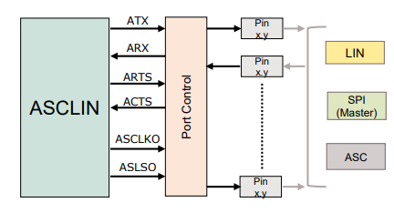

作为ASC(UART)或Master SPI时, 支持高达25MBaud波特率.  

过采样的设置:  

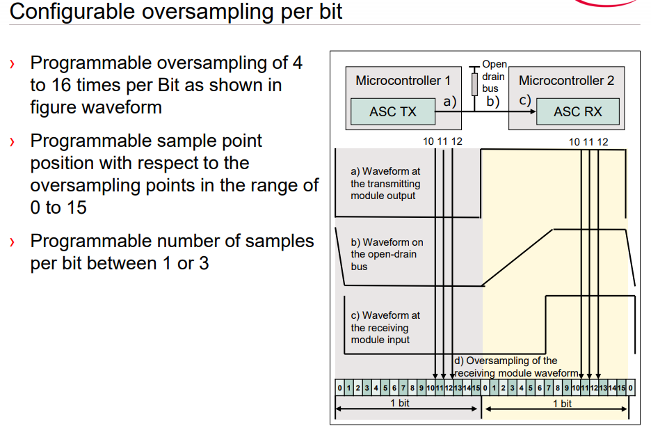

来源 [AURIX ASCLIN](https://www.infineon.com/dgdl/Infineon-AURIX_Asynchronous+Synchronous+Interface-Training-v01_00-EN.pdf?fileId=5546d46269bda8df0169ca52fd3e251f)

## 硬件连接

先来看下硬件连接, `KIT_A2G_TC397_5V_TFT`评估板上:  

| PIN   | ASCLIN0_UART |
|-------|------|
| P14.0 | TX   |
| P14.1 | RX   |

这个串口直接连到了调试器上:

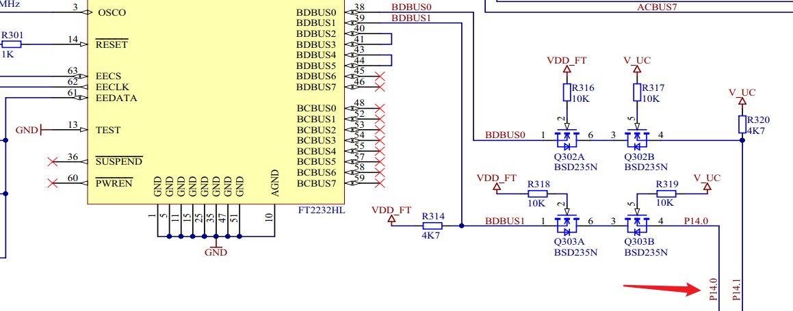

所以评估板USB插到电脑上, 电脑就可以和这个串口通信:  

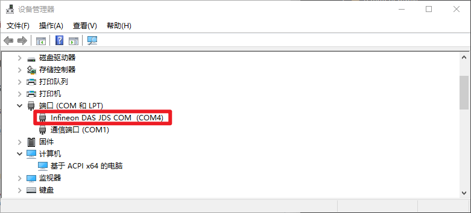

## 新建工程

- 打开AURIX Development Studio
- File -> New -> New AURIX Project
- 填入Project Name, 然后Next
- 选择板子和器件, Finish: 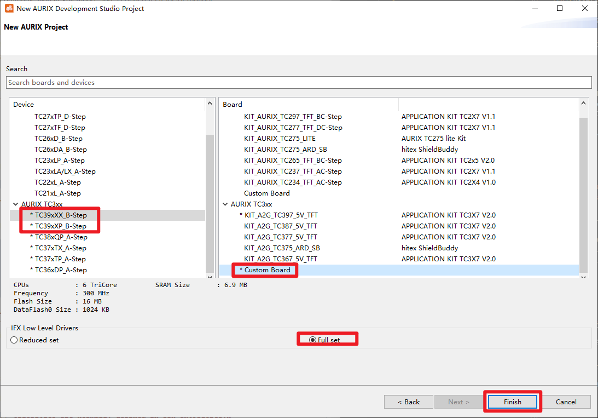

## Debug Printf

这种方式在调试的时候可以用, 无需串口外设.  

```c
#include "Bsp.h"
#include <stdio.h>

    while(1)
    {
        static uint8 count = 0;     //Only for Debug
        printf("Hello, world, %d\r\n", ++count);    //Only for Debug
        waitTime(5 * TimeConst_100ms);
    }
```

点击爬虫图标进入调试:  

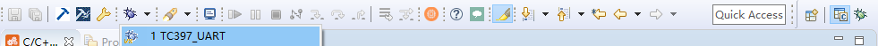

点击Resume按钮运行程序, 可以在右下方看到打印:  

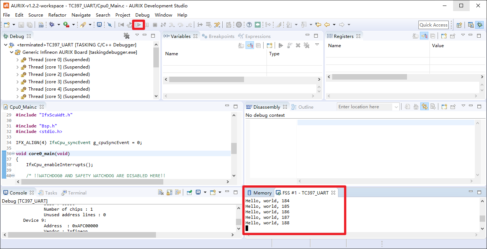

## ASCLIN_UART 发送

直接上`Cpu0_Main.c`

```c
#include "Ifx_Types.h"
#include "IfxCpu.h"
#include "IfxScuWdt.h"

#include "Bsp.h"
//#include <stdio.h>  //Only for Debug
#include "IfxAsclin_Asc.h"
#include "IfxCpu_Irq.h"

#define SERIAL_BAUDRATE0         115200
#define SERIAL_PIN_RX0           IfxAsclin0_RXA_P14_1_IN
#define SERIAL_PIN_TX0           IfxAsclin0_TX_P14_0_OUT
#define INTPRIO_ASCLIN0_TX       19      /* Priority of the ISR */

#define ASC_TX_BUFFER_SIZE       64
/* The transfer buffers allocate memory for the data itself and for FIFO runtime variables.
 * 8 more bytes have to be added to ensure a proper circular buffer handling independent from
 * the address to which the buffers have been located.
 */
uint8 g_ascTxBuffer[ASC_TX_BUFFER_SIZE + sizeof(Ifx_Fifo) + 8];

IFX_ALIGN(4) IfxCpu_syncEvent g_cpuSyncEvent = 0;

IfxAsclin_Asc g_asc0;

IFX_INTERRUPT(asclin0TxISR, 0, INTPRIO_ASCLIN0_TX);  /* Adding the Interrupt Service Routine */

void asclin0TxISR(void)
{
    IfxAsclin_Asc_isrTransmit(&g_asc0);
}

void core0_main(void)
{
    IfxCpu_enableInterrupts();
    
    /* !!WATCHDOG0 AND SAFETY WATCHDOG ARE DISABLED HERE!!
     * Enable the watchdogs and service them periodically if it is required
     */
    IfxScuWdt_disableCpuWatchdog(IfxScuWdt_getCpuWatchdogPassword());
    IfxScuWdt_disableSafetyWatchdog(IfxScuWdt_getSafetyWatchdogPassword());
    
    /* Wait for CPU sync event */
    IfxCpu_emitEvent(&g_cpuSyncEvent);
    IfxCpu_waitEvent(&g_cpuSyncEvent, 1);
    
    initTime();

    /* Initialize an instance of IfxAsclin_Asc_Config with default values */
    IfxAsclin_Asc_Config ascConfig;
    IfxAsclin_Asc_initModuleConfig(&ascConfig, SERIAL_PIN_TX0.module);
    /* Set the desired baud rate */
    ascConfig.baudrate.baudrate = SERIAL_BAUDRATE0;
    /* ISR priorities and interrupt target */
    ascConfig.interrupt.txPriority = INTPRIO_ASCLIN0_TX;
    ascConfig.interrupt.typeOfService = IfxCpu_Irq_getTos(IfxCpu_getCoreIndex());
    /* FIFO configuration */
    ascConfig.txBuffer = &g_ascTxBuffer;
    ascConfig.txBufferSize = ASC_TX_BUFFER_SIZE;
    /* Port pins configuration */
    const IfxAsclin_Asc_Pins pins =
    {
        NULL_PTR,         IfxPort_InputMode_pullUp,     /* CTS pin not used     */
        &SERIAL_PIN_RX0,   IfxPort_InputMode_pullUp,     /* RX pin not used      */
        NULL_PTR,         IfxPort_OutputMode_pushPull,  /* RTS pin not used     */
        &SERIAL_PIN_TX0,   IfxPort_OutputMode_pushPull,  /* TX pin               */
        IfxPort_PadDriver_cmosAutomotiveSpeed1
    };
    ascConfig.pins = &pins;
    /* Initialize module with above parameters  */
    IfxAsclin_Asc_initModule(&g_asc0, &ascConfig);


    while(1)
    {
        static uint8 count = 1;     //Only for Debug
        //printf("Hello, world, %d\r\n", ++count);    //Only for Debug

        IfxAsclin_Asc_blockingWrite(&g_asc0, ++count);
        IfxAsclin_Asc_blockingWrite(&g_asc0, '-');
        uint8 txData[] = "Hello World!\r\n";                                    /* Message to send                          */
        Ifx_SizeT count1 = 14;                                                 /* Size of the message                      */
        IfxAsclin_Asc_write(&g_asc0, txData, &count1, TIME_INFINITE);

        waitTime(5 * TimeConst_100ms);
    }
}
```

其中: 
- 初始化了发送, 优先级, 中断, FIFO
- 发送的中断服务还不能少
- 波特率115200以下时, 用`AURIX Development Studio`自带的`Terminal`即可接收串口消息:    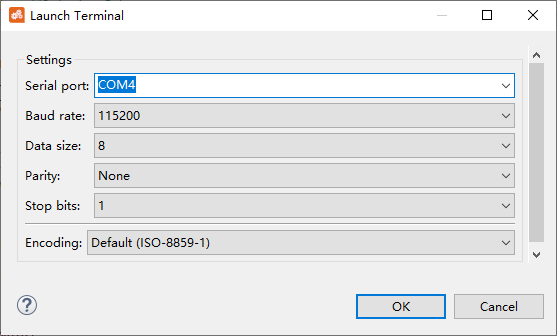  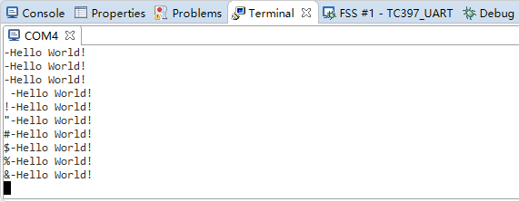
- 只测试了2M及以下的波特率, 改用SSCOM或者友善串口助手, 是正常的, 这个兄弟用printf测到了6.18M, [AURIX 学习笔记（6）标准库中串口控制台输出](https://zhuanlan.zhihu.com/p/151285149)  

## Ifx_Console_print

这个就是类似于`printf`的功能, 只不过函数名变了一下而已.  

```c
#include "Ifx_Console.h"

IfxStdIf_DPipe  g_ascStandardInterface;     /* Standard interface object            */

void core0_main(void)
{
    //上面的初始化
    //...

    /* Initialize the Standard Interface */
    IfxAsclin_Asc_stdIfDPipeInit(&g_ascStandardInterface, &g_asc0);
    /* Initialize the Console */
    Ifx_Console_init(&g_ascStandardInterface);

    while(1)
    {
        static uint8 count = 1;
        Ifx_Console_print("count: %d\r\n", ++count);
        waitTime(5 * TimeConst_100ms);
    }
}

```

编译运行:  

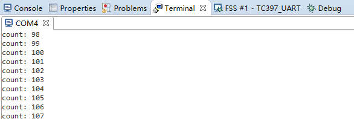

## 接收中断

这里实现一下把接收到的数据原封不动发送出去, 直接上 `Cpu0_Main.c`:  

```c
#include "Ifx_Types.h"
#include "IfxCpu.h"
#include "IfxScuWdt.h"

#include "Bsp.h"
//#include <stdio.h>  //Only for Debug
#include "IfxAsclin_Asc.h"
#include "IfxCpu_Irq.h"
#include "Ifx_Console.h"

#define SERIAL_BAUDRATE0         921600
#define SERIAL_PIN_RX0           IfxAsclin0_RXA_P14_1_IN
#define SERIAL_PIN_TX0           IfxAsclin0_TX_P14_0_OUT
#define INTPRIO_ASCLIN0_TX       19      /* Priority of the ISR */
#define INTPRIO_ASCLIN0_RX       15      /* Priority of the ISR */
#define INTPRIO_ASCLIN0_ER       23      /* Priority of the ISR */

#define ASC_TX_BUFFER_SIZE       1024
#define ASC_RX_BUFFER_SIZE       1024
/* The transfer buffers allocate memory for the data itself and for FIFO runtime variables.
 * 8 more bytes have to be added to ensure a proper circular buffer handling independent from
 * the address to which the buffers have been located.
 */
uint8 g_ascTxBuffer[ASC_TX_BUFFER_SIZE + sizeof(Ifx_Fifo) + 8];
uint8 g_ascRxBuffer[ASC_RX_BUFFER_SIZE + sizeof(Ifx_Fifo) + 8];

IFX_ALIGN(4) IfxCpu_syncEvent g_cpuSyncEvent = 0;

IfxAsclin_Asc g_asc0;                       /* ASCLIN module object                 */
IfxStdIf_DPipe  g_ascStandardInterface;     /* Standard interface object            */

IFX_INTERRUPT(asclin0TxISR, 0, INTPRIO_ASCLIN0_TX);  /* Adding the Interrupt Service Routine */
void asclin0TxISR(void)
{
    IfxAsclin_Asc_isrTransmit(&g_asc0);
}

IFX_INTERRUPT(asc0RxISR, 0, INTPRIO_ASCLIN0_RX);
void asc0RxISR(void)
{
    IfxStdIf_DPipe_onReceive(&g_ascStandardInterface);

//    //abcdefghijklmnopqrstuvwxyz0123456789~?!$%^&*()
//    if(IfxAsclin_Asc_getReadCount(&g_asc0) > 0)
//    {
//        uint8 a = IfxAsclin_Asc_blockingRead(&g_asc0);
//        IfxAsclin_Asc_blockingWrite(&g_asc0, a);
////        if(a == '\n')
////        {
////            //IfxAsclin_Asc_blockingWrite(&g_asc0, 'R');
////            //IfxAsclin_Asc_blockingWrite(&g_asc0, ':');
////            //IfxAsclin_Asc_blockingWrite(&g_asc0, ' ');
////            Ifx_Console_print("R: ");
////        }
//    }
}

IFX_INTERRUPT(asc0ErrISR, 0, INTPRIO_ASCLIN0_ER);
void asc0ErrISR(void)
{
    IfxStdIf_DPipe_onError(&g_ascStandardInterface);
}

void core0_main(void)
{
    IfxCpu_enableInterrupts();
    
    /* !!WATCHDOG0 AND SAFETY WATCHDOG ARE DISABLED HERE!!
     * Enable the watchdogs and service them periodically if it is required
     */
    IfxScuWdt_disableCpuWatchdog(IfxScuWdt_getCpuWatchdogPassword());
    IfxScuWdt_disableSafetyWatchdog(IfxScuWdt_getSafetyWatchdogPassword());
    
    /* Wait for CPU sync event */
    IfxCpu_emitEvent(&g_cpuSyncEvent);
    IfxCpu_waitEvent(&g_cpuSyncEvent, 1);
    
    initTime();

    /* Initialize an instance of IfxAsclin_Asc_Config with default values */
    IfxAsclin_Asc_Config ascConfig;
    IfxAsclin_Asc_initModuleConfig(&ascConfig, SERIAL_PIN_TX0.module);
    /* Set the desired baud rate */
    ascConfig.baudrate.baudrate = SERIAL_BAUDRATE0;
    ascConfig.baudrate.oversampling = IfxAsclin_OversamplingFactor_16; /* Set the oversampling factor */
    /* Configure the sampling mode */
    ascConfig.bitTiming.medianFilter = IfxAsclin_SamplesPerBit_three;             /* Set the number of samples per bit*/
    ascConfig.bitTiming.samplePointPosition = IfxAsclin_SamplePointPosition_8;    /* Set the first sample position    */
    /* ISR priorities and interrupt target */
    ascConfig.interrupt.txPriority = INTPRIO_ASCLIN0_TX;
    ascConfig.interrupt.rxPriority = INTPRIO_ASCLIN0_RX;
    ascConfig.interrupt.erPriority = INTPRIO_ASCLIN0_ER;
    ascConfig.interrupt.typeOfService = IfxCpu_Irq_getTos(IfxCpu_getCoreIndex());
    /* FIFO configuration */
    ascConfig.txBuffer = &g_ascTxBuffer;
    ascConfig.txBufferSize = ASC_TX_BUFFER_SIZE;
    ascConfig.rxBuffer = &g_ascRxBuffer;
    ascConfig.rxBufferSize = ASC_RX_BUFFER_SIZE;
    /* Port pins configuration */
    const IfxAsclin_Asc_Pins pins =
    {
        NULL_PTR,         IfxPort_InputMode_pullUp,      /* CTS pin not used    */
        &SERIAL_PIN_RX0,   IfxPort_InputMode_pullUp,     /* RX pin              */
        NULL_PTR,         IfxPort_OutputMode_pushPull,   /* RTS pin not used    */
        &SERIAL_PIN_TX0,   IfxPort_OutputMode_pushPull,  /* TX pin              */
        IfxPort_PadDriver_cmosAutomotiveSpeed1
    };
    ascConfig.pins = &pins;
    /* Initialize module with above parameters  */
    IfxAsclin_Asc_initModule(&g_asc0, &ascConfig);

    /* Initialize the Standard Interface */
    IfxAsclin_Asc_stdIfDPipeInit(&g_ascStandardInterface, &g_asc0);
    /* Initialize the Console */
    Ifx_Console_init(&g_ascStandardInterface);

    //Ifx_Console_print("ACK Test\r\nR: ");

    while(1)
    {
        //static uint8 count = 1;     //Only for Debug
        //printf("Hello, world, %d\r\n", ++count);    //Only for Debug

        //IfxAsclin_Asc_blockingWrite(&g_asc0, ++count);
        //IfxAsclin_Asc_blockingWrite(&g_asc0, '-');
        //uint8 txData[] = "Hello World!\r\n";                                    /* Message to send                          */
        //Ifx_SizeT count1 = 14;                                                 /* Size of the message                      */
        //IfxAsclin_Asc_write(&g_asc0, txData, &count1, TIME_INFINITE);

        //Ifx_Console_print("count: %d\r\n", ++count);
        //waitTime(5 * TimeConst_100ms);

        //abcdefghijklmnopqrstuvwxyz0123456789~?!$%^&*()
        sint32 readCount = (Ifx_SizeT)IfxAsclin_Asc_getReadCount(&g_asc0);
        if(readCount > 0)
        {
            uint8 a = IfxAsclin_Asc_blockingRead(&g_asc0);
            IfxAsclin_Asc_blockingWrite(&g_asc0, a);
            //IfxAsclin_Asc_read(&g_asc0, g_ascTxBuffer, &readCount, TIME_INFINITE);
            //IfxAsclin_Asc_write(&g_asc0, g_ascTxBuffer, &readCount, TIME_INFINITE);
        }
    }
}
```

注意结果:  

- 波特率改为921600, 缓存改为1024字节(之前的64字节太小)
- SSCOM -> 显示 -> 显示缓冲上限设为5M, 勾选1ms定时发送`abcdefghijklmnopqrstuvwxyz0123456789~?!$%^&*()`加回车换行
- 测试百万字节, 没有丢字节, 大环形缓冲真香  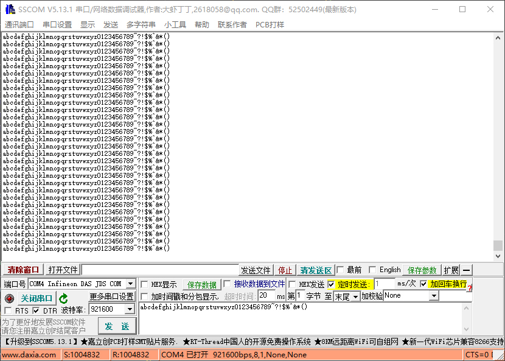


## TC397_UART工程下载


## ASCLIN_Shell_UART_1

打开AURIX Development Studio

File -> Import... -> Infineon, AURIX Development Studio Project -> ASCLIN_Shell_UART_1_KIT_TC397_TFT, 这个例程很有意思, 一种终端的感觉:  

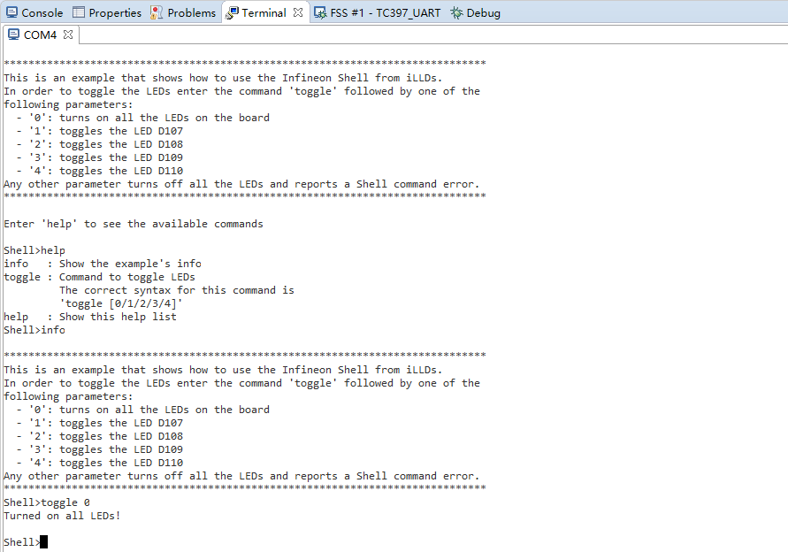

## 参考

- [ASCLIN_Shell_UART_1 for KIT_AURIX_TC397_TFT](https://www.infineon.com/dgdl/Infineon-AURIX_ASCLIN_Shell_UART_1_KIT_TC397_TFT-Training-v01_00-EN.pdf?fileId=5546d46272e49d2a0172e6c59e0301dc)
- [ASCLIN_UART_1 for KIT_AURIX_TC397_TFT](https://www.infineon.com/dgdl/Infineon-AURIX_ASCLIN_UART_1_KIT_TC397_TFT-Training-v01_00-EN.pdf?fileId=5546d46272e49d2a0172e6c5b92e01e0).  
- [UART_DMA_Transfer_1 for KIT_AURIX_TC397_TFT](https://www.infineon.com/dgdl/Infineon-AURIX_UART_DMA_Transfer_1_KIT_TC397_TFT-Training-v01_00-EN.pdf?fileId=5546d46272e49d2a0172e6fced6e0226)
- [UART_VCOM_1 for KIT_AURIX_TC397_TFT](https://www.infineon.com/dgdl/Infineon-AURIX_UART_VCOM_1_KIT_TC397_TFT-Training-v01_00-EN.pdf?fileId=5546d46272e49d2a0172e6fcf6570228)
