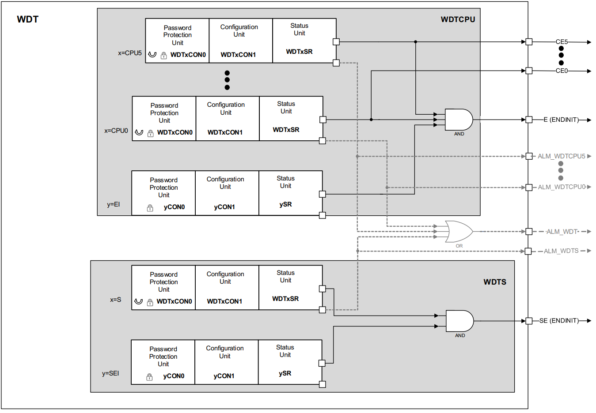

# TC397_Watchdog

<!-- TOC -->

- [TC397_Watchdog](#tc397_watchdog)
  - [看门狗基础](#看门狗基础)
  - [TC397 Watchdog](#tc397-watchdog)

<!-- /TOC -->

## 看门狗基础

文档参阅 TC3XX User Manual 的9.4节, 看门狗Watchdog Timers (WDT)是System Control Units (SCU)六大模块之一.  

TC3xx包含以下看门狗定时器：  

- 1个安全看门狗定时器(Safety Watchdog Timer), 防止意外写入关键系统寄存器和存储器, 一定时间内未响应其计时器, 将引发SMU警报请求.  
- 每个CPU一个看门狗定时器(CPU Watchdogs Timer ), 为CPU寄存器以及特定的系统寄存器提供保护, 监视单独的CPU, 一定时间内未刷新, 将触发设备复位.  

每个看门狗定时器具有以下基本功能：  

- 可编程的时基和重载值
- 可编程的密码保护以及可配置的自动密码序列(automatic password sequencing)
- 带有可编程窗口的可编程时间戳检查
- 无效或缺少计时器刷新序列会导致安全警报(Safety Alarm)
- 可在调试期间挂起看门狗操作
- 关键寄存器写保护，只能在短超时时间内解锁

AURIX TC2xx SCU WDT和AURIX TM TC3xx SCU WDT之间最重要的变化是：  

- 寄存器地址更改
- 增加的CPU响应增加相应的看门狗定时器
- 可以通过新的ENDINIT(End-of-Initialization, 初始化终止)超时计数器（EICON寄存器）进行ENDINIT解锁，而不会影响任何CPU看门狗定时器
- 可以通过新的安全ENDINIT超时计数器（SEICON寄存器）解锁安全ENDINIT，而不会影响安全看门狗定时器
- 安全看门狗定时器的单独ACCEN保护范围
- 外部WDT“活动心跳”指示功能已删除

WDT提供了一种高度可靠和安全的方法来检测软件或硬件故障并从中恢复。 WDT有助于在用户指定的时间段内中止CPU或系统的意外故障.  

WDT框图:  



除此标准的“看门狗”功能外，每个WDT都具有初始化终止（ENDINIT, End-of-Initialization）功能，可以保护关键寄存器免于意外写入.  

维护看门狗和修改ENDINIT位是至关重要的功能，如果系统出现故障，则不允许这样做。 为了保护这些功能，实施了一种复杂的方案，该方案在访问WDT控制寄存器期间需要密码和保护位。 任何未提供正确密码或保护位正确值的写访问均被视为系统故障，并导致看门狗警报。 另外，即使在执行了有效的访问并且将ENDINIT位清零以提供对关键寄存器的访问之后，看门狗也对该访问窗口施加了时间限制。 如果在该限制到期之前未再次正确设置ENDINIT位，则认为系统发生了故障。 这些严格的要求尽管不能得到保证，但是仍然为系统操作的鲁棒性提供了高度的保证.  

可用的配置选项使看门狗服务能够额外检查代码执行顺序和中间代码执行时间。 如果启用了这些检查，则任何不正确的顺序或超限的执行时间也将导致SMU警报请求.  

任何WDT到期都会引发SMU警报。 可以对SMU进行编程以提供中断或陷阱，以便在采取进一步措施（例如重置设备或CPU）之前为恢复或状态记录提供一些时间. 

Safety Watchdog Timer, 安全看门狗定时器:  

- 提供了独立于CPU看门狗定时器的整体系统级看门狗，并且还提供了另一种保护措施，以防止意外写入安全关键系统寄存器。 启用安全WDT时，如果在用户可编程的时间段内未对SMU发出警报，则可能引发SMU警报请求. CPU必须在此时间间隔内为安全WDT服务，以防止发生这种情况。 在SMU中可以配置对安全WDT超时的响应。 因此，定期对Safety WDT进行维护可确认系统正在按预期运行.  
- 通常，将配置SCU写保护（ACCEN），以便只有受限制的“安全” CPU(s)才能配置安全关键功能, 这包括服务安全看门狗的能力. 此外，安全监视程序计时器的禁用/启用/配置功能需要安全ENDINIT密码

CPU Watchdogs Timer, CPU看门狗定时器:  

- 单独的CPU看门狗定时器提供了监视单独的CPU执行线程的能力，而无需软件来协调通用看门狗的共享使用.  
- 启用CPU WDT时，如果在用户可编程的时间段内未正确服务，则可能导致SMU警报请求。 CPU必须在此时间间隔内为其CPU WDT服务，以防止出现这种情况。 在SMU内可配置对每个CPUy看门狗超时的响应. 因此，对CPU WDT的定期服务确认相应的CPU正在按预期执行软件序列.  
- 复位后，CPU0运行，并且CPU0看门狗定时器自动启动. 其他CPU最初处于HALT状态，因此禁用了它们对应的看门狗定时器。 默认情况下，其他CPU看门狗定时器未配置为生成超时复位，但是可以启用它. CPU看门狗只能由其相应的CPU进行配置，启用或禁用.  

WDT的主要功能总结如下:  

- 16位看门狗定时器
- 可选输入频率：fSPB / 64，fSPB / 256或fSPB / 16384
- 正常看门狗定时器操作的16位用户可定义重载值，超时模式为固定重载值
- 合并相应的ENDINIT位并监视其修改
- 具有用户可定义的密码字段的复杂密码访问机制
- 访问错误检测：无效的密码（第一次访问期间）或无效的保护位（第二次访问期间）触发对SMU的警报请求
- 时间和逻辑监视功能：可选的代码序列检查. 错误的代码序列签名标识将触发对SMU的警报请求; 可选的代码执行时间检查, 代码执行时间超出预期的限制将触发向SMU发出警报的请求
- 溢出错误检测：WDT计数器的溢出触发向SMU发出警报请求
- 看门狗功能可以禁用； 访问保护和ENDINIT位监视功能保持启用状态
- 可配置的机制，以防止在未使用安全警告警报后重新加载看门狗，以确保未使用警告会导致SMU硬件响应

## TC397 Watchdog

参考 [Watchdog_1 for KIT_AURIX_TC397_TFT](https://www.infineon.com/dgdl/Infineon-AURIX_Watchdog_1_KIT_TC397_TFT-Training-v01_00-EN.pdf?fileId=5546d46272e49d2a0172e6fd001f022a)  

以CPU0的看门狗定时器为例, 步骤如下:  

- 屏蔽默认的关闭CPU看门狗这一句: `IfxScuWdt_disableCpuWatchdog(IfxScuWdt_getCpuWatchdogPassword());`
- 配置CPU0WDT, `IfxScuWdt_changeCpuWatchdogReload`, 重载值(REL, Reload Value)默认0xFFFC, 向上计数, 到0xFFFF就溢出了, 这个时间太短, 改为0xE000, 超时时间timeout ≈ (0xFFFF - REL) / (100MHz/16384) ≈ 1.342s, 值16384是一个常量，由寄存器WDTSCON1的IRx定义
- 获取密码喂狗: `IfxScuWdt_serviceCpuWatchdog(IfxScuWdt_getCpuWatchdogPassword());`

Cpu0_Main.c代码如下:  

```c
#include "Ifx_Types.h"
#include "IfxCpu.h"
#include "IfxScuWdt.h"

#include "Bsp.h"

IFX_ALIGN(4) IfxCpu_syncEvent g_cpuSyncEvent = 0;

#define LED         &MODULE_P13, 0

#define REL_VAL     0xE000       /* Reload value for extended timeout window */

void core0_main(void)
{
    IfxCpu_enableInterrupts();
    
    /* !!WATCHDOG0 AND SAFETY WATCHDOG ARE DISABLED HERE!!
     * Enable the watchdogs and service them periodically if it is required
     */
    //IfxScuWdt_disableCpuWatchdog(IfxScuWdt_getCpuWatchdogPassword());
    IfxScuWdt_disableSafetyWatchdog(IfxScuWdt_getSafetyWatchdogPassword());
    
    IfxScuWdt_changeCpuWatchdogReload(IfxScuWdt_getCpuWatchdogPassword(), REL_VAL); /* Set CPU0WD timer to ~1.3 sec */
    IfxScuWdt_serviceCpuWatchdog(IfxScuWdt_getCpuWatchdogPassword());               /* Service the CPU0WDT          */

    /* Wait for CPU sync event */
    IfxCpu_emitEvent(&g_cpuSyncEvent);
    IfxCpu_waitEvent(&g_cpuSyncEvent, 1);
    
    IfxPort_setPinMode(LED,  IfxPort_Mode_outputPushPullGeneral);
    IfxPort_setPinHigh(LED);

    initTime();

    while(1)
    {
        IfxScuWdt_serviceCpuWatchdog(IfxScuWdt_getCpuWatchdogPassword());           /* Continuously service CPU0WDT */
        wait(TimeConst_1s);                                                         /* Wait for one second          */
        IfxPort_togglePin(LED);
    }
}
```

编译运行, 由于1s<1.34s, 不会复位, LED正常翻转.  

等待时间改为2s: `wait(TimeConst_1s*2);` 编译运行, CPU一直复位, LED不会正常翻转. 这个值别改太小, 可能引起下载时候的麻烦.  

