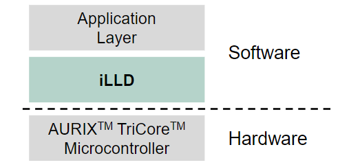
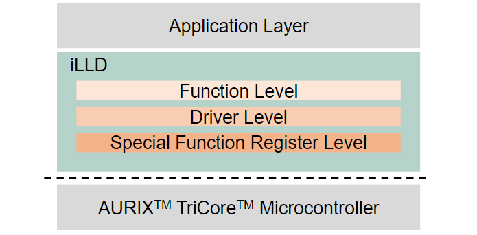
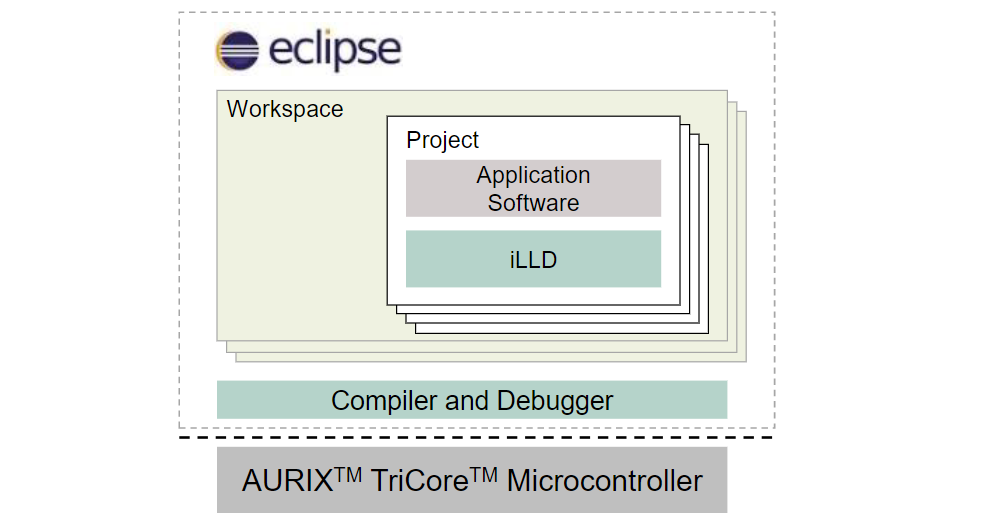

# iLLD简介

`iLLD`, 全称 `Infineon Low Level Driver`, AURIX 家族的开源软件包, 支持多种编译器, 硬件抽象, 包含Demo, 让外设的配置/初始化/使用更简单.  

iLLD提供了函数, 驱动和结构体, 实现3个层次的抽象:  

- Special FunctionRegister Level: 通过名字访问寄存器位
- Driver Level: 封装寄存器配置为函数, 更易执行
- Function Level: 初始化, 配置, 启动, 停止任何AURIX外设

开发环境集成:  

以I2C为例:  

来源 [AURIX™ Infineon Low Level Driver](https://www.infineon.com/dgdl/Infineon-AURIX_Infineon_Low_Level_Driver-Training-v01_00-EN.pdf?fileId=5546d46269bda8df0169ca77502b254c)