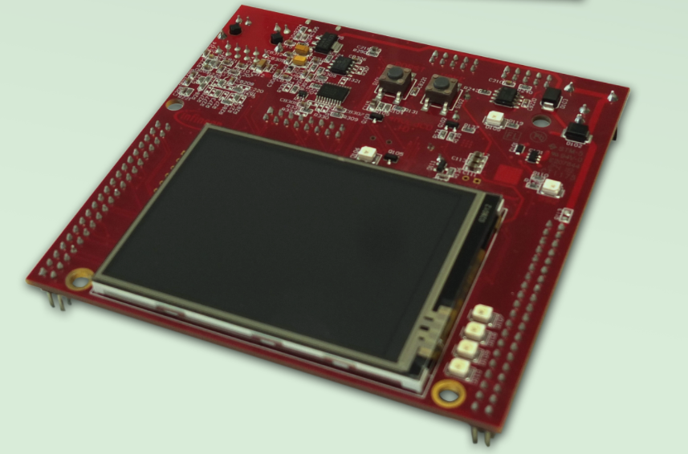
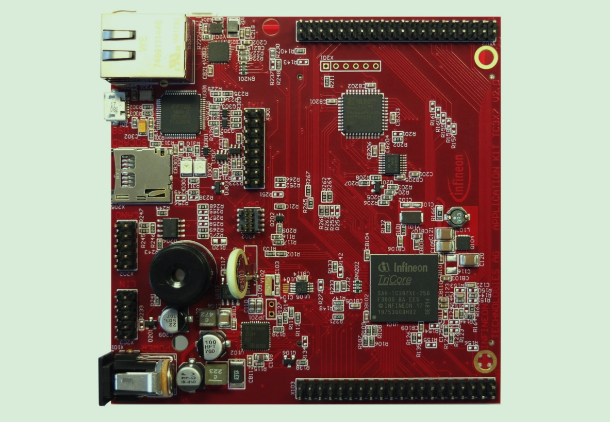
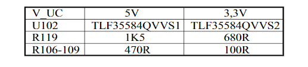
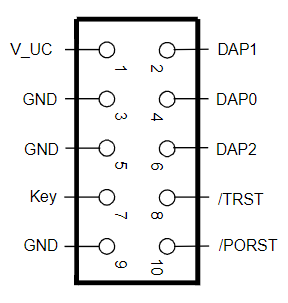
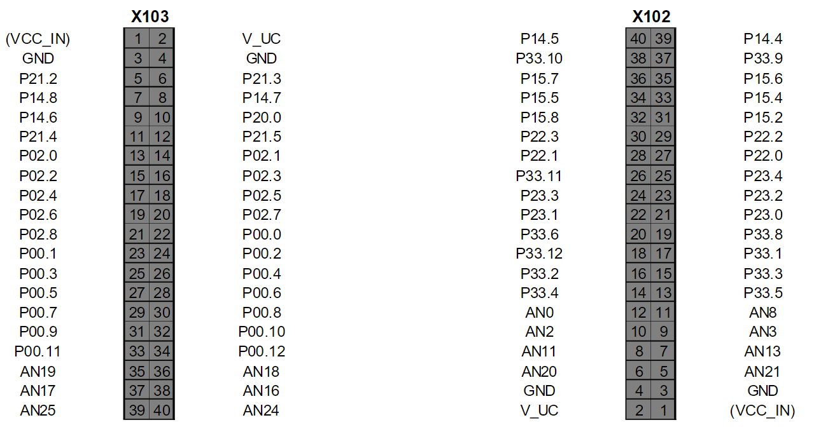
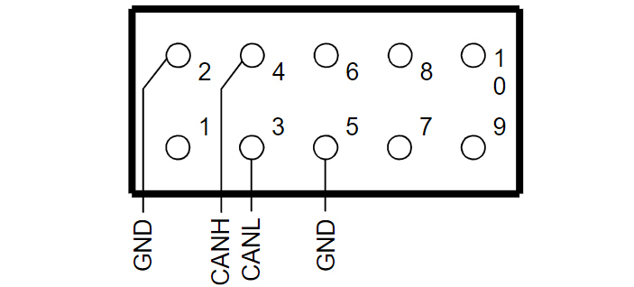

# 开发板简介

<!-- TOC -->

- [开发板简介](#开发板简介)
  - [照片](#照片)
  - [资料](#资料)
  - [调试](#调试)
  - [资源](#资源)
  - [供电](#供电)
  - [扩展](#扩展)
  - [CAN](#can)

<!-- /TOC -->

用的开发板是[KIT_A2G_TC397_5V_TFT](https://www.infineon.com/cms/en/product/evaluation-boards/kit_a2g_tc397_5v_tft/), 其实更推荐[KIT_A2G_TC397_3V3_TFT](https://www.infineon.com/cms/en/product/evaluation-boards/kit_a2g_tc397_3v3_tft/), 售价¥ 1,670.59

## 照片

正面:  

背面:

5V的板子和3.3V的板子主要是下面几个器件不同, 测量X103的PIN2即可知道是5V还是3.3V的板子:  

## 资料

配套资料只有一个手册 [Infineon-ApplicationKitManual_TC3X7-UM-v02_00-EN.pdf](https://www.infineon.com/dgdl/Infineon-ApplicationKitManual_TC3X7-UM-v02_00-EN.pdf?fileId=5546d462696dbf120169b454383c483d), 当然, 里面有原理图啥的, 其它资料参考TC397的公共资源即可.  

## 调试

板载了`USB miniWiggler JDS`调试器, 还引出了 `OCDS1` 和 `DAP` 接口, 后者小巧, 用的多, 连接器型号`Samtec FTSH10`, 引脚分配如下:  

## 资源

板载资源:  

- Infineon’s TC3X7 (TC397, TC387) AURIX™ 2G Controller in LFBGA-292 Package
- LCD XGA Display 320x240–SD card slot (mini SD)
- High Speed CAN Transceiver (CAN FD capable)
- USB to UART bridge
- Ethernet Gigabit PHY–LIN Transceiver
- Crystal 20MHz (default) or External Clock
- USB miniWiggler JDS for easy debugging
- 4 Low Power Status LEDs
- RTC with alarm
- Acoustic beeper
- 100mm x 100mm

## 供电
供电通过USB(900mA)或者DC口, 后者DC5.5~40V, 6V@800mA是足够的, 常用的12V/1A适配器即可.  

## 扩展

扩展IO引脚分布如下:  

## CAN

X202是CAN接口, 已经板载了收发器且接上了`120Ω`终端电阻, 引脚分布:  

  
