# 环境搭建与GPIO

<!-- TOC -->

- [环境搭建与GPIO](#环境搭建与gpio)
  - [AURIX™ Development Studio](#aurix-development-studio)
  - [导入工程](#导入工程)
  - [新建工程](#新建工程)
  - [延时](#延时)
  - [GPIO设置推挽输出](#gpio设置推挽输出)
  - [GPIO输出](#gpio输出)
  - [GPIO电平读取](#gpio电平读取)
  - [Ports](#ports)
  - [参考](#参考)

<!-- /TOC -->

## AURIX™ Development Studio

[AURIX™ Development Studio](https://www.infineon.com/cms/en/product/promopages/aurix-development-studio/), 一个综合开发环境，包括Eclipse IDE、C-编译器、多核调试器、英飞凌低级驱动程序（iLLD），没有时间和代码大小的限制，能够编辑、编译和调试应用程序代码。  

注册完后, 下载链接会发到邮箱. 我下载的是 `AURIX-studio-setup_1.2.2_20201012-1308`版本, 大小`382MB`. 默认安装目录`C:\Infineon\AURIX-Studio-1.2.2`, 就不改了.  

主要安装 `AURIX™Development Studio` 和 `DAS64`, 勾选同意协议, 下一步就可以了.  

## 导入工程

`AURIX™ Development Studio`可以导入最新的示例工程, 可能是 [Github Infineon
/AURIX_code_examples](https://github.com/Infineon/AURIX_code_examples) 这里面的:  

- 打开 `AURIX Development Studio`
- `File` -> `Import...`
- 选择`Infineon` -> `AURIX Development Studio Project`, 然后点 `Next`: 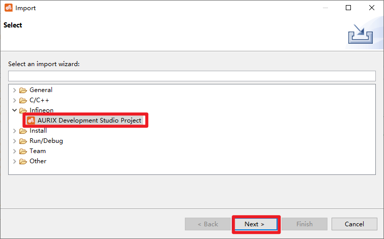
- 选择一个TC397的Blink工程, 点Finish, 如果点不动, 可能默认workspace下有同名文件夹: 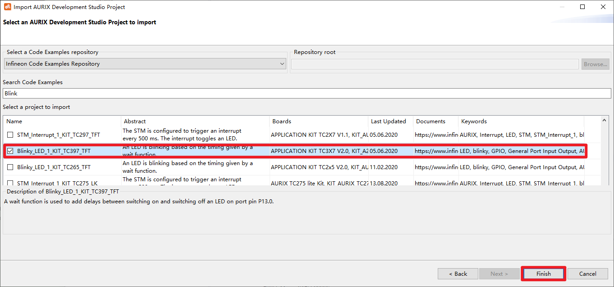

## 新建工程

上面是导入示例工程的方法, 也可以自己新建工程:  

- `File` -> `New` -> `New AURIX Project`:  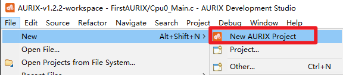
- 输入工程名 `TC397_Blink_LED`, `Next`:  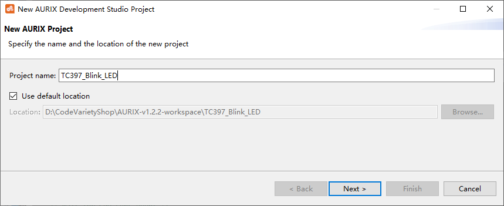
- 选择器件和板子或者`Custom Board`:  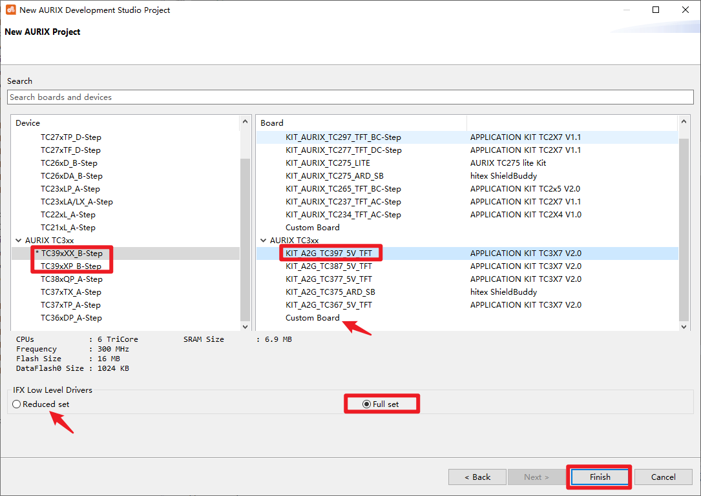
- 有时候编辑的时候发现编辑器页面变灰, 说明当前文件所在工程不是Actice的, 工程右键, 选择`Set Active Project`即可:  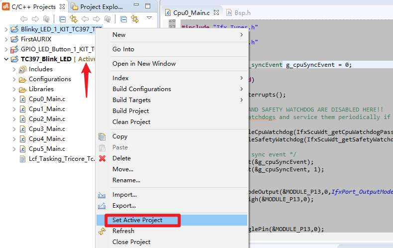

打开`Cpu0_Main.c`, 默认代码如下:  

```c
#include "Ifx_Types.h"
#include "IfxCpu.h"
#include "IfxScuWdt.h"

IFX_ALIGN(4) IfxCpu_syncEvent g_cpuSyncEvent = 0;

void core0_main(void)
{
    IfxCpu_enableInterrupts();
    
    /* !!WATCHDOG0 AND SAFETY WATCHDOG ARE DISABLED HERE!!
     * Enable the watchdogs and service them periodically if it is required
     */
    IfxScuWdt_disableCpuWatchdog(IfxScuWdt_getCpuWatchdogPassword());
    IfxScuWdt_disableSafetyWatchdog(IfxScuWdt_getSafetyWatchdogPassword());
    
    /* Wait for CPU sync event */
    IfxCpu_emitEvent(&g_cpuSyncEvent);
    IfxCpu_waitEvent(&g_cpuSyncEvent, 1);
    
    while(1)
    {
    }
}
```

[KIT_A2G_TC397_5V_TFT](https://www.infineon.com/cms/en/product/evaluation-boards/kit_a2g_tc397_5v_tft/) 板子上有4颗LED, 分别为:  

| Reference | PIN   | ON |
|-----------|-------|----|
| D107      | P13.0 | 0  |
| D108      | P13.1 | 0  |
| D109      | P13.2 | 0  |
| D110      | P13.3 | 0  |

原理图:  

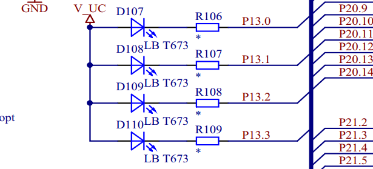

现在加入一些延时还有点灯的功能:  

```c
#include "Ifx_Types.h"
#include "IfxCpu.h"
#include "IfxScuWdt.h"
#include "Bsp.h"    //initTime();

IFX_ALIGN(4) IfxCpu_syncEvent g_cpuSyncEvent = 0;

void core0_main(void)
{
    IfxCpu_enableInterrupts();
    
    /* !!WATCHDOG0 AND SAFETY WATCHDOG ARE DISABLED HERE!!
     * Enable the watchdogs and service them periodically if it is required
     */
    IfxScuWdt_disableCpuWatchdog(IfxScuWdt_getCpuWatchdogPassword());
    IfxScuWdt_disableSafetyWatchdog(IfxScuWdt_getSafetyWatchdogPassword());
    
    /* Wait for CPU sync event */
    IfxCpu_emitEvent(&g_cpuSyncEvent);
    IfxCpu_waitEvent(&g_cpuSyncEvent, 1);
    
    initTime(); /* Calculate iLLDs time constants   */
    IfxPort_setPinModeOutput(&MODULE_P13,0, IfxPort_OutputMode_pushPull, IfxPort_OutputIdx_general);
    IfxPort_setPinHigh(&MODULE_P13,0);   //Switch OFF the LED (low-level active)

    while(1)
    {
        IfxPort_togglePin(&MODULE_P13,0);       /* Toggle the state of the LED*/
        waitTime(5 * TimeConst_100ms);          /* Wait 500 milliseconds*/
    }
}
```

`Build Active Project`:  

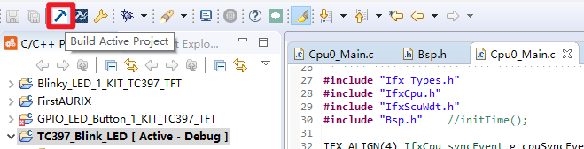

结果如下:  

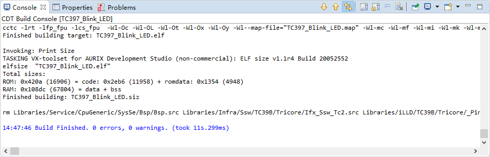

用Micro-USB线连接板子和电脑, 设备管理器中确认驱动没有问题:  

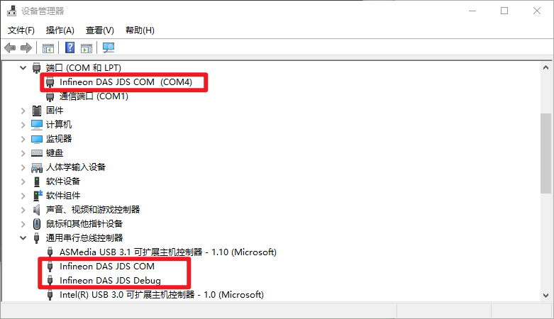

可以调试, 也可以RUN, 这里以后者为例, `AURIX™ Development Studio`中工程右键 Run As -> Run Configuration:  

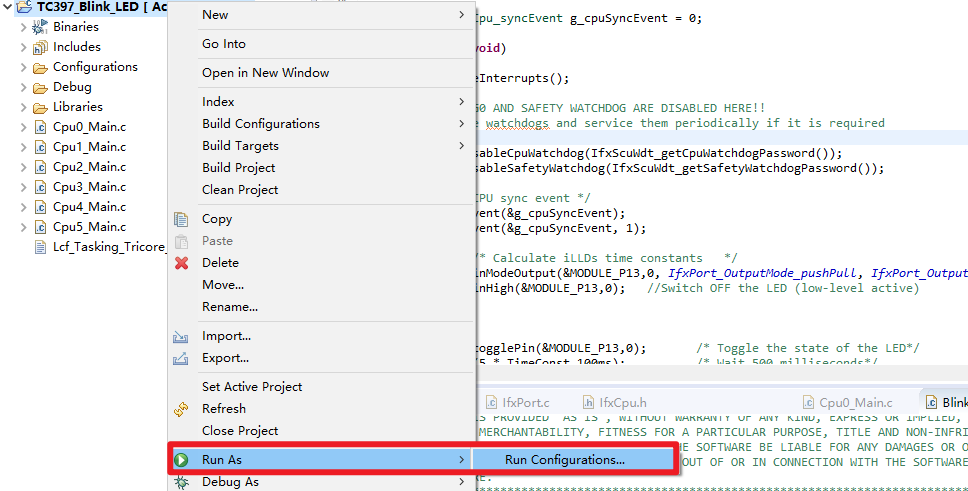

发现啥也没有, 右键`TASKING C/C++ Debugger` -> `New Configuration`:  

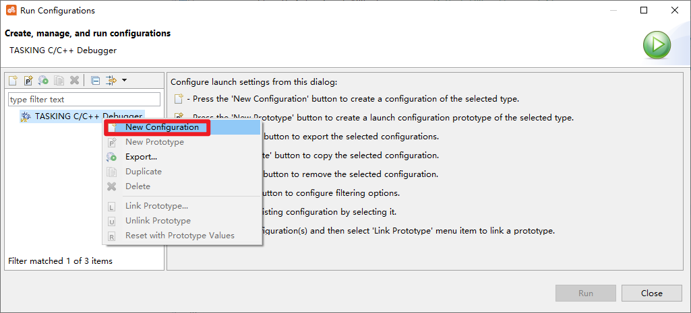

然后就出现工程同名的配置:  

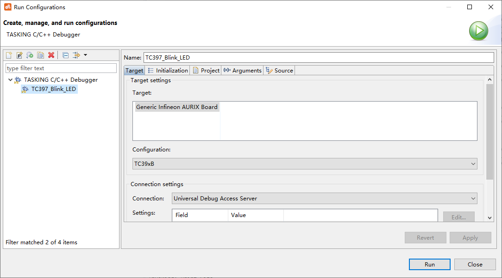

可以保持默认, 然后 Run, Console中提示`Loading 'D:\CodeVarietyShop\AURIX-v1.2.2-workspace\TC397_Blink_LED\Debug\TC397_Blink_LED.elf'...`, 已经下到单片机里面了, 程序还没有运行, 按下复位键`S101 PORST`, 发现D107蓝色LED以500ms交替亮灭.  

修改下代码:  

```c
    initTime(); /* Calculate iLLDs time constants   */
    IfxPort_setPinModeOutput(&MODULE_P13,0, IfxPort_OutputMode_pushPull, IfxPort_OutputIdx_general);
    IfxPort_setPinModeOutput(&MODULE_P13,1, IfxPort_OutputMode_pushPull, IfxPort_OutputIdx_general);
    IfxPort_setPinModeOutput(&MODULE_P13,2, IfxPort_OutputMode_pushPull, IfxPort_OutputIdx_general);
    IfxPort_setPinModeOutput(&MODULE_P13,3, IfxPort_OutputMode_pushPull, IfxPort_OutputIdx_general);
    IfxPort_setPinHigh(&MODULE_P13,0);   //Switch OFF the LED (low-level active)
    IfxPort_setPinHigh(&MODULE_P13,1);   //Switch OFF the LED (low-level active)
    IfxPort_setPinHigh(&MODULE_P13,2);   //Switch OFF the LED (low-level active)
    IfxPort_setPinHigh(&MODULE_P13,3);   //Switch OFF the LED (low-level active)

    while(1)
    {
        IfxPort_togglePin(&MODULE_P13,0);       /* Toggle the state of the LED*/
        IfxPort_togglePin(&MODULE_P13,1);
        IfxPort_togglePin(&MODULE_P13,2);
        IfxPort_togglePin(&MODULE_P13,3);
        waitTime(5 * TimeConst_100ms);          /* Wait 500 milliseconds*/
    }
```

点击锤子形状的 `Build Active Project`, 编译完后提示:  

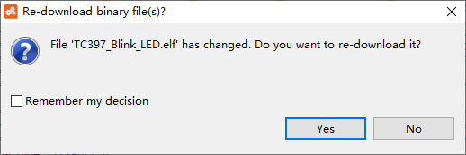

点 `Yes`, 自动下载, 提示 `Re-loading 'D:\CodeVarietyShop\AURIX-v1.2.2-workspace\TC397_Blink_LED\Debug\TC397_Blink_LED.elf'...`, 按下复位按键, 可以看到4个灯同时500ms交替亮灭.  

## 延时

- 头文件包含 `#include "Bsp.h"`
- 初始化 `initTime(); /* Calculate iLLDs time constants   */`
- 延时 `waitTime(5 * TimeConst_100ms);          /* Wait 500 milliseconds*/`

还可以使用的常量有:  

```c
#define TimeConst_0s    ((Ifx_TickTime)0)                           /**< \brief time constant equal to 1s */
#define TimeConst_10ns  (TimeConst[TIMER_INDEX_10NS])               /**< \brief time constant equal to 10ns */
#define TimeConst_100ns (TimeConst[TIMER_INDEX_100NS])              /**< \brief time constant equal to 100ns */
#define TimeConst_1us   (TimeConst[TIMER_INDEX_1US])                /**< \brief time constant equal to 1us */
#define TimeConst_10us  (TimeConst[TIMER_INDEX_10US])               /**< \brief time constant equal to 10us */
#define TimeConst_100us (TimeConst[TIMER_INDEX_100US])              /**< \brief time constant equal to 100us */
#define TimeConst_1ms   (TimeConst[TIMER_INDEX_1MS])                /**< \brief time constant equal to 1ms */
#define TimeConst_10ms  (TimeConst[TIMER_INDEX_10MS])               /**< \brief time constant equal to 10ms */
#define TimeConst_100ms (TimeConst[TIMER_INDEX_100MS])              /**< \brief time constant equal to 100ms */
#define TimeConst_1s    (TimeConst[TIMER_INDEX_1S])                 /**< \brief time constant equal to 1s */
#define TimeConst_10s   (TimeConst[TIMER_INDEX_10S])                /**< \brief time constant equal to 10s */
#define TimeConst_100s  (TimeConst[TIMER_INDEX_100S])               /**< \brief time constant equal to 100s */
```

## GPIO设置推挽输出

- 设置推挽输出 `IfxPort_setPinModeOutput(&MODULE_P13,0, IfxPort_OutputMode_pushPull, IfxPort_OutputIdx_general);`

## GPIO输出

- 输出高电平 `IfxPort_setPinHigh(&MODULE_P13,0);`
- 输出低电平 `IfxPort_setPinLow(&MODULE_P13,0);`
- 翻转 `IfxPort_togglePin(&MODULE_P13,0);`  

## GPIO电平读取

- 函数原型: `uint32 IfxPort_getGroupState(Ifx_P *port, uint8 pinIndex, uint16 mask)`

- 读取P13.2电平: `IfxPort_getGroupState(&MODULE_P13,2,1)`
- 读取P33[7:0]电平: uint16 value = IfxPort_getGroupState(&MODULE_P33, 0, 0xff);

## Ports

另一种初始化方法

```c
#include "IfxPort_PinMap.h"
#include "IfxPort_Io.h"

    const IfxPort_Io_ConfigPin configPin[] = {
        {&IfxPort_P13_0, IfxPort_Mode_outputPushPullGeneral, IfxPort_PadDriver_cmosAutomotiveSpeed1},
        {&IfxPort_P13_1, IfxPort_Mode_outputPushPullGeneral, IfxPort_PadDriver_cmosAutomotiveSpeed1},
        {&IfxPort_P13_2, IfxPort_Mode_outputPushPullGeneral, IfxPort_PadDriver_cmosAutomotiveSpeed1},
        {&IfxPort_P13_3, IfxPort_Mode_outputPushPullGeneral, IfxPort_PadDriver_cmosAutomotiveSpeed1}
    };

    const IfxPort_Io_Config conf = {
            sizeof(configPin)/sizeof(IfxPort_Io_ConfigPin),
            (IfxPort_Io_ConfigPin *)configPin
    };

    IfxPort_Io_initModule(&conf);
```

## 参考

- [AURIX™ Development Studio](https://www.infineon.com/cms/en/product/promopages/aurix-development-studio/?redirId=119357)
- [AURIX™ Expert Training](https://www.infineon.com/cms/en/product/promopages/aurix-expert-training/?redirId=118978)
- [iLLD_TC23x  1.0](http://doc.tasking.com/act/illd_1_0_0_11_0/TC23x/html/index.html)
- [iLLD_TC26x  1.0](http://doc.tasking.com/act/illd_1_0_0_11_0/TC26x/html/index.html)
- [iLLD_TC27xD  1.0](http://doc.tasking.com/act/illd_1_0_0_11_0/TC27xD/html/index.html)
- [iLLD_TC29x  1.0](http://doc.tasking.com/act/illd_1_0_0_11_0/TC29x/html/index.html)
- [Aurix GPIO](https://www.infineon.com/dgdl/Infineon-AURIX_General_Purpose_Input_Output-Training-v01_00-EN.pdf?fileId=5546d46269bda8df0169ca6e19b12540)